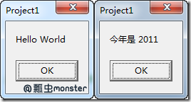
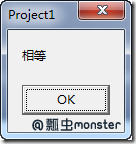
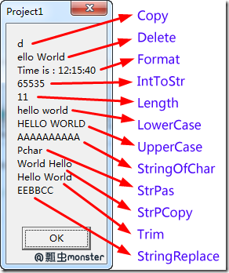

参考：[http://www.cnblogs.com/pchmonster/archive/2011/12/16/2290034.html](http://www.cnblogs.com/pchmonster/archive/2011/12/16/2290034.html)

结合这个博客一起学习：[http://xumenger.github.io/delphi-string-pchar-chararray-20150415/](http://xumenger.github.io/delphi-string-pchar-chararray-20150415/)

 
在实际编程中，这些操作会经常用到的。开始你不用着急全部记住它们，只要知道有这些功能就行，需要用到的时候能查到即可。

##用 + 操作符实现字符串的连接##

    var
      X: Integer;
      S1: string;
      S2: string;
    begin
      S1 := 'Hello';
      S2 := 'World';
      ShowMessage(S1 + ' ' + S2); { 连接了三个字符串S1,S2,和空格字符串}
     
      X := 2011;
      ShowMessage('今年是 ' + IntToStr(X)); { IntToStr函数将整型转换为字符串类型}
    end;

显示的消息框依次为：



##脚标操作符[]##

用脚标操作符可以从一个字符串中提取个别字符。

    var
      S1: string;
      S2: string;
    begin
      S1 := 'Hello World';
      S2 := S1[1];
      ShowMessage(S2);  { 将获取S1字符串的第一个字符H}
    end;

字符串是从1开始的，字符串中的第一个字符是在S[1]中，短字符串（ShortString）的0元素（S[0]）包含了字符串的长度，而不是字符串的第一个字符，在长字符串（AnsiString）和宽字符串（WideString）中不能存取X[0]。ShortString可以访问X[0]

**注意：定义一个字符串**

    s: string;

进行赋值

    s:= 'Text';

进行下面的测试可以知道s 是一个指针，而且所指向的地址是和 @s[1]一样的

    ShowMessage(
        IntToStr(Sizeof(s))        //这里显示的结果是 4
        +IntToStr(s) + IntToStr(@s[1])        //这里输出的 s的值和 s[1]的地址是一样的
    );
    

##字符串中的控制字符##

字符串常量（ string literal  or string constant）一般用两个单引号引起来，如果要字符串本身也有单引号，需要用两个单引号表示，如下：

    'BORLAND'           { BORLAND }
    'You''ll see'       { You'll see }
    ''''                { ' }
    ''                  { null string }
    ' '                 { a space }

在字符串中可以嵌入控制字符，当需要在字符串中增加一些非打印字符时，这个功能是非常有用的。字符串中嵌入控制字符用以发送给串行设备。

用字符#就可以为字符串增加控制字符，例如：

    var
      S1: string;
      S2: string;
    begin
      S1 := #89#111#117;
      S2 := 'You';       { 实际上S1和S2是一样}
      ShowMessage(S1 + #13#10 + S2); { #13#10表示换行回车carriage-return-line-feed}
    end;

运行后显示效果如下：


##用多行代码扩展字符串##

用单引号引起来的字符串叫做字符串常量（ string literal or string constant），其最多只能有255个字符。

为了增强可读性和可维护性，把一个字符串分成多行是必要的，需要用到+操作符，例如：

    ShowMessage('This is very, very long message ' +
      'that seems to go on and on forever. In order ' +
      'to make the code more readable the message has ' +
      'been split across several lines of code.');
      

##字符串的比较##

字符串比较操作符包括：=（等于）、<>（不等）、<（小于）、>（大于）、<=（小于或等于）、>=（大于或等于）。

这些操作符比较字符串都是基于ASCII数值。在大部分的情况下，只需要用等号来判别字符串是否等于一个定值或者不等于一个定值。例如：

    var
      S1: string;
    begin
      S1 := 'Hello World';
      if S1 = 'Hello World' then
        ShowMessage('相等')     { 将显示“相等”的消息框}
      else
        ShowMessage('不相等');
    end;

运行结果如下：




##字符串操作的函数##

基本常用的字符串操作函数都定义在System或者SysUtils单元中，我们就用一段范例讲解下基本常用的字符串函数的用法。

```
const
    S1: ShortString = 'Hello World';
var
    X: Integer;
    SP: PChar;
    S2: string;
    RS: string;     //显示最后的结果
begin
    SP := 'Pchar';
    
    //copy函数获取从最后一个字符开始，共一个字符
    S2 := Copy(S1, Length(S1), 1);   //S2 = 'd'
    RS := RS + S2 + #13#10;
    
    //删除字符串中指定位置字符的Delete函数
    S2 := S1;
    Delete(S2, 1, 1);           //S2 = 'ello World'
    RS := RS + S2 + #13#10;
    
    //格式化字符串Format函数
    S2 := Format('Time is : %d:%d:%d', [12, 15, 40]);
    //S2 = 'Time is : 12:15:40'
    //%d表示将在这里放置一个整数，[2011]表示放置2011这个数值
    RS := RS + S2 + #13#10;
    
    //数值转换为字符串InttoStr函数
    X := 65535;
    S2 := IntToStr(X);   //S2 = '65535'
    RS := RS + S2 + #13#10;
    
    //获取字符串长度Length函数
    X := Ord(S1[0]);     //X = 11，Ord函数的作用：Char 类型与其编码值的转换
    X := Length(S1);     //因为S1为ShortString类型，所以可以通过S1[0]来获取字符长度
    RS := RS + IntToStr(X) + #13#10;
    
    //转化为小写LowerCase函数
    S2 := LowerCase(S1);  //S2 = 'hello world'
    RS := RS + S2 + #13#10;
    
    //转化为大写UpperCase函数
    S2 := UpperCase(S1);  //S2 = 'HELLO WORLD'
    RS := RS + S2 + #13#10;
    
    //返回指定字符重复的字符串
    S2 := StringOfChar('A', 10);  //S2 = 'AAAAAAAAAA'
    RS := RS + S2 + #13#10;
    
    //StrPas把一个空结尾字符串(PChar或字符数组)转化为Pascal字符串
    S2 := StrPas(SP);    //S2 = 'Pchar'
    RS := RS + S2 + #13#10;
    
    //StrPCopy把一个Pascal字符串转化为空结尾字符串
    StrPCopy(SP, 'World Hello');    //SP = 'World Hello'
    RS := RS + StrPas(SP) + #13#10;
    
    //Trim用于去除字符串前后的空格和控制字符，不能去掉中间的空格和控制字符
    S2 := #13#10' Hello World   ';
    S2 := Trim(S2);              //S2 = 'Hello World'
    RS := RS + S2 + #13#10;
    
    //StringReplace用于替换字符串中制定字符
    S2 := 'AABBCC';
    S2 := StringReplace(S2, 'A', 'E', [rfReplaceAll]);
    RS := RS + S2 + #13#10;
    
    ShowMessage(RS);
end;
```

运行结果如下：



以上代码均在Delphi7中测试成功。
