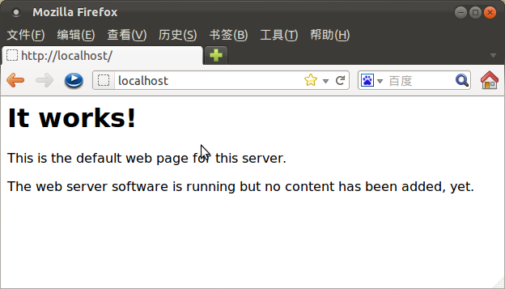

最近重新安装了Ubuntu，但是之前的LAMP环境自然也就没有了，实在是不想再去编译搭建LAMP环境（这种方法实在是太费时间，而且太容易遇到各种不知道为什么的错误），所以，就去查查有没有什么简单的搭建方法。上网上查了好多博客、文章，并且自己去在自己的机器上尝试了一下，整理出下面的搭建步骤、相关的命令

##1.安装 tasksel##

用tasksel可以方便安装dns server, lamp, kubuntu desktop, ubuntu desktop, xubuntu之类的软件包。

这个软件在ubuntu server里是预装的，而在桌面版里是不预装的，想用的话得安装一下：`sudo apt-get install tasksel`

##2.安装lamp环境：##

输入命令 `sudo tasksel install lamp-server` , 即可完成LAMP的安装。

就用这条命令安装，之前我通过先执行 sudo tasksel，然后在选择安装，导致不知道为什么删除了一些重要的软件、文件，最后系统没有办法进入到图形界面，fuck，只能重装

 
##3.相关的管理、配置的命令、方法##

然后通过命令 `sudo /etc/init.d/apache2 restart` 重启Apache服务器。

如果要修改php.ini文件，则通过命令 `sudo gedit /etc/php5/apache2/php.ini` 编辑即可

 
##测试结果：##

1.通过http://localhost 访问服务器首页，结果如下：

2.在/var/www/html下新建文件test.php，内容为：<?php phpinfo(); ?>，通过http://localhost/test.php，结果如下：

本来apache放置网站的目录应该是 /var/www，但是使用这种安装的方法之后，网站的目录是 /var/www/html ，不过自己注意就行了

