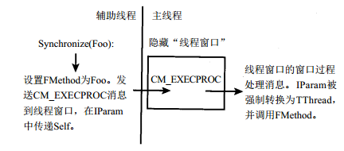

看本文时，可以同时参考:《[Delphi中线程类 TThread实现多线程编程（事件、临界区、Synchronize、WaitFor……）](http://www.cnblogs.com/xumenger/p/4449925.html)》

先说一下RTL和VCL
----

* RTL（Run-Time library），运行时库，包括System、SysUtils、Math三个单元，提供的函数与语言、编译器、操作系统及进程有关
* RTL提供类之间继承于 TObject 和 RTL内部的类
* VCL（Visual Component Library），可视化组件库，包括Graphics、classes、Controls等与类和组件相关的单元

VCL不是线程安全的
---

因为VCL不是线程安全的，所以对VCL的访问只能在主线程中。这将意味着：所有需要与用户打交道的代码都只能在主线程的环境中执行。这是其结构上明显的不足，并且这种需求看起来只局限在表面上，但它实际上有一些优点

开发多线程项目的主要需要考虑的一点就是同步多线程使用资源，不要产生冲突，其实想Delphi的VCL组件也是一种资源，但是VCL不是线程安全的，不能让其他的线程使用，只能通过主线程来使用它

###1.可能的一个应用场景###

比如在开发图形化界面的项目中，需要连接数据库，可以采用这样的策略：用主线程来绘制组件到图形化界面，而连接数据库的过程在子线程中实现。

这时候能够保证就算在连接数据库的时候出现问题，子线程可能会去尝试一直连接，但是因为各个线程之间互不相干，各自执行各自的逻辑代码，所以不影响主线程绘制组件，所以窗体并不会卡住

但是可能要在子线程中读取数据库中的数据来展示数据，这个时候，因为VCL 不是线程安全的，所以不能允许主线程（绘制组件）和子线程（想要去将从数据库中的数据“写”到界面上）同时去操作组件

所以可能的解决方法（见 3.Synchronize() 方法）就是 使用Synchronize() 方法来调用子线程想要将数据“写到”界面的方法，这样就能保证这个方法实际上是在主线程中执行的（虽然它是子线程的方法，但是通过Synchronize() 方法可以实现将子线程的方法放到主线程中执行），这样就能保证不会出现多个线程使用VCL 组件

###2.单线程用户界面的好处###

首先，只有一个线程能够访问用户界面，这减少了编程的复杂性。Win32 要求每个创建窗口的线程都要使用 GetMessage() 建立自己的消息循环。正如你所想的，这样的程序将会非常难于调试，因为消息的来源实在太多了

其次，由于 VCL只用一个线程来访问它，那些用于把线程同步的代码就可以省略了，从而改善了应用程序的性能

###3.Synchronize() 方法###

在 TThread中有一个方法叫Synchronize()，通过它可以让子线程的一些方法在主线程中执行。Synchronize() 的声明如下

    procedure Synchronize(Method: TThreadMethod);

参数Method 的类型是 TThreadMethod（这是一个无参数的过程），类型的声明如下

    type
        TThreadMethod = procedure of object;

Method参数用来传递在主线程中执行的方法。以 TTestThread对象为例，如果要在一个编辑框中显示计算的结果。首先要在TTestThread中增加能对编辑控件的Text 属性进行修改的方法，然后，用Synchronize() 来调用此方法

给这个方法取名 GiveAnswer()，下面列出例子的代码，其中包含了更新主窗体的编辑控件的代码

    unit ThrdU;
    
    interface
    uses
        Classes;
    
    type
        TTestThread = class(TThread)
        private
            Answer: Integer;
        protected
            procedure GiveAnswer;
            procedure Execute; override;
        end;
    
    implementation
    uses
        SysUtils, Main;
    
    {TTestThread}
    procedure TTestThread.GiveAnswer;
    begin
        MainForm.Edit1.Text := IntToStr(Answer);
    end;
    
    procedure TTestThread.Execute;
    var
        I: Integer;
    begin
        FreeOnTerminate:= True;
        for I:= 1 to 2000000 do
        begin
            if Terminated then Breadk;
            Inc(Answer, Round(Abs(Sin(Sqrt(I))));
            Synchronize(GiveAnswer);
        end;
    end;

Synchronize() 的作用是在主线程中执行一个方法。

>当你在程序中第一次创建一个附属线程时，VCL 将会从主线程环境中创建和维护一个隐含的线程窗口。此窗口唯一的目的是把通过Synchronize() 调用的方法排队

Synchronize() 把由Method 参数传递过来的方法保存在 TThread的 FMethod字段中，然后，给线程窗口发送一个CM_EXECPROC消息，并且把消息的lParam 参数设为self（这里是值线程对象）。当线程窗口的窗口过程收到这个消息后，它就调用 FMethod字段所指定的方法。由于线程窗口是在主线程内创建的，线程窗口的窗口过程也将被主线程执行。因此，FMethod字段所指定的方法就在主线程内执行

下图形象地说明了 Synchronize() 的内部机制和原理

###4.用消息来同步###

可以利用在线程之间使用消息同步以替代 TThread.Synchronize() 方法。可以使用API 函数SendMessage() 或 PostMessage() 来发送消息。例如下面一段用来在一个线程中设置另一个线程中的编辑框文本的代码

    var
        S: String;
    begin
        S:= 'hello from threadland';
        SendMessage(SomeEdit.Handle, WM_SETTEXT, 0, Integer(PChar(S)));
    end;

　　
