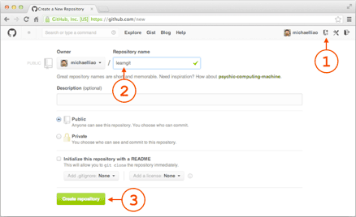
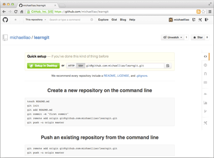

我是通过看[廖雪峰的git教程](http://www.liaoxuefeng.com/wiki/0013739516305929606dd18361248578c67b8067c8c017b000)学习的，真的是极好的，以下是我学习过程中的总结，记录下来，方便自己参考以熟悉git和github的使用。

除了廖雪峰的教程，还比较推荐在看完廖雪峰的教程之后，再看这样一篇文章：[使用git和github进行协同开发流程](http://segmentfault.com/a/1190000002413519)，和我的另一篇git的笔记：[使用git和github管理自己的项目---真实开发环境的策略](http://xumenger.github.io/github-git-use) ，深入了解github和git怎么在具体的项目开发中管理项目、有什么好的规范！

我这里记录git的学习笔记，方便随时参考，具体的**git的原理**、**github的原理**、**集中式和分布式版本控制的区别**、**版本控制的概念和原理**、**Git和其他版本控制工具比如SVN的区别**、以及更多的相关**概念讲解**，请自己参见[廖雪峰的git教程](http://www.liaoxuefeng.com/wiki/0013739516305929606dd18361248578c67b8067c8c017b000)。

>我强烈推荐先看廖雪峰的git教程来系统化认识和学习git，然后自己整理一份具体的步骤方便平时开发时快速参考，或者直接参考我的。

先说一个比较好笑的事：廖雪峰的git教程中，刚开始的部分的浏览量有38万，但是最后一页教程的网页的浏览量是1万多。

以前因为觉得git、github比较难，所以一直拖着不学，现在去尝试学习，一晚上就OK了
- 重点之一是找到全面的、详细的、生动的、高质量的教程。廖雪峰的git教程是我目前找到的最好的一个。之前找到的讲解git用法的书[《pro git》](http://git-scm.com/book/zh/v1%E3%80%81)现在看来是没有必要再看了！
- 重点之二就是自己立即去学，其实没什么难的，不要被貌似难的表象、概念唬住。
- 重点之三是最好能自己做简单的、系统的整理，方便自己随时再回来查看、复习、参考，不至于出现这样的情况：学完以后过一段时间之后再用，但是这时候发现忘了差不多了！
- 重点之四就是立即动手去用，否则学完很快就忘了。

>有钱的买mac，没钱的用ubuntu--或者其他的linux发行版、被逼无奈的用Windows--但是被逼之余的自主时间一定要远离Windows。

现在我的测试环境是ubuntu。

以对一个文件的管理为例，简单说明git的使用。另外需要说明的是下面的实验过程主要是只针对一个文件、并且修改的次数往往只有一次，而在真正的项目中，往往有大量的文件，也可能多次修改后才合并，合并时候的冲突可能也不只一两个，等等。不过原理都是一样的，我想说的是，不要局限在这个教程的示例上，请自己通过教程掌握基本的远原理之后，自己推广、去大量的实践，最重要的是要制定一个好的版本控制的策略（合理分工、安排，还是尽可能的避免冲突为好），这个可以参考：[使用git和github进行协同开发流程](http://segmentfault.com/a/1190000002413519)以及我的学习笔记[使用git和github管理自己的项目---真实开发环境的策略](http://xumenger.github.io/github-git-use)。

[1.创建版本库](http://www.liaoxuefeng.com/wiki/0013739516305929606dd18361248578c67b8067c8c017b000/0013743256916071d599b3aed534aaab22a0db6c4e07fd0000)
----------

- `sudo apt-get install git` 先安装git
- 先创建目录，作为仓库
- `git init` 初始化仓库，可以发现当前目录下多了一个.git的目录，这个目录是Git来跟踪管理版本库的，没事千万不要手动修改这个目录里面的文件，不然改乱了，就把Git仓库给破坏了
- `vim readme.txt` 新建一个文本文件，比如往里面添加简单的一行字符串
- `git add readme.txt` 添加一个文件，比如readme.txt，如果目录里面的所有文件都要添加，可以`git add *`
- `git commit-m "添加一个readme.txt文件"` 将文件提交到仓库，并加上说明（这时候是版本1）
- 如果是第一次使用git，那么git commit可能报错，所以需要你配置一些个人信息
- `git config --global user.email "you@example.com"` 配置邮件
- `git config --global user.name "Your Name"` 配置用户名
- 必须配置，否则后面的commit、push到远程库都会失败
- 然后再次`git commit -m "添加一个readme.txt文件"` 才会成功

[2.提交修改](http://www.liaoxuefeng.com/wiki/0013739516305929606dd18361248578c67b8067c8c017b000/0013743858312764dca7ad6d0754f76aa562e3789478044000)
-------

- 假如此时**第一次**修改了readme.txt文件
- `git status` 让我们时刻掌握仓库当前的状态。这时告诉我们，readme.txt被修改过了，但还没有准备提交的修改。
- `git diff readme.txt` 查看对readme.txt做了什么修改
- `git add readme.txt` 提交修改和提交新文件是一样，先git add
- `git status` 可以再用git status查看仓库的当前状态，告诉我们，将要被提交的修改包括readme.txt
- `git commit-m "第一次修改"`  然后再git commit，并添加修改的描述（这时候是版本2）
- `git status` 可以再执行git status看仓库状态，因为所有的都提交了，Git告诉我们当前没有需要提交的修改，而且，工作目录是干净（working directory clean）的。

[3.版本回退](http://www.liaoxuefeng.com/wiki/0013739516305929606dd18361248578c67b8067c8c017b000/0013744142037508cf42e51debf49668810645e02887691000)
---------

- 你可以像上面所说的那样不停的提交新的文件、提交对文件的修改
- 这时候第二次修改readme.txt文件
- `git add readme.txt` 先git add
- `git commit -m "第二次修改"`  提交第二次修改（这时候是版本3）
- `git log` 显示从最近到最远的提交日志，具体显示的内容自己试一试看看
- `git log --pretty=oneline` 如果嫌输出信息太多，看得眼花缭乱，试试加上--pretty=oneline参数
- 看[这篇教程](http://www.liaoxuefeng.com/wiki/0013739516305929606dd18361248578c67b8067c8c017b000/0013744142037508cf42e51debf49668810645e02887691000)去理解为什么Git的版本号要这么长，Git的版本号类似：3628164fb26d48395383f8f31179f24e0882e1e0 这样的特别长的十六进制数。
- `git reset --hard HEAD^` 会回退到上一个版本，也就是从版本3回退到版本2
- 在Git中，用HEAD表示当前版本，也就是最新的提交3628164...882e1e0（注意我的提交ID和你的肯定不一样），上一个版本就是HEAD^，上上一个版本就是HEAD^^，当然往上100个版本写100个^比较容易数不过来，所以写成HEAD~100
- `vim readme.txt` 可以看到此时的readme.txt文件就是版本2时候的内容，回退成功！
- `git log` 此时看到版本3的信息没有了
- `git reset --hard 3628164` 通过命令行上的历史信息（假如你没清屏的话），找到版本3 的版本号，不一定要全部的版本号，就像这个命令的例子，只要前面的约7、8位这样就可以指定回到版本3
- `vim readme.txt` 看到的是第三版本的readme.txt文件的内容，所以又回来了
- Git的版本回退速度非常快，因为Git在内部有个指向当前版本的HEAD指针，当你回退版本的时候，Git仅仅是把HEAD从指向你要回退的那个版本
- `git reflog` 记录你的每一次命令，最先显示的是这个命令执行之后的版本的版本号的前七位，这样就算你清屏了或者重启了，也能找到某个版本的版本号，就可以轻松回退到那个版本

[4.工作区、版本库和暂存区](http://www.liaoxuefeng.com/wiki/0013739516305929606dd18361248578c67b8067c8c017b000/0013745374151782eb658c5a5ca454eaa451661275886c6000)
------------

**工作区**：就是你在电脑里能看到的目录，比如我的learngit文件夹就是一个工作区。

**版本库**：工作区有一个隐藏目录.git，这个不算工作区，而是Git的版本库。

**暂存区**：Git的版本库里存了很多东西，其中最重要的就是称为stage（或者叫index）的暂存区，还有Git为我们自动创建的第一个分支master，以及指向master的一个指针叫HEAD。

前面讲了我们把文件往Git版本库里添加的时候，是分两步执行的：

1. 第一步是用git add把文件添加进去，实际上就是把文件修改添加到暂存区；
2. 第二步是用git commit提交更改，实际上就是把暂存区的所有内容提交到当前分支。

因为我们创建Git版本库时，Git自动为我们创建了唯一一个master分支，所以，现在，git commit就是往master分支上提交更改。

你可以简单理解为，需要提交的文件修改通通放到暂存区，然后，一次性提交暂存区的所有修改。

详细知识见[这篇教程](http://www.liaoxuefeng.com/wiki/0013739516305929606dd18361248578c67b8067c8c017b000/0013745374151782eb658c5a5ca454eaa451661275886c6000)。必须理解暂存区、工作区、版本库。这些都是是Git非常重要的概念，弄明白了这些概念，就弄明白了Git的很多操作到底干了什么。**没弄明白的话，请反复看！！**

[5.管理修改](http://www.liaoxuefeng.com/wiki/0013739516305929606dd18361248578c67b8067c8c017b000/001374829472990293f16b45df14f35b94b3e8a026220c5000)
---------

为什么Git比其他版本控制系统设计得优秀，因为Git跟踪并管理的是修改，而非文件。

什么是修改？比如你新增了一行，这就是一个修改，删除了一行，也是一个修改，更改了某些字符，也是一个修改，删了一些又加了一些，也是一个修改，甚至创建一个新文件，也算一个修改。

通过实例讲解什么叫跟踪修改，要想理解，请参考[原文](http://www.liaoxuefeng.com/wiki/0013739516305929606dd18361248578c67b8067c8c017b000/001374829472990293f16b45df14f35b94b3e8a026220c5000)结合暂存区的知识理解：
- `vim readme.txt` 编辑文件，比如添加新的一行
- `git add readme.txt` 添加，但是不提交
- `vim readme.txt` 再编辑文件，比如再添加一行
- `git commit -m "修改两次，添一次，提交一次"` 提交
- `git status` 看到的效果是：只提交了第一次的修改，第二次的修改没有提交 

那怎么提交第二次修改呢？你可以继续`git add`再`git commit`，也可以别着急提交第一次修改，先`git add`第二次修改，再`git commit`，也就是`第一次修改 -> git add -> 第二次修改 -> git add -> git commit`，就相当于把两次修改合并后一块提交了。

[6.撤销修改](http://www.liaoxuefeng.com/wiki/0013739516305929606dd18361248578c67b8067c8c017b000/001374831943254ee90db11b13d4ba9a73b9047f4fb968d000)
----------

**第一种情况**

- 修改了readme.txt文件，还没有git add 和git commit
- 但是在你提交之前发现这次修改有问题。既然错误发现得很及时，就可以很容易地纠正它。你可以手动把文件恢复到上一个版本的状态。
- `git checkout -- readme.txt` 也可以通过命令撤销修改，这条命令的意思就是，把readme.txt文件在工作区的修改全部撤销
- 无论是文件修改后值存在于工作区还没有放到暂存区，还是已经添加到暂存区，总之这个命令就是让这个文件回到最近一次git commit或git add时的状态。
- 查看文件，内容果然复原了。git checkout -- file命令中的`--`很重要，没有`--`，就变成了“切换到另一个分支”的命令，我们在后面的分支管理中会再次遇到git checkout命令。

**第二种情况**

- 修改了readme.txt文件，而且执行了`git add readme.txt`
- 庆幸的是你在 git commit 之前发现了这个问题
- `git status` 查看一下，修改只是添加到了暂存区，还没有提交
- `git reset HEAD readme.txt` 可以把暂存区的修改撤销掉，重新放回工作区。git reset命令既可以回退版本，也可以把暂存区的修改回退到工作区。当我们用HEAD时，表示最新的版本。
- `git status` 查看一下，现在暂存区是干净的，工作区有修改
- `git checkout -- readme.txt` 还记得第一种情况中如何丢弃工作区的修改吧

**第三种情况**

现在，假设你不但改错了东西，还从暂存区提交到了版本库，怎么办呢？还记得版本回退一节吗？可以回退到上一个版本。不过，这是有条件的，就是你还没有把自己的本地版本库推送到远程。

还记得Git是分布式版本控制系统吗？我们后面会讲到远程版本库，一旦你把错误的修改（如果是影响很大的错误）提交推送到远程版本库，你就真的惨了……

区别对待本地版本库和远程版本库！

7.删除文件
---------

在Git中，删除也是一个修改操作
- 添加一个新的文件 test.txt
- `git add test.txt`
- `git commit test.txt -m "再次新增一个文件"`
- 一般情况下，你通常会在文件管理器中把没用的文件删除，或者直接`rm test.txt`
- `git status` 这个时候，Git知道你删除了文件，因此，工作区和版本库就不一致了，git status命令会立刻告诉你哪些文件被删除了
- 现在你有两个选择，一是确实从版本库中删除该文件，那就`git rm test.txt`，然后`git commit` 文件就从版本库中删除了
- 另一种情况是删除错了，因为版本库里还有，所以可以轻松地将误删除的文件恢复到最新版本`git checkout -- test.txt` git checkout其实使用版本库中的版本替换工作区的版本，无论工作区是修改还是删除，都可以“一键还原”

[8.添加远程库](http://www.liaoxuefeng.com/wiki/0013739516305929606dd18361248578c67b8067c8c017b000/0013752340242354807e192f02a44359908df8a5643103a000)
---------

要想学习这部分的知识，请先参考下面的：**a.配置连接远程仓库Github**。

- 假如现在你已经配置好github，并且在github上添加了`learngit`仓库。
- `git init`在本地仓库初始化
- `git remote add origin git@github.com:michaelliao/learngit.git`  这个命令是在本地的learngit仓库下执行的，前面通过learngit仓库为例我们已经讲过在本地创建和操作git仓库。这两个地方的仓库名不需要相同，因为会通过在本地的仓库目录下执行这条命令（命令中包含远程库的名字）已经将两者建立了联系
- 请千万注意，把上面的michaelliao替换成你自己的GitHub账户名，否则，你在本地关联的就是我的远程库，关联没有问题，但是你以后推送是推不上去的，因为你的SSH Key公钥不在我的账户列表中。
- `git add *`添加所有的文件到仓库
- `git commit -m "说明"`提交到本地仓库
- `git push -u origin master` 把本地库的所有内容推送到远程库上。把本地库的内容推送到远程，用git push命令，实际上是把当前分支master推送到远程。由于远程库是空的，我们第一次推送master分支时，加上了-u参数，Git不但会把本地的master分支内容推送的远程新的master分支，还会把本地的master分支和远程的master分支关联起来，在以后的推送或者拉取时就可以简化命令。
- 然后去Github对应的远程库看看，都已经推送上去了。
- 此后，每次本地提交后，只要有必要，就可以使用命令`git push origin master`推送最新修改。

>这样你就可以在Github上托管你的项目代码、vim的配置文件和插件、重要的文档……

现在我的vim的配置文件和插件已经同步到Github上了：[https://github.com/xumenger/myVimConfig](https://github.com/xumenger/myVimConfig)

另外推荐我的关于vim配置的文章：：[http://xumenger.github.io/vim/](http://xumenger.github.io/vim/)

[9.从远程库克隆](http://www.liaoxuefeng.com/wiki/0013739516305929606dd18361248578c67b8067c8c017b000/001375233990231ac8cf32ef1b24887a5209f83e01cb94b000)
----------

- 假设我的github上面有一个远程库，但是本地没有，需要克隆到本地，远程库的名字叫'gitskills'
- `git clone git@github.com:michaelliao/gitskills.git` 克隆一个本地库
- `cd gitskills` 进入克隆下来的本地库，默认的名字是和github上的一样的
- `ls -al` 可以看到本地的克隆库里面是和远程库里面的一样的
- 如果有多个人协作开发，那么每个人各自从远程克隆一份就可以了。

你也许还注意到，GitHub给出的地址不止一个，还可以用https://github.com/michaelliao/gitskills.git这样的地址。实际上，Git支持多种协议，默认的git://使用ssh，但也可以使用https等其他协议。

使用https除了速度慢以外，还有个最大的麻烦是每次推送都必须输入口令，但是在某些只开放http端口的公司内部就无法使用ssh协议而只能用https。

[10.分支管理](http://www.liaoxuefeng.com/wiki/0013739516305929606dd18361248578c67b8067c8c017b000/0013743862006503a1c5bf5a783434581661a3cc2084efa000)
--------

分支在实际中有什么用呢？假设你准备开发一个新功能，但是需要两周才能完成，第一周你写了50%的代码，如果立刻提交，由于代码还没写完，不完整的代码库会导致别人不能干活了。如果等代码全部写完再一次提交，又存在丢失每天进度的巨大风险。

现在有了分支，就不用怕了。你创建了一个属于你自己的分支，别人看不到，还继续在原来的分支上正常工作，而你在自己的分支上干活，想提交就提交，直到开发完毕后，再一次性合并到原来的分支上，这样，既安全，又不影响别人工作。

其他版本控制系统如SVN等都有分支管理，但是用过之后你会发现，这些版本控制系统创建和切换分支比蜗牛还慢，简直让人无法忍受，结果分支功能成了摆设，大家都不去用。

但Git的分支是与众不同的，无论创建、切换和删除分支，Git在1秒钟之内就能完成！无论你的版本库是1个文件还是1万个文件。

[11.创建和合并分支](http://www.liaoxuefeng.com/wiki/0013739516305929606dd18361248578c67b8067c8c017b000/001375840038939c291467cc7c747b1810aab2fb8863508000)
-------------

首先教程中会详细讲解分支的原理（分支、指针、工作区……），一定要好好看！！看完之后你才能对你的创建分支和合并分支的操作不只是会用，更能在用的时候没有任何疑惑！反正能学到更多的知识，何乐而不为！

另外推荐这样的博客：[使用git和github进行协同开发流程](http://segmentfault.com/a/1190000002413519)以及我的学习笔记[使用git和github管理自己的项目---真实开发环境的策略](http://xumenger.github.io/github-git-use/)。

在[版本回退](http://www.liaoxuefeng.com/wiki/0013739516305929606dd18361248578c67b8067c8c017b000/0013744142037508cf42e51debf49668810645e02887691000)里，你已经知道，每次提交，Git都把它们串成一条时间线，这条时间线就是一个分支。截止到目前，我们练习的learngit，只有一条时间线，在Git里，这个分支叫主分支，即`master`分支。HEAD严格来说不是指向提交，而是指向master，master才是指向提交的，所以，HEAD指向的就是当前分支。

开始实战：

- `git checkout -b dev` 创建一个新的分支：dev，并且会切换到dev分支。所以这条命令有两个作用。git checkout命令加上-b参数表示创建并切换，相当于以下两条命令：`git branch dev` 和 `git checkout dev`
- 补充：所有的git管理的项目刚开始时候默认有一条分支：master
- `git branch` 查看当前所在的分支。git branch命令会列出所有分支，当前分支前面会标一个*号。
- 因为切换到dev分支，所以我们现在可以在dev分支上正常提交，比如对readme.txt做一个修改
- `git add readme.txt`
- `git commit -m "提交到dev分支"`
- `git checkout master` 现在，dev分支的工作完成，我们就可以切换回master分支
- **注意*:*切换回master分支后，再查看一个readme.txt文件，刚才添加的内容不见了！因为那个提交是在dev分支上，而master分支此刻的提交点并没有变
- `git merge dev` 这是在master分支上执行的命令，作用是：把dev分支上的工作成果合并到master分支上
- git merge命令用于合并指定分支到当前分支。合并后，再查看readme.txt的内容，就可以看到，和dev分支的最新提交是完全一样的。注意到上面的Fast-forward信息，Git告诉我们，这次合并是“快进模式”，也就是直接把master指向dev的当前提交，所以合并速度非常快。当然，也不是每次合并都能Fast-forward，我们后面会将其他方式的合并。
- `git branch -d dev` 合并完成之后，可以放心的删除dev分支了
- `git branch` 删除后，查看branch，只剩下master了

[12.解决冲突](http://www.liaoxuefeng.com/wiki/0013739516305929606dd18361248578c67b8067c8c017b000/001375840202368c74be33fbd884e71b570f2cc3c0d1dcf000)
-----------

教程中有详细的图文说明，很形象，很好！一定要参考！

人生不如意之事十之八九，合并分支往往也不是一帆风顺的。

- `git checkout -b feature1` 创建新的分支feature1，并且换到这个分支，进行新的实验
- 在feature1分支下，假如将readme.txt的最后一行由"test branch" 改为"test feature1"
- `git add readme.txt`
- `git commit -m "在feature1上修改readme.txt的最后一行"` 在feature1分支上提交
- `git checkout master` 切换到master分支。Git还会自动提示我们当前master分支比远程的master分支要超前1个提交。
- 在master分支下，假如将readme.txt的最后一行由"test branch" 改为"test master"因为上面的是在feature1上进行的修改，所以切换回master之后，看到的文件并不是在feature1上修改后的文件
- `git add readme.txt`
- `git commit -m "又在master上修改了readme.txt文件"`  在master上也提交修改
- 现在，master分支和feature1分支各自都分别有新的提交
- `git merge feature1` 在master分支上执行该命令，与feature1分支合并。这种情况下，Git无法执行“快速合并”，只能试图把各自的修改合并起来，但这种合并就可能会有冲突，果然冲突了！Git告诉我们，readme.txt文件存在冲突，必须手动解决冲突后再提交
- `git status` git status也可以告诉我们冲突的文件
- 这时候使用vim等编辑器打开readme.txt文件可以看到已经在readme.txt文件中将冲突的信息已经添加到里面了，Git用`<<<<<<<`，`=======`，`>>>>>>>`标记出不同分支的内容
- 然后我们编辑readme.txt文件，处理冲突，将内容改成我们想要的样子
- `git add readme.txt` 
- `git commit -m "解决冲突"` 在master上提交
- `git log --graph --pretty=oneline --abbrev-commit` 用带参数的git log可以看到分支的合并情况。用`git log --graph`命令可以看到分支合并图。
- `git branch -d feature1` 最后删除feature分支，完成工作。

2015.09.09 今天就学到这里，实在太晚了，赶紧睡觉，明天还得工作！什么都没有身体重要！
明天继续：[分支管理策略](http://www.liaoxuefeng.com/wiki/0013739516305929606dd18361248578c67b8067c8c017b000/0013758410364457b9e3d821f4244beb0fd69c61a185ae0000)

[a.配置连接远程仓库Github](http://www.liaoxuefeng.com/wiki/0013739516305929606dd18361248578c67b8067c8c017b000/001374385852170d9c7adf13c30429b9660d0eb689dd43a000)
---------

首先看这篇文章了解git和SVN的区别，毕竟现在必须在工作中使用的就是SVN，所以还是弄清楚两者的区别。

Git是分布式版本控制系统，同一个Git仓库，可以分布到不同的机器上。怎么分布呢？最早，肯定只有一台机器有一个原始版本库，此后，别的机器可以“克隆”这个原始版本库，而且每台机器的版本库其实都是一样的，并没有主次之分。

实际情况往往是这样，找一台电脑充当服务器的角色，每天24小时开机，其他每个人都从这个“服务器”仓库克隆一份到自己的电脑上，并且各自把各自的提交推送到服务器仓库里，也从服务器仓库中拉取别人的提交。

完全可以自己搭建一台运行Git的服务器，不过现阶段，为了学Git先搭个服务器绝对是小题大作。好在这个世界上有个叫GitHub的神奇的网站，从名字就可以看出，这个网站就是提供Git仓库托管服务的，所以，只要注册一个GitHub账号，就可以免费获得Git远程仓库。

在继续阅读后续内容前，请自行注册GitHub账号。由于你的本地Git仓库和GitHub仓库之间的传输是通过SSH加密的，所以，需要一点设置：

1. 创建SSH Key。在`用户目录`下，看看有没有`.ssh`目录，如果有，再看看这个目录下有没有`id_rsa`和`id_rsa.pub`这两个文件，如果已经有了，可直接跳到下一步。如果没有，打开Shell（Windows下打开Git Bash），创建SSH Key，输入命令`ssh-keygen -t rsa -C "youremail@example.com"`,你需要把邮件地址换成你自己的邮件地址，然后一路回车，使用默认值即可，由于这个Key也不是用于军事目的，所以也无需设置密码。如果一切顺利的话，可以在用户主目录里找到`.ssh`目录，里面有`id_rsa`和`id_rsa.pub`两个文件，这两个就是SSH Key的秘钥对，`id_rsa`是私钥，不能泄露出去，`id_rsa.pub`是公钥，可以放心地告诉任何人。
2. 登陆GitHub，打开“Account settings”，“SSH Keys”页面.然后，点“Add SSH Key”，填上任意Title，在Key文本框里粘贴`id_rsa.pub`文件的内容：

3. 点“Add Key”，你就应该看到已经添加的Key：

注意现在的Github的页面的布局可能和图片中显示有细小的差别，不过相信你能找到对应的操作！

为什么GitHub需要SSH Key呢？因为GitHub需要识别出你推送的提交确实是你推送的，而不是别人冒充的，而Git支持SSH协议，所以，GitHub只要知道了你的公钥，就可以确认只有你自己才能推送。

当然，GitHub允许你添加多个Key。假定你有若干电脑，你一会儿在公司提交，一会儿在家里提交，只要把每台电脑的Key都添加到GitHub，就可以在每台电脑上往GitHub推送了。

最后友情提示，在GitHub上免费托管的Git仓库，任何人都可以看到喔（但只有你自己才能改）。所以，不要把敏感信息放进去。

如果你不想让别人看到Git库，有两个办法，一个是交点保护费，让GitHub把公开的仓库变成私有的，这样别人就看不见了（不可读更不可写）。另一个办法是自己动手，搭一个Git服务器，因为是你自己的Git服务器，所以别人也是看不见的。这个方法我们后面会讲到的，相当简单，公司内部开发必备。

现在的情景是，你已经在本地创建了一个Git仓库后，又想在GitHub创建一个Git仓库，并且让这两个仓库进行远程同步，这样，GitHub上的仓库既可以作为备份，又可以让其他人通过该仓库来协作，真是一举多得。具体可以见[教程](http://www.liaoxuefeng.com/wiki/0013739516305929606dd18361248578c67b8067c8c017b000/0013752340242354807e192f02a44359908df8a5643103a000)。

1. 首先，登陆GitHub，然后，在右上角找到“Create a new repo”按钮，创建一个新的仓库：

2. 在Repository name填入`learngit`，其他保持默认设置，点击“Create repository”按钮，就成功地创建了一个新的Git仓库：

目前，在GitHub上的这个learngit仓库还是空的，GitHub告诉我们，可以从这个仓库克隆出新的仓库，也可以把一个已有的本地仓库与之关联，然后，把本地仓库的内容推送到GitHub仓库。

 