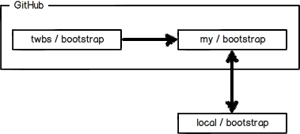

基础知识和命令先参考：[使用git和github管理自己的项目---基础操作学习](http://xumenger.github.io/github-git-learn/)

[13.分支管理策略](http://www.liaoxuefeng.com/wiki/0013739516305929606dd18361248578c67b8067c8c017b000/0013758410364457b9e3d821f4244beb0fd69c61a185ae0000)
-------------

通常，合并分支时，如果可能，Git会用`Fast forward`模式，但这种模式下，删除分支后，会丢掉分支信息。

如果要强制禁用`Fast forward`模式，Git就会在merge时生成一个新的commit，这样，从分支历史上就可以看出分支信息。

下面我们实战一下`--no-ff`方式的`git merge`：

- `git checkout -b dev` 创建并切换到dev分支
- `vim readme.txt` 修改readme.txt文件
- `git add readme.txt`
- `git commit -m "add merge"` 提交一个新的commit
- `git checkout master` 切回master分支
- `git merge --no-ff -m "merge with with no-ff" dev` 准备合并dev分支，注意`--no-ff`参数表示禁用Fast forward，因为本次合并要创建一个新的commit，所以加上`-m`参数，把commit描述写进去
- `git log --graph --pretty=oneline --abbrev-commit` 合并后查看分支历史

合并分支时，加上--no-ff参数就可以用普通模式合并，合并后的历史有分支，能看出来曾经做过合并，而fast forward合并就看不出来曾经做过合并。

[14.分支策略](http://www.liaoxuefeng.com/wiki/0013739516305929606dd18361248578c67b8067c8c017b000/0013758410364457b9e3d821f4244beb0fd69c61a185ae0000)
--------

在实际开发中，我们应该按照几个基本原则进行分支管理：

- 首先，`master`分支应该是非常稳定的，也就是仅用来发布新版本，平时不能在上面干活
- 那在哪里干活呢？干活都在`dev`分支上，也就是说，`dev`分支是不稳定的，到某个时候，比如2.0版本发布时，再把`dev`分支合并到`master`上，在`master`分支发新版本
- 你和你的小伙伴每个人都在`dev`分支上干活，每个人都有自己的分支，时不时往`dev`分支上合并就可以了

所以，团队合作的分支看起来就像这个样子：

Git分支十分强大，在团队开发中应该充分应用。

[15.Bug分支](http://www.liaoxuefeng.com/wiki/0013739516305929606dd18361248578c67b8067c8c017b000/00137602359178794d966923e5c4134bc8bf98dfb03aea3000)
----------

软件开发中，bug就像是家常便饭一样。有了bug就需要修复，在Git中，由于分支是如此的强大，所以每个bug都可以通过一个新的临时分支来修复，修复后，合并分支，然后将临时分支删除。

当你接到一个修复代号为101的bug的任务的时候，很自然的，你想创建一个分支`issue-101`来修复它，但是，等等，当前正在`dev`上进行的工作还没有提交：

- `git status` 查看状态

并不是你不想提交，而是工作只进行到一半，还没法提交，预计完成还需1天时间。但是，必须在两个小时内修复该bug，怎么办？

* 在dev分支执行`git stash`命令，可以把当前分支的工作现场“储藏”起来，等以后恢复现场后继续工作
* 在dev分支执行`git status`命令查看工作区，就是干净的（除非有没有被Git管理的文件），因此可以放心的创建分支来修复bug了。
- `git checkout master` 从dev分支切换回master
- `git checkout -b issue-101`  假定需要在master分支上修复，就从`master`创建临时分支
- 假设现在修复好了bug，本例中，就假如在readme.txt文件中做了修改
- `git add readme.txt` 
- `git commit -m "fic bug 101"` 修改之后提交
- `git checkout master` 从issue-101切换回master
- `git merge --no-ff -m "merged bug fix 101" issue-101` 合并分支选择不适用Fast forward模式，然后添加必要的描述信息
- `git branch -d issue-101` 删除issue-101这个临时bug修复分支
- 太棒了，bug搞定了，现在可以回到`dev`分支干活了
- `git checkout dev` 切换回dev分支
- `git status` 可以看出工作区是干净的，那么刚才的工作现场存在哪里呢？
- `git stash list` 看到工作现场还在，Git把stash内容存在某个地方了，但是需要恢复一下
- 方法一`git stash apply`，但是恢复后，stash内容并不删除，你需要使用`git stash drop`来删除
- 方法二`git stash pop`，恢复的同时也把stas内容删除了
- `git stash list` 再用git stash list查看，就看不到任何stash内容了
- 你可以多次`stash`，恢复的时候，先用`git stash list` 查看，然后恢复指定的stash，使用如下的命令
- `git stash apply stash@{0}`

修复bug时，我们会通过创建新的bug分支进行修复，然后合并，最后删除。

当手头工作没有完成时，先把工作现场git stash一下，然后去修复bug，修复后，再git stash pop，回到工作现场。

[16.Feature分支](http://www.liaoxuefeng.com/wiki/0013739516305929606dd18361248578c67b8067c8c017b000/001376026233004c47f22a16d1f4fa289ce45f14bbc8f11000)
------------

软件开发中，总有无穷无尽的新的功能要不断添加进来。

添加一个新功能时，你肯定不希望因为一些实验性质的代码，把主分支搞乱了，所以，每添加一个新功能，最好新建一个feature分支，在上面开发，完成后，合并，最后，删除该feature分支。

现在，你终于接到了一个新任务：开发代号为Vulcan的新功能，该功能计划用于下一代星际飞船。于是开始准备工作

- `git checkout -b feature-vulcan` 在dev分支上创建并且换到feature-vulcan分支，用来开发新功能
- 假如现在经过一定的时间后，工作完成了
- `git add vulcan.py`
- `git status` 查看状态
- `git commit -m "add feature vulcan"` 提交
- `git checkout dev` 切换回dev分支
- 一切顺利的话，feature分支和bug分支是类似的，合并，然后删除。但是，就在此时，接到上级命令，因经费不足，新功能必须取消！虽然白干了，但是这个分支还是必须就地销毁，不要再合并了:
- `git branch -d feature-vulcan` 销毁失败。Git友情提醒，feature-vulcan分支还没有被合并，如果删除，将丢失掉修改，如果要强行删除，需要使用命令git branch -D feature-vulcan。
- `git branch -D feature-vulcan`

[17.多人协作](http://www.liaoxuefeng.com/wiki/0013739516305929606dd18361248578c67b8067c8c017b000/0013760174128707b935b0be6fc4fc6ace66c4f15618f8d000)
----------

当你从远程仓库克隆时，实际上Git自动把本地的master分支和远程的master分支对应起来了，并且，远程仓库的默认名称是origin。

**推送分支**

- `git remote` 查看远程库的信息
- `git remote -v` 显示更为详细的信息
- `git push origin master` 推送分支，就是把该分支上的所有本地提交推送到远程库。推送时，要指定本地分支，这样，Git就会把该分支推送到远程库对应的远程分支上。
- `git push origin dev` 也可以推送到其他的分支，比如dev分支
- 但是，并不是一定要把本地分支往远程推送，那么，哪些分支需要推送，哪些不需要呢？master分支是主分支，因此要时刻与远程同步；dev分支是开发分支，团队所有成员都需要在上面工作，所以也需要与远程同步；bug分支只用于在本地修复bug，就没必要推到远程了，除非老板要看看你每周到底修复了几个bug；feature分支是否推到远程，取决于你是否和你的小伙伴合作在上面开发。总之，就是在Git中，分支完全可以在本地自己藏着玩，是否推送，视你的心情而定！

**抓取分支**

多人协作时，大家都会往master和dev分支上推送各自的修改。

- `git clone git@github.com:michaelliao/learngit.git`  现在，模拟一个你的小伙伴，可以在另一台电脑（注意要把SSH Key添加到GitHub）或者同一台电脑的另一个目录下克隆。
- `git branch` 当你的小伙伴从远程库clone时，默认情况下，你的小伙伴只能看到本地的master分支，所以执行这条命令只能看到master分支
- `git checkout -b dev origin/dev` 现在，你的小伙伴要在dev分支上开发，就必须创建远程origin的dev分支到本地，于是他用这个命令创建本地dev分支
- `git commit -m "add /usr/bin/env"` 现在，他就可以在dev上继续修改，然后，时不时地把dev分支push到远程。
- `git add hello.py` `git commit -m "add coding: utf-8"` ` git push origin dev` 你的小伙伴已经向origin/dev分支推送了他的提交，而碰巧你也对同样的文件作了修改，并试图推送。推送失败，因为你的小伙伴的最新提交和你试图推送的提交有冲突。
- `git pull` 解决办法也很简单，Git已经提示我们，先用git pull把最新的提交从origin/dev抓下来，然后，在本地合并，解决冲突，再推送。
- `git branch --set-upstream dev origin/dev` git pull也失败了，原因是没有指定本地dev分支与远程origin/dev分支的链接，根据提示，设置dev和origin/dev的链接。
- `git pull` 再次pull，这回git pull成功，但是合并有冲突，需要手动解决，解决的方法和分支管理中的解决冲突完全一样
- `git commit -m "merge & fix hello.py"` `git push origin dev` 解决冲突后，再提交，再push

**因此，多人协作的工作模式通常是这样的：**

- 首先，可以试图用`git push origin branch-name` 推送自己的修改
- 如果推送失败，则因为远程分支比你的本地更新，需要先用`git pull`试图合并
- 如果合并有冲突，则解决冲突，并在本地提交
- 没有冲突或者解决掉冲突之后，再用`git push origin branch-name`推送就能成功
- 如果git pull提示“no tracking information”，则说明本地分支和远程分支的链接关系没有创建，用命令git branch --set-upstream branch-name origin/branch-name。**这就是多人协作的工作模式，一旦熟悉了，就非常简单。**

18.标签管理
--------

发布一个版本时，我们通常先在版本库中打一个标签，这样，就唯一确定了打标签时刻的版本。将来无论什么时候，取某个标签的版本，就是把那个打标签的时刻的历史版本取出来。**所以，标签也是版本库的一个快照。**

**Git的标签虽然是版本库的快照，但其实它就是指向某个commit的指针（跟分支很像对不对？但是分支可以移动，标签不能移动），所以，创建和删除标签都是瞬间完成的。**

[19.创建标签](http://www.liaoxuefeng.com/wiki/0013739516305929606dd18361248578c67b8067c8c017b000/001376951758572072ce1dc172b4178b910d31bc7521ee4000)
--------

- `git branch` 查看当前有哪些分支
- `git checkout master` 在Git中打标签非常简单，首先，切换到需要打标签的分支上
- `git tag tagnamev1.0` 打一个新标签
- `git tag` 查看所有标签
- 默认标签是打在最新提交的commit上的（也就是`HEAD`）。有时候，如果忘了打标签，比如，现在已经是周五了，但应该在周一打的标签没有打，怎么办？
- `git log --pretty=oneline --abbrev-commit` 方法是找到历史提交的commit id，然后打上就可以了，这时候显示了提交的历史信息 ，假如有这么一条就是你想打标签的历史commit：`6224937 add merge`
- `git tag tagnamev2.0 6224937` 就可以给这次提交打标签了
- `git tag` 可以查看标签信息，注意，标签不是按时间顺序列出，而是按字母排序的
- `git show tagnamev2.0` 查看具体的某个标签的信息
- `git tag -a v0.1 -m "version 0.1 released" 3628164` 还可以创建带有说明的标签，用-a指定标签名，-m指定说明文字
- `git show v0.1` 查看具体的某个标签的信息，可以看到说明文字
- `git tag -s v0.2 -m "signed version 0.2 released" fec145a` 还可以通过-s用私钥签名一个标签，签名采用PGP签名，因此，必须首先安装gpg（GnuPG），如果没有找到gpg，或者没有gpg密钥对，就会报错
- `git show v0.2`  用命令git show <tagname>可以看到PGP签名信息，用PGP签名的标签是不可伪造的，因为可以验证PGP签名。

[20.操作标签](http://www.liaoxuefeng.com/wiki/0013739516305929606dd18361248578c67b8067c8c017b000/001376951885068a0ac7d81c3a64912b35a59b58a1d926b000)
-----------

- `git tag -d v0.1` 假如标签打错了，也可以删除，因为创建的标签都只存储在本地，不会自动推送到远程。所以，打错的标签可以在本地安全删除。
- `git push origin v1.0` 要推送某个标签到远程
- `git push origin --tags` 或者，一次性推送全部尚未推送到远程的本地标签
- `git tag -d v0.9` 如果标签已经推送到远程，要删除远程标签就麻烦一点，先从本地删除
- `git push origin :refs/tags/v0.9` 然后，从远程删除。删除命令也是push，但是格式要注意

[21.使用Github](http://www.liaoxuefeng.com/wiki/0013739516305929606dd18361248578c67b8067c8c017b000/00137628548491051ccfaef0ccb470894c858999603fedf000)
-------

如何参与一个开源项目呢？比如人气极高的bootstrap项目，这是一个非常强大的CSS框架。

- 你可以访问它的项目主页https://github.com/twbs/bootstrap，点“Fork”就在自己的账号下克隆了一个bootstrap仓库
- `git clone git@github.com:yourname/bootstrap.git` 然后，从自己的账号下clone
- 一定要从自己的账号下clone仓库，这样你才能推送修改。如果从bootstrap的作者的仓库地址git@github.com:twbs/bootstrap.git克隆，因为没有权限，你将不能推送修改。

Bootstrap的官方仓库twbs/bootstrap、你在GitHub上克隆的仓库my/bootstrap，以及你自己克隆到本地电脑的仓库，他们的关系就像下图显示的那样：

如果你想修复bootstrap的一个bug，或者新增一个功能，立刻就可以开始干活，干完后，往自己的仓库推送。

**如果你希望bootstrap的官方库能接受你的修改，你就可以在GitHub上发起一个pull request。当然，对方是否接受你的pull request就不一定了。**

如果你没能力修改bootstrap，但又想要试一把pull request，那就Fork一下廖雪峰的仓库：https://github.com/michaelliao/learngit，创建一个`your-github-id.txt`的文本文件，比如我的：`xumenger.txt`，写点自己学习Git的心得，然后推送一个pull request给他，他会视心情而定是否接受。

[22.自定义Git](http://www.liaoxuefeng.com/wiki/0013739516305929606dd18361248578c67b8067c8c017b000/00137621280731812dec22ecc9b44f4b2ca1c680f181a5b000)
-------------

之前已经说过在使用之前必须先配置`user.name`和`user.email`，否则后面commit的时候可能会有错误，实际上git还有很多可配置的：

- `git config --global color.ui true` 让Git显示颜色，会让命令输出看起来更醒目，自己去试试一些git命令的输出看看是不是有色！

[23.忽略特殊文件](http://www.liaoxuefeng.com/wiki/0013739516305929606dd18361248578c67b8067c8c017b000/0013758404317281e54b6f5375640abbb11e67be4cd49e0000)
------------

有些时候，你必须把某些文件放到Git工作目录中，但又不能提交它们，比如保存了数据库密码的配置文件啦，等等，每次git status都会显示Untracked files ...，有强迫症的童鞋心里肯定不爽。

好在Git考虑到了大家的感受，这个问题解决起来也很简单，在Git工作区的根目录下创建一个特殊的.gitignore文件，然后把要忽略的文件名填进去，Git就会自动忽略这些文件。

不需要从头写.gitignore文件，GitHub已经为我们准备了各种配置文件，只需要组合一下就可以使用了。所有配置文件可以直接在线浏览：https://github.com/github/gitignore

**忽略文件的原则是：**

- 忽略操作系统自动生成的文件，比如缩略图等；
- 忽略编译生成的中间文件、可执行文件等，也就是如果一个文件是通过另一个文件自动生成的，那自动生成的文件就没必要放进版本库，比如Java编译产生的.class文件；
- 忽略你自己的带有敏感信息的配置文件，比如存放口令的配置文件。

**举个例子**

假设你在Windows下进行Python开发，Windows会自动在有图片的目录下生成隐藏的缩略图文件，如果有自定义目录，目录下就会有Desktop.ini文件，因此你需要忽略Windows自动生成的垃圾文件：

    # Windows:
    Thumbs.db
    ehthumbs.db
    Desktop.ini

然后，继续忽略Python编译产生的.pyc、.pyo、dist等文件或目录：

    # Python:
    *.py[cod]
    *.so
    *.egg
    *.egg-info
    dist
    build

加上你自己定义的文件，最终得到一个完整的.gitignore文件，内容如下：

    # Windows:
    Thumbs.db
    ehthumbs.db
    Desktop.ini
    
    # Python:
    *.py[cod]
    *.so
    *.egg
    *.egg-info
    dist
    build
    
    # My configurations:
    db.ini
    deploy_key_rsa

最后一步就是把.gitignore也提交到Git，就完成了！当然检验.gitignore的标准是git status命令还会不会再说working directory clean。**.gitignore文件本身要放到版本库里，并且可以对.gitignore做版本管理！**

使用Windows的童鞋注意了，如果你在资源管理器里新建一个.gitignore文件，它会非常弱智地提示你必须输入文件名，但是在文本编辑器里“保存”或者“另存为”就可以把文件保存为.gitignore了。

>再次建议：有钱的买mac，没钱的用ubuntu--或者其他的linux发行版、被逼无奈的用Windows--但是被逼之余的自主时间一定要远离Windows。

[24.配置别名](http://www.liaoxuefeng.com/wiki/0013739516305929606dd18361248578c67b8067c8c017b000/001375234012342f90be1fc4d81446c967bbdc19e7c03d3000)
--------------

>给Git配置好别名，就可以输入命令时偷个懒。我们鼓励偷懒。

- `git config --global alias.st status` 有没有经常敲错命令？比如git status？status这个单词真心不好记。如果敲git st就表示git status那就简单多了，当然这种偷懒的办法我们是极力赞成的。
- `git config --global alias.co checkout`
- `git config --global alias.ci commit`
- `git config --global alias.br branch`
- 很多人都用co表示checkout，ci表示commit，br表示branch
- `git ci -m "bala bala bala..."` 以后提交就可以简写成这样
- `git config --global alias.unstage 'reset HEAD'` 在[撤销修改](http://www.liaoxuefeng.com/wiki/0013739516305929606dd18361248578c67b8067c8c017b000/001374831943254ee90db11b13d4ba9a73b9047f4fb968d000)一节中，我们知道，命令`git reset HEAD file`可以把暂存区的修改撤销掉（unstage），重新放回工作区。既然是一个unstage操作，就可以配置一个unstage别名
- `git unstage test.py` 当你敲入此命令，实际上Git执行的是：`git reset HEAD test.py`
- `git config --global alias.last 'log -1'` 配置一个git last，让其显示最后一次提交信息
- `git config --global alias.lg "log --color --graph --pretty=format:'%Cred%h%Creset -%C(yellow)%d%Creset %s %Cgreen(%cr) %C(bold blue)<%an>%Creset' --abbrev-commit"` 甚至还有人这样的配置，那么，这时候`git lg`的效果是这样的

**配置文件**

配置Git的时候，加上`--global`是针对当前用户起作用的，如果不加，那只针对当前的仓库起作用。

配置文件放哪了？每个仓库的Git配置文件都放在`.git/config`文件中：

    $ cat .git/config 
    [core]
        repositoryformatversion = 0
        filemode = true
        bare = false
        logallrefupdates = true
        ignorecase = true
        precomposeunicode = true
    [remote "origin"]
        url = git@github.com:michaelliao/learngit.git
        fetch = +refs/heads/*:refs/remotes/origin/*
    [branch "master"]
        remote = origin
        merge = refs/heads/master
    [alias]
        last = log -1

别名就在`[alias]`后面，要删除别名，直接把对应的行删掉即可。

而当前用户的Git配置文件放在用户主目录下的一个隐藏文件`.gitconfig`中：

    $ cat .gitconfig
    [alias]
        co = checkout
        ci = commit
        br = branch
        st = status
    [user]
        name = Your Name
        email = your@email.com

配置别名也可以直接修改这个文件，如果改错了，可以删掉文件重新通过命令配置。

[25.搭建Git服务器](http://www.liaoxuefeng.com/wiki/0013739516305929606dd18361248578c67b8067c8c017b000/00137583770360579bc4b458f044ce7afed3df579123eca000)
--------

如果需要的话，请自己参考[廖雪峰的教程](http://www.liaoxuefeng.com/wiki/0013739516305929606dd18361248578c67b8067c8c017b000/00137583770360579bc4b458f044ce7afed3df579123eca000)

