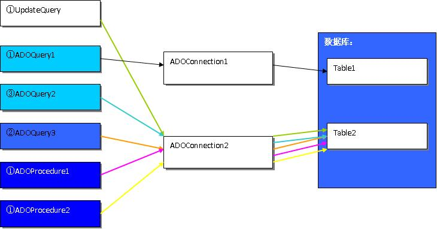
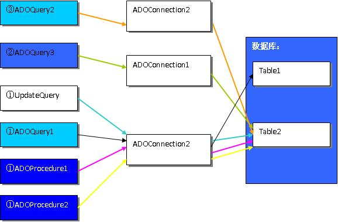

##前言：

几个月前接到一个任务：将一后台程序访问数据库的方式从BDE改为ADO，原因是由于业务量的增加，通过BDE不论是向数据库写入数据还是从数据库中读出数据的速度都变得无法忍受，大家都知道ADO在数据库访问速度方面比BDE要快的多了（我写了一个测试程序使用ADO比使用BDE快了近100倍!）。这个任务还不简单嘛，只要将BDE的控件更换成ADO的再修改一些代码不就搞定了！我当时确实是这么想的，而且用了不到一个小时就搞定，测试运行一段没问题，大功告成了，我想。谁知道一个恶梦就此开始，我的愚昧无知使我在程序中埋下了一个超级炸弹，它的威力不次于9.11撞击世贸大厦的两架客机，整个系统被它无情的催跨。程序在运行很长一段时间候捕获到一系列的异常：

```
OLE error 800A0E7F

Access violation at address 00135770.Write of address 005D8B78

Access violation at address 00178EC6. Readof address FFFFFFFF

Access violation at address 1F499BDD inmodule 'msado15.dll'. Read of address 0000000C
```

接下来我们的系统就像世贸大厦一下悲壮的倒下了。 

##为什么？

为什么？程序在为改动之前使用BDE运行得好好的，我并没有更改程序的结构啊？我十分的迷惑，当然要想解决问题一切都得从错误代码开始。

OLE error 800A0E7F：什么咚咚来的？它什么意思？什么原因引起的？我找了半天也没有在我的系统里找到它的说明，好在现在网络发达，也许有人遇到跟我一样的问题吧，于是我用OLE error 800A0E7F作为关键字搜了一下，嘿嘿，果真被我找到了：

>0x800A0E7FOperation cannot be performed while executing
> asynchronously.

异步执行时操作不能被执行（完成），还是不太清楚错误的原因，于是我在一个网站发布了帖子求助，一些人告诉我ADO线程不安全，需要线程同步，事实上我的程序做了同步，而且针对不同的应用使用了多个ADOConnection，我想我应该自己动手来好好研究一下这个问题了，它很意思。接下来我该好好分析我的程序并做一系列的测试来找到那个炸弹。 

##找出炸弹 

在我的程序里所有访问数据库都是通过一个DataModule单元TDataModule1类提供的接口来完成，共有三个线程使用到了TDataModule1的对象DataModule1，DataModule1是一全局变量，下面是数据库的访问模式的结构模型图。（实际结构要复杂很多）



说明：

* UpdateQuery    ADOQuery控件用来修改table2记录，①代表为线程1所有，
* 白色代表使用频率很低（颜色越深说明使用频率越高）
* ADOQuery2   查询table2，③代表为线程3所有，使用频率较高
* ADOQuery3 查询table2，③代表为线程2所有，使用频率很高
* ADOProcedure1   ADO存储过程控件向表table2插入数据，属于线程1频繁使用
* 修改ADOProcedure1插入的记录，属于线程1频繁使用
* 其中线程3和线程2使用ADO控件时没有加锁，而线程1的所有访问都加锁了（这样做毫无作用）

程序的结构出来了，问题在哪里呢？接下来我写了一个小小的测试程序，该程序的结构与上面相同，它拥有三个线程和一个DataMoule单元，线程一通过ADOQuery1查询数据库DBTest的table1的记录，线程二通过ADOQuery2向table1中插入记录，线程三通过ADOQuery3修改table1中最后一条记录的某个字段。ADOQuery1、ADOQuery2、ADOQuery3都通过ADOConnection1与数据库DBTest1建立连接，一开始，所有的线程都不做同步，运行，OK!错误出来了其中两个错误正是我所想要的，这就是我的程序报的错啊。

接下来我将三个ADOQuery都加上锁，再运行没问题，我又将ADOQuery分别通过三个不同的ADOConnection来连接数据库且不加锁也没有问题。看来我是找到那个可恶的炸弹了，怎么拆了它？ 

##排除炸弹 

炸弹找到了，我该怎么拆它？**是简单的做线程同步还是每个线程都是用一个ADOConnection？**这下我再也不敢蛮干了，我得好好看看这方面的资料，在Delphi帮助文档，《Usingthe main VCL thread》我找到了下面一段话：

>Data access components are thread-safe as long as each thread hasits own database session component. The one exception to this is when you areusing Access drivers. Access drivers are built using the Microsoft ADO library,which is not thread-safe.

同样在Delphi的帮助文档《Managingmultiple sessions》中给我明确的建议：

>If you create a single application that uses multiple threads toperform database operations, you must create one additional session for eachthread.

喔找到了：ADO控件是线程不安全的，所以如果你的程序是使用多线程访问数据库的话你应该确保每个线程都有自己的会话。

事实上在另外一本书《Delphi 4编程技术内幕》一书在谈到线程安全数据库访问也有相同的建议，不过台湾李维先生在他的《Delphi 5.X ADO/MTS/COM+高级程序设计篇》却说，如果你的程序不是连接多个数据库的话，最好同一数据库使用一个连接，不要使用多个连接。怎么办？谁对谁错？为什么要使用一个连接呢？这主要是从服务器来考虑，因为数据库服务器需要为每个连接分配一定的资源并对其进行维护，连接数越多服务器方所耗的资源就越多，服务器的性能也就越差，所以要尽可能的减少客户端的连接数。好在我的程序是作为服务器程序增加一些连接对数据库服务器的影响不会很大，现在我可以重新设置我的数据库访问结构模型了 



我增加了一个ADOConnection以保证每个线程都有一个自己连接(会话)，从而避免出现资源冲突，我的问题是不是解决了呢？是的，这个问题已经解决了，将我的程序与数据库放在同一台机器上运行没有问题，但是当程序与数据库服务器不在同一台机器上运行时会出现一个新的问题。 

>[DBNMPNTW]ConnectionWrite(writeFile())错误

这个错误不是多线程引起的，而是Micrsoft自己的一个问题，产生该问题的原因可能是因为网络异常而引起的，可以通过SQLServer客户端的默认的网络协议namedpipes network propocol 改为 TCP/IP Sockets，具体做法请参考Micrsoft技术支持网站的《Microsoft Knowledge Base Article - Q178040》 

##总结

由于ADO控件的线程不安全性（事实上这种不安全性是来自Micrsoft ADO Library，所以在其它开发工具中也存在同样的问题）因此在使用多线程ADO编程时应该注意一下问题： 

* 第一：要保证每个线程都拥有自己的会话。
* 第二：作为客户端程序应该尽可能的减少与数据库库服务器的连接数。
* 第三：在退出线程之前确保释放所有的资源。

##参考文献：

* 1、李维《Delphi 5.X ADO/MTS/COM+高级程序设计篇》机械工业出版社 2000。
* 2、CharlieCalvert《Delphi4编程技术内幕》潇湘工作室 译 机械工业出版社 1999。