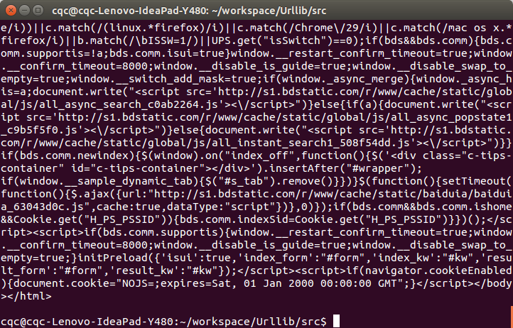

##Urllib库的基本使用

怎么扒网页内？其实就是根据URL来获取它的网页信息，虽然我们在浏览器中看到的是一幅幅优美的画面，但是其实是由浏览器解释才呈现出来的，其实质就是一段HTML代码，加JS、CSS，如果把网页比作一个人，那么HTML便是他的骨架，JS便是他的肌肉，CSS便是他的衣服。所以最重要的部分是存在于HTML中的，下面我们就写一个例子来扒一个网页下来

```
import urllib2

response = urllib2.urlopen("http://www.baidu.com")
print response.read()
```

是的，你没有看错，真正的程序就两行，把它保存成demo.py，进入该文件的目录，执行命令`python demo.py`查看运行效果



下面我们来简单分析一下这两行代码，第一行

```
response = urllib2.urlopen("http://www.baidu.com")
```

首先我们调用的是urllib2库里面的urlopen方法，传入一个URL，这个网址是百度首页，协议是HTTP协议，当然你也可以把HTTP换成FTP、FILE、HTTPs等等，只是代表一种访问控制协议，urlopen一般接受三个参数，它的参数如下：

```
urlopen(url, data, timeout)
```

第一个参数url就是URL，第二个参数data就是访问URL时要传送的数据，第三个timeout是设置超时时间

第二三个参数是可以不传的，data默认为空None，timeout默认是socket._GLOBAL_DEFAULT_TIMEOUT

第一参数URL是必须要传送的，在这个例子中我们传送的是百度的URL，执行urlopen方法之后，返回的是一个response对象，返回的信息便保存在这里面

```
print response.read()
```

response对象有一个read方法，可以返回取到的网页内容

如果不加read直接打印会怎么样？答案如下：

```
 <addinfourl at 139728495260376 whose fp = <socket._fileobject object at 0x7f1513fb3ad0>>
```

##构造Resquest

其实上面的urlopen参数可以传入一个request请求，它其实就是一个Request类的实例，构造是需传入URL、Data等等的内容，比如上面的两行代码，我们可以这个改写

```
import urllib2

request = urllib2.Request("http://www.baidu.com")
response = urllib2.urlopen(request)
print response.read()
```

运行的结果是完全一样的，只不过中间多了一个request对象，建议大家这么写，因为在构件请求时还需要假如好多内容，通过构建一个request，服务器响应请求得到应答，这样显得逻辑上清晰明确

##POST和GET数据传送

上面的程序演示了最基本的网页抓取，不过，现在大多数网站都是动态网页，需要你动态地传递参数给它，它做出对应的响应。所以，在访问时，我们需要传递数据局给它。最常见的情况是什么？对了，就是登陆注册的时候

把数据用户名和密码传送到一个URL，然后你得到服务器处理之后的响应，这个该怎么办？

数据传送分为POST和GET联两种方式，两种方式有什么区别呢？

最重要的区别是GET方法是直接以链接形式访问，链接中包含了所有的参数，当然如果包含了密码的话是一种不安全的选择，不过你可以直观地看到自己提交了什么内容。POST则不会在网址上显示所有的参数，不过如果你想直接查看提交了什么就不太方便了，大家可以酌情选择

**POST方式：**

上面我们说了data参数是干嘛的？对了，它就是用在这里的，我们传送的数据就是这个参数data，下面演示一下POST方式。

```
import urllib
import urllib2

values = {"username":"xumenger@126.com", "password":"XXXX"}
data = urllib.urlencode(values)
url = "https://passport.csdn.net/account/login?from=http://my.csdn.net/my/mycsdn"
request = urllib2.Request(url, data)
response = urllib2.urlopen(request)
print response.read()
```

我们引入了urllib库，现在我们模拟登录CSDN，当然上述代码可能登陆不进去，因为还要做一些设置头部header的工作，或者还有一些参数 没有设置全，还没有提及到在此就不写上去了，在此只是说明登录的原理。我们需要定义一个字典，名字为values，参数我设置了username和 password，下面利用urllib的urlencode方法将字典编码，命名为data，构建request时传入两个参数，url和data，运 行程序，即可实现登陆，返回的便是登陆后呈现的页面内容。当然你可以自己搭建一个服务器来测试一下。

注意上面字典的定义方式还有一种，下面的写法是等价的

```
import urllib
import urllib2
 
values = {}
values['username'] = "xumenger@126.com"
values['password'] = "XXXX"
data = urllib.urlencode(values) 
url = "http://passport.csdn.net/account/login?from=http://my.csdn.net/my/mycsdn"
request = urllib2.Request(url,data)
response = urllib2.urlopen(request)
print response.read()
```

以上方法便实现了POST方式的传送

**GET方式**

至于GET方式我们可以直接把参数写到网址上，直接构建一个带参数的URL出来即可

```
import urllib
import urllib2
values = {}
values["username"] = "xumenger@126.com"
values["password"] = "XXXX"
data = urllib.urlencode(values)
url = "http://passport.csdn.net/account/login"
geturl = url + "?" + data
request = urllib2.Request(geturl)
response = urllib2.urlopen(request)
print response.read()
```

你可以`print geturl`，打印输出一下URL，发现其实就是原来的url加?然后加编码后的参数

```
http://passport.csdn.net/account/login?username=xumenger@126.com&password=XXXX
```

和我们平常GET访问方式一模一样，这样就实现了数据的GET方式传送。

##Urllib库的高级用法

上面介绍的是urllib的基础用法，下面将会介绍urllib的高级用法

##设置Headers

有些网站不会同意程序直接用上面的方式进行访问，如果识别有问题，那么网站根本不会响应，所以为了完全模拟浏览器的工作，我们需要设置一些Headers的属性

首先，打开我们的浏览器，调试浏览器F12，我用的是Chrome，打开网络监听，示意如下：比如知乎，点登陆之后，我们会发现登陆之后界面都变化了，出现一个新的界面，实质上这个页面包含了许许多多的内容，这些内容也不是一次性就加载完成的，实质是执行了好多次请求，一般是首先请求HTML文件，然后加载JS、CSS等等，经过多次请求之后，网页的骨架和肌肉全了，整个网页的效果也就出来了

拆分整个请求，我们只看第一个请求，可以看到，有一个Request URL，还有headers，下面便是response，图片显示的不全，小伙伴们可以亲身试一下。那么这个头中包含了许许多多的信息，有文件编码、压缩方式、请求的agent等等

其中，agent就是请求的身份，如果写入请求身份，那么服务器不一定会响应，所以可以在headers中设置agent，例如下面的例子，这个例子只是说明了怎么设置headers，看一下设置格式就好

```
import urllib
import urllib2

url = 'http://www.server.com/login'
user_agent = 'Mozilla/4.0 (compatible; MSTE 5.5; Windows NT)'
values = {'username':'cqc', 'password':'XXXX'}
headers = {'User-Agent':user_agent}
data = urllib.urlencode(values)
request = urllib2.Request(url, data, headers)
response = urllib2.urlopen(request)
page = response.read()
```

这样，我们设置了一个headeres，在构建request时传入，在请求时，就加入了headers传入，服务器若识别了是浏览器发出的请求，就会得到响应

另外，我们还有对付“反盗链”的方式，对付反盗链，服务器会识别headers中的referer是不是它自己，如果不是，有的服务器就不会响应，所以我们还可以在headers中加入referer

假如我们可以构建下面的headers

```
headers = {'User-Agent':'Mozilla/4.0 (compatible; MSTE 5.5; Windows NT)', 'Referer':'http://www.zhihu.com/articles'}
```

同上面的方法，在传送请求时将headers传入Request参数中，这样就能应对防反盗链了

另外，headers的一些属性，下面的需要特别注意一下

* User-Agent : 有些服务器或 Proxy 会通过该值来判断是否是浏览器发出的请求
* Content-Type : 在使用 REST 接口时，服务器会检查该值，用来确定 HTTP Body 中的内容该怎样解析。
* application/xml ： 在 XML RPC，如 RESTful/SOAP 调用时使用
* application/json ： 在 JSON RPC 调用时使用
* application/x-www-form-urlencoded ： 浏览器提交 Web 表单时使用
在使用服务器提供的 RESTful 或 SOAP 服务时， Content-Type 设置错误会导致服务器拒绝服务

其他的有必要的可以审查浏览器的headers内容，在构建时写入同样的数据即可

##Proxy（代理）的设置

urllib2默认会使用环境变量http_proxy来设置HTTP Proxy。假如一个网站它会检测某一段时间某个IP的访问次数，如果访问次数过多，它会禁止你的访问。所以你可以设置一些代理服务器来帮助你做工作，每隔一段时间换一个代理，网站君都不知道是谁在捣鬼了

下面一段代码说明了代理的设置用法

```
import urllib2
enable_proxy = True
proxy_handler = urllib2.ProxyHandler({"http":"http://some-proxy.com:8080"})
null_proxy_handler = urllib2.ProxyHanlder({})
if enbale_proxy:
	opener = urllib2.build_opener(proxy_handler)
else:
	opener = urllib2.build_opener(null_proxy_handler)
urllib2.install_opener(opener)
```

##Timeout的设置

上一节已经说过urlopen方法了，第三个参数就是timeout的设置，可以设置等待多久超时，为了解决一些网站实在响应过慢而造成的影响

例如下面的代码，如果第二个参数data为空那么要特别指定timeout是多少，写明形参，如果data已经传入，则不必声明

```
import urllib2
response = urllib2.urlopen("http://www.baidu.com", timeout=10)
```

```
import urllib2
response = urllib2.urlopen('http://www.baidu.com',data, 10)
```

##使用HTTP的PUT和DELETE方法

http协议有六种请求方式，get、head、put、delete、post、options，我们有时候需要用到PUT或者DELETE方式请求

* PUT：这个方法比较少见。HTML表单也不支持这个。本质上来讲， PUT和POST极为相似，都是向服务器发送数据，但它们之间有一个重要区别，PUT通常指定了资源的存放位置，而POST则没有，POST的数据存放位置由服务器自己决定。
* DELETE：删除某一个资源。基本上这个也很少见，不过还是有一些地方比如amazon的S3云服务里面就用的这个方法来删除资源。

如果要使用HTTP PUT和DELETE，只能使用比较底层的httplib库。虽然如此，我们还是能通过下面的方式，使urllib2能够发出PUT或DELETE请求，不过用的次数确实少，在这里提一下

```
import urllib2
request = urllib2.Request(rui, data=data)
request.get_method=lambda:'PUT' # or 'DELETE'
response = urllib2.urlopen(request)
```

##使用DebugLog

可以通过下面的方法把DebugLog打开，这样收发包的内容就会在屏幕上打印出来，方便调试，这个也不太常用，仅提一下

```
import urllib2
hrrpHandler = urllib2.HTTPHandler(debuglevel=1)
httpsHandler = urllib2.HTTOSHandler(debuglevel=1)
opener = urllib2.build_opener(httpHandler, httpsHandler)
urllib2.install_opener(opener)
response = urllib2.urlopen('http://www.baidu.com')
```

以上便是一部分的高级特性，前三个是重要内容。在后面，还有cookies的设置还有异常处理
