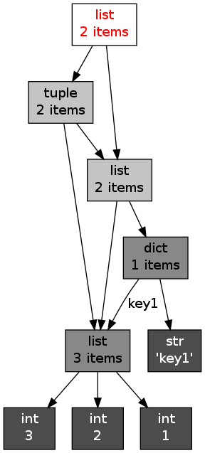
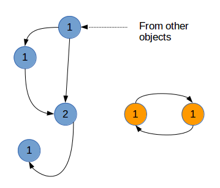

转载自[Vamei：Python深入06 Python的内存管理](http://www.cnblogs.com/vamei/p/3232088.html)

语言的内存管理是语言设计的一个重要方面。它是决定语言性能的重要因素。无论是C语言的手工管理，还是Java的垃圾回收，都成为语言最重要的特征。这里以Python语言为例子，说明一门动态类型的、面向对象的语言的内存管理方式。

##对象的内存管理

赋值语句是语言最常见的功能了。**但即使是最简单的赋值语句，也可以很有内涵，其中也包含着很深的原理和机制**。Python的赋值语句就很值得研究。

```
a = 1
```

整数1为一个对象。而a是一个引用。利用赋值语句，引用a指向对象1。Python是动态类型的语言(参考动态类型)，对象与引用分离。Python像使用“筷子”那样，通过引用来接触和翻动真正的食物——对象。

为了探索对象在内存的存储，我们可以求助于Python的内置函数id()。它用于返回对象的身份(identity)。其实，这里所谓的身份，就是该对象的内存地址。

```
a = 1

print(id(a))
print(hex(id(a)))
```

在我的计算机上，它们返回的是:

```
11246696
'0xab9c68'
```

分别为内存地址的十进制和十六进制表示。

在Python中，整数和短小的字符，Python都会缓存这些对象，以便重复使用。当我们创建多个等于1的引用时，实际上是让所有这些引用指向同一个对象。

```
a = 1
b = 1

print(id(a))
print(id(b))
```

上面程序返回

```
11246696
11246696
```

可见a和b实际上是指向同一个对象的两个引用。

为了检验两个引用指向同一个对象，我们可以用is关键字。is用于判断两个引用所指的对象是否相同。

```
# True
a = 1
b = 1
print(a is b)

# True
a = "good"
b = "good"
print(a is b)

# False
a = "very good morning"
b = "very good morning"
print(a is b)

# False
a = []
b = []
print(a is b)
```

上面的注释为相应的运行结果。可以看到，由于Python缓存了整数和短字符串，因此每个对象只存有一份。比如，所有整数1的引用都指向同一对象。即使使用赋值语句，也只是创造了新的引用，而不是对象本身。长的字符串和其它对象可以有多个相同的对象，可以使用赋值语句创建出新的对象。

>**在Python中，每个对象都有存有指向该对象的引用总数，即引用计数(reference count)。**

我们可以使用sys包中的getrefcount()，来查看某个对象的引用计数。需要注意的是，当使用某个引用作为参数，传递给getrefcount()时，参数实际上创建了一个临时的引用。因此，getrefcount()所得到的结果，会比期望的多1。

```
from sys import getrefcount

a = [1, 2, 3]
print(getrefcount(a))

b = a
print(getrefcount(b))
```

由于上述原因，两个getrefcount将返回2和3，而不是期望的1和2。

##对象引用对象

Python的一个容器对象(container)，比如表、词典等，可以包含多个对象。**实际上，容器对象中包含的并不是元素对象本身，是指向各个元素对象的引用。**

我们也可以自定义一个对象，并引用其他对象：

```
class from_obj(object):
    def __init__(self, to_obj):
        self.to_obj = to_obj
        
b = [1,2,3]
a = from_obj(b)
print(id(a.to_obj))
print(id(b))
```

可以看到，a引用了对象b。

对象引用对象，是Python最基本的构成方式。即使是a = 1这一赋值方式，实际上是让词典的一个键值"a"的元素引用整数对象1。该词典对象用于记录所有的全局引用。该词典引用了整数对象1。我们可以通过内置函数globals()来查看该词典。

当一个对象A被另一个对象B引用时，A的引用计数将增加1。

```
from sys import getrefcount

a = [1,2,3]
print(getrefcount(a))

b = [a, a]
print(getrefcount(a))
```

由于对象b引用了两次a，a的引用计数增加了2。

容器对象的引用可能构成很复杂的拓扑结构。我们可以用objgraph包来绘制其引用关系，比如

```
x = [1,2,3]
y = [x, dict(key1 = x)]
z = [y, (x, y)]

import objgraph
objgraph.show_refs([z], filename = 'fer_topo.png')
```



objgraph是Python的一个第三方包。安装之前需要安装xdot。

```
sudo apt-get install xdot
sudo pip install objgraph
```

[objgraph官网](http://mg.pov.lt/objgraph/)

两个对象可能相互引用，从而构成所谓的引用环(reference cycle)。

```
a = []
b = [a]
a.append(b)
```

即使是一个对象，只需要自己引用自己，也能构成引用环。

```
a = []
a.append(a)
print(getrefcount(a))
```

引用环会给垃圾回收机制带来很大的麻烦，我将在后面详细叙述这一点。

##引用减少

某个对象的引用计数可能减少。比如，可以使用del关键字删除某个引用:

```
from sys import getrefcount

a = [1, 2, 3]
b = a
print(getrefcount(b))

del a
print(getrefcount(b))
```

del也可以用于删除容器元素中的元素，比如:

```
a = [1,2,3]
del a[0]
print(a)

#输出
[2,3]
```

如果某个引用指向对象A，当这个引用被重新定向到某个其他对象B时，对象A的引用计数减少:

```
from sys import getrefcount

a = [1, 2, 3]
b = a
print(getrefcount(b))

a = 1
print(getrefcount(b))
```

##垃圾回收

吃太多，总会变胖，Python也是这样。当Python中的对象越来越多，它们将占据越来越大的内存。不过你不用太担心Python的体形，它会乖巧的在适当的时候“减肥”，启动垃圾回收(garbage collection)，将没用的对象清除。在许多语言中都有垃圾回收机制，比如Java和Ruby。尽管最终目的都是塑造苗条的提醒，但不同语言的减肥方案有很大的差异 (这一点可以对比本文和[Java内存管理与垃圾回收](http://www.cnblogs.com/vamei/archive/2013/04/28/3048353.html))。

从基本原理上，当Python的某个对象的引用计数降为0时，说明没有任何引用指向该对象，该对象就成为要被回收的垃圾了。比如某个新建对象，它被分配给某个引用，对象的引用计数变为1。如果引用被删除，对象的引用计数为0，那么该对象就可以被垃圾回收。比如下面的表:

```
a = [1, 2, 3]
del a
```

del a后，已经没有任何引用指向之前建立的[1, 2, 3]这个表。用户不可能通过任何方式接触或者动用这个对象。这个对象如果继续待在内存里，就成了不健康的脂肪。当垃圾回收启动时，Python扫描到这个引用计数为0的对象，就将它所占据的内存清空。

然而，减肥是个昂贵而费力的事情。垃圾回收时，Python不能进行其它的任务。频繁的垃圾回收将大大降低Python的工作效率。如果内存中的对象不多，就没有必要总启动垃圾回收。所以，Python只会在特定条件下，自动启动垃圾回收。当Python运行时，会记录其中分配对象(object allocation)和取消分配对象(object deallocation)的次数。当两者的差值高于某个阈值时，垃圾回收才会启动。

我们可以通过gc模块的get_threshold()方法，查看该阈值:

```
import gc
print(gc.get_threshold())
```

返回(700, 10, 10)，后面的两个10是与分代回收相关的阈值，后面可以看到。700即是垃圾回收启动的阈值。可以通过gc中的set_threshold()方法重新设置。

我们也可以手动启动垃圾回收，即使用gc.collect()。

##分代回收

Python同时采用了分代(generation)回收的策略。这一策略的基本假设是，存活时间越久的对象，越不可能在后面的程序中变成垃圾。我们的程序往往会产生大量的对象，许多对象很快产生和消失，但也有一些对象长期被使用。出于信任和效率，对于这样一些“长寿”对象，我们相信它们的用处，所以减少在垃圾回收中扫描它们的频率。

Python将所有的对象分为0，1，2三代。所有的新建对象都是0代对象。当某一代对象经历过垃圾回收，依然存活，那么它就被归入下一代对象。垃圾回收启动时，一定会扫描所有的0代对象。如果0代经过一定次数垃圾回收，那么就启动对0代和1代的扫描清理。当1代也经历了一定次数的垃圾回收后，那么会启动对0，1，2，即对所有对象进行扫描。

这两个次数即上面get_threshold()返回的(700, 10, 10)返回的两个10。也就是说，每10次0代垃圾回收，会配合1次1代的垃圾回收；而每10次1代的垃圾回收，才会有1次的2代垃圾回收。

同样可以用set_threshold()来调整，比如对2代对象进行更频繁的扫描。

```
import gc
gc.set_threshold(700, 10, 5)
```

##孤立的引用环

引用环的存在会给上面的垃圾回收机制带来很大的困难。这些引用环可能构成无法使用，但引用计数不为0的一些对象。

```
a = []
b = [a]
a.append(b)

del a
del b
```

上面我们先创建了两个表对象，并引用对方，构成一个引用环。删除了a，b引用之后，这两个对象不可能再从程序中调用，就没有什么用处了。但是由于引用环的存在，这两个对象的引用计数都没有降到0，不会被垃圾回收。



为了回收这样的引用环，Python复制每个对象的引用计数，可以记为gc_ref。假设，每个对象i，该计数为gc_ref_i。Python会遍历所有的对象i。对于每个对象i引用的对象j，将相应的gc_ref_j减1。下图是对于引用环遍历后的结果


在结束遍历后，gc_ref不为0的对象，和这些对象引用的对象，以及继续更下游引用的对象，需要被保留。而其它的对象则被垃圾回收。

##总结

Python作为一种动态类型的语言，其对象和引用分离。这与曾经的面向过程语言有很大的区别。为了有效的释放内存，Python内置了垃圾回收的支持。Python采取了一种相对简单的垃圾回收机制，即引用计数，并因此需要解决孤立引用环的问题。Python与其它语言既有共通性，又有特别的地方。对该内存管理机制的理解，是提高Python性能的重要一步。