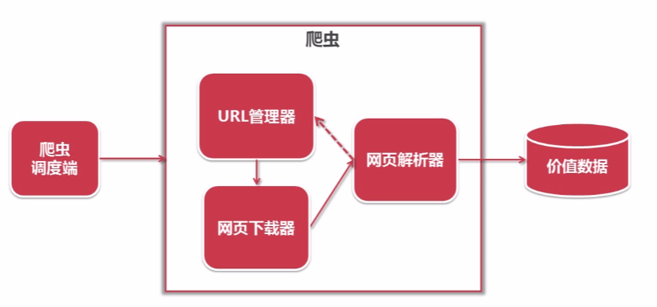
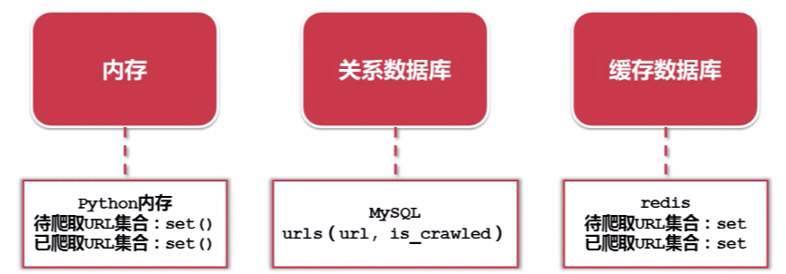
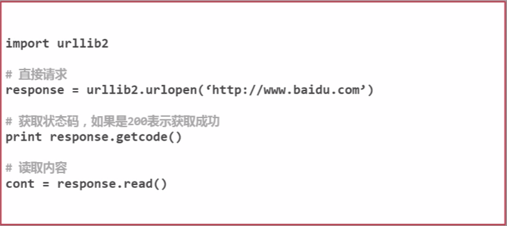

##简介

* 本文是在通过慕课网的[《Python开发简单爬虫》](http://www.imooc.com/learn/563)时顺便整理的
* 相关的图片也是来自该课程截图
* 通过该教材学习一个简单的Python爬虫开发，对于复杂的爬虫暂时没有学到
* 复杂的爬虫需考虑更多的场景：比如需要登录后才可以爬取、有的网页内容是使用js异步更新的
* 目前只是考虑的场景只有静态网页的内容抓取

##爬虫简介

* 爬虫是一段自动抓取互联网信息的程序
* 爬虫就是自动爬取互联网，提取有意义数据的程序
* 爬虫的价值：互联网数据，为我所用


##简单爬虫架构

* 爬虫调度端：来启动爬虫、停止爬虫、监视爬虫的运行情况
* URL管理器：对将要爬取的和已经爬取的URL进行管理
* 网页下载器：从URL管理器中获取一个将要爬取的URL，传给网页下载器，将URL指向的网页下载并存储为一个字符串
* 网页解析器：将网页下载器下载下来的字符串进行解析，一方面获取价值数据，另一方面每个URL中往往还有指向其他页面的URL，需要补充到URL管理器中
* 上面的逻辑就形成了一个循环，只要有相关联的URL，就可以一直运行下去
* 这个简单的爬虫架构的运行，就可以将互联网上相关联的所有网页都爬取下来



##简单爬虫架构的运行流程

* 调度器询问URL管理器是否有待爬取的URL？
* URL管理器返回是/否？
* 如果是，调度器会从URL管理器中获取一个待爬取的URL
* URL管理器将URL返回给调度器
* 调度器将URL传给下载器对网页内容进行下载
* 下载好后下载器将URL内容返回给调度器
* 调度器将URL内容传递给解析器进行网页的解析
* 解析之后将价值数据和新的URL列表传给调度器
* 一方面调度器会将价值数据传递给应用进行数据的收集
* 另一方面将新的URL列表补充进URL管理器
* 如果URL管理器中还有未爬取的URL，那么将会一直执行上面的循环，直到爬取完所有URL
* 最后调度器会调用应用的方法将价值数据进行输出，将价值数据输出到需要的格式


##URL管理器

* URL管理器用来管理待抓取URL集合和已抓取URL集合
* 防止重复抓取和循环抓取，因为每个网页都有很多指向其他网页的URL，其他网页也有指向本网页的URL，就可能存在URL循环指向的问题
* URL管理器需要支持的最小功能范围
	* 添加新的URL到待爬取集合中
	* 判断待添加的URL是否已经存在容器中
	* 从容器中获取一个待爬取的URL
	* 判断容器中还有没有待爬取的URL
	* 将URL从待爬取集合移动到已爬取集合


* URL管理器实现方式
	* 将已爬取和未爬取的URL集合都存储在内存中，使用Python的set类型，是因为Python的set类型可以自动去除集合中重复的数据元素
	* 使用关系数据库，比如在MySQL中建立一张表，有两个字段：URL、is_crawled，表示URL和是否被抓取过
	* 缓存数据库，比如使用redis，redis本身就支持set数据结构
	* 目前大型的网络公司因为redis的性能比较高，一般都是要redis，其实使用关系型数据库对于一般的开发也就够了



##网页下载器

* 使用Python自带的urllib2模块
* 将互联网上URL对应的网页下载到本地的工具，因为将网页下载到本地才能进行后续的分析和处理
* 类似于网页浏览器
* 将URL对应的网页下载到本地存储为本地文件或者内存字符串，然后才能进行分析


* Python的网页下载器
	* urllib2：支持直接的URL网页下载，或者向网页发送一些需要用户输入的数据，甚至支持需要登录网页的cookie处理、需要代理访问的代理处理
	* requests：第三方插件，功能更强大
* urllib2三种下载网页的方法，分别给出对应代码
	* 最简洁的方法：
	


	* 添加data、http header：
	


	* 添加特殊情景的处理器：img10
	


		* 有些网页需要用户登录才能处理，需要cookie的处理，可以使用HTTPCookieProcessor
		* 有的网页需要代理才能访问，使用ProxyHandler
		* 有些网页使用https加密访问，使用HTTPSHandler
		* 有些网页，它的URL是相互自动的跳转关系，使用HTTPRedirectHandler
		


* urllib2实例代码：在ubuntu上测试，新建test.py，输入以下代码，执行python test.py执行
* 如果网络不好的情况下，可以发现执行的速度会很慢

```
# coding:utf8
import urllib2
import cookielib

url = "http://www.baidu.com"

print "第一种方法"
response1 = urllib2.urlopen(url)
print response1.getcode()
print len(response1.read())

print "第二种方法"
request = urllib2.Request(url)
request.add_header("user_agent", "Mozilla/5.0") #伪装成一个浏览器
response2 = urllib2.urlopen(request)
print response2.getcode()
print len(response2.read())

print "第三种方法"
cj = cookielib.CookieJar()
opener = urllib2.build_opener(urllib2.HTTPCookieProcessor(cj))
urllib2.install_opener(opener)
response3 = urllib2.urlopen(url)
print response3.getcode()
print cj
print response3.read()
```

##网页解析器

* 使用第三方插件BeautifulSoup
* 将互联网上的网页爬取到本地后，需要对它们进行解析才能提取出需要的内容
* 网页解析器是从网页中提取出有价值数据的工具
* img11
* Python有哪些网页解析器：正则表达式、html.parser、BeautifulSoup、lxml
* 正则表达式是一种模糊匹配的方式
* 其他三种使用的是结构化的解析
	* 将整个网页文档下载成一个DOM（Document Object Model）树
	* img12
	* 使用这种方式，DOM就像整个文档加载成一个树形结构，使用树形的上下级关系可以很方便的定位到每个元素，访问这个元素的属性、文本……
* [BeautifulSoup官网](https://www.crummy.com/software/BeautifulSoup/bs4/doc/)
* BeautifulSoup安装
	* 安装：pip install BeautifulSoup4
	* 测试：import bs4
* BeautifulSoup的语法
	* 根据一个下载好的html网页字符串可以创建一个BeautifulSoup对象，创建这个对象的同时就将整个html字符串加载成一个DOM树，然后根据这个DOM树搜索节点（find_all、find）
	* find_all会搜索到所有满足条件的节点
	* find只会搜索第一个满足条件的节点
* img13
	* 针对img14中的html字符串进行解析的代码
	* 创建BeautifulSoup对象：img15
	* 搜索节点（find_all、find）：img16
	* 访问节点信息：img17
* BeautifulSoup实例测试

```
# coding:utf8

from bs4 import BeautifulSoup
import re

html_doc = """
<html><head><title>The Dormouse's story</title></head>
<body>
<p class="title"><b>The Dormouse's story</b></p>

<p class="story">Once upon a time there were three little sisters; and their names were
<a href="http://example.com/elsie" class="sister" id="link1">Elsie</a>,
<a href="http://example.com/lacie" class="sister" id="link2">Lacie</a> and
<a href="http://example.com/tillie" class="sister" id="link3">Tillie</a>;
and they lived at the bottom of a well.</p>

<p class="story">...</p>
"""

soup = BeautifulSoup(html_doc, 'html.parser', from_encoding='utf-8')

print '获取所有链接'
links = soup.find_all('a')
for link in links:
    print link.name, link['href'], link.get_text()

print '获取lacie的链接'
link_node = soup.find('a', href='http://example.com/lacie')
print link_node.name, link_node['href'], link_node.get_text()

print '正则表达式模糊匹配'
link_node = soup.find('a', href=re.compile(r"ill"))
print link_node.name, link_node['href'], link_node.get_text()

print '获取p段落文字'
p_node = soup.find('p', class_='title')
print p_node.name, p_node.get_text()
```

##完整实例

* 抓取百度百科Python词条相关的1000个页面数据，然后保存到一个html文件中