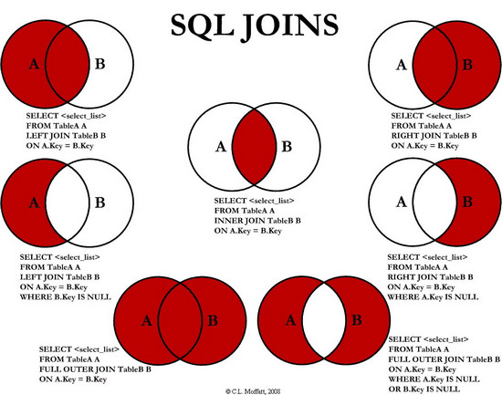

##说明

* 参考[《SQL的四种连接-左外连接、右外连接、内连接、全连接》](http://www.cnblogs.com/afirefly/archive/2010/10/08/1845906.html)
* 不说废话，直接通过例子看效果



##基础数据准备

**创建两张用于测试的表**

```
--用户表
create table test_user(id int, name varchar(10));

--工作信息表
create table test_job(id int, job varchar(10));
```

**分别插入两条测试数据**

```
--往用户表中插入数据
insert into test_user values(1, '张三');
insert into test_user values(2, '李四');
insert into test_user values(3, '王五');

--往工作表中插入数据
insert into test_job values(1, '医生');
insert into test_job values(2, '律师');
insert into test_job values(4, '神仙');

```

##内连接

* 内连接（典型的连接运算，使用像 =  或 <> 之类的比较运算符）。
* 包括相等连接和自然连接。
* 内连接使用比较运算符根据每个表共有的列的值匹配两个表中的行。

```
SQL> select a.*, b.* from test_user a inner join test_job b on a.id = b.id;
                                     ID NAME                                            ID JOB
--------------------------------------- ---------- --------------------------------------- ----------
                                      1 张三                                             1 医生
                                      2 李四                                             2 律师

```

等价于

```
SQL> select a.*, b.* from test_user a, test_job b where a.id = b.id;
                                     ID NAME                                            ID JOB
--------------------------------------- ---------- --------------------------------------- ----------
                                      1 张三                                             1 医生
                                      2 李四                                             2 律师

```

连接的时候 on 和 普通的 where 一样，可以使用 and 和 or 关联多个条件，比如下面的SQL

```
SQL> select a.*, b.* from test_user a inner join test_job b on a.id = b.id and a.id = 1;
                                     ID NAME                                            ID JOB
--------------------------------------- ---------- --------------------------------------- ----------
                                      1 张三                                             1 医生

```

##外连接

* left join 或 left outer join
  * 左向外联接的结果集包括  left outer子句中指定的左表的所有行，而不仅仅是联接列所匹配的行。
  * 如果左表的某行在右表中没有匹配行，则在相关联的结果集行中右表的所有选择列表列均为空值。       
* right join 或 right outer  join
  * 右向外联接是左向外联接的反向联接。将返回右表的所有行。
  * 如果右表的某行在左表中没有匹配行，则将为左表返回空值。 
* full join 或 full outer join
  * 完整外部联接返回左表和右表中的所有行。
  * 当某行在另一个表中没有匹配行时，则另一个表的选择列表列包含空值。
  * 如果表之间有匹配行，则整个结果集行包含基表的数据值。

##左(外)连接

使用**left join**和使用**left outer join**的效果相同

```
SQL> select a.*, b.* from test_user a left join test_job b on a.id = b.id;
                                     ID NAME                                            ID JOB
--------------------------------------- ---------- --------------------------------------- ----------
                                      1 张三                                             1 医生
                                      2 李四                                             2 律师
                                      3 王五                                              nil

```

左(外)连接的时候，from后面的表或视图的顺序很重要

```
SQL> select a.*, b.* from test_job b left join test_user a on a.id = b.id;
                                     ID NAME                                            ID JOB
--------------------------------------- ---------- --------------------------------------- ----------
                                      1 张三                                             1 医生
                                      2 李四                                             2 律师
                                        nil                                              4 神仙
```

##右(外)连接

使用**right join**和使用**right outer join**的效果相同

```
SQL> select a.*, b.* from test_user a right join test_job b on a.id = b.id;
                                     ID NAME                                            ID JOB
--------------------------------------- ---------- --------------------------------------- ----------
                                      1 张三                                             1 医生
                                      2 李四                                             2 律师
                                       nil                                               4 神仙

```

右(外)连接的时候，from后面的表或视图的顺序很重要

```
SQL> select a.*, b.* from test_job b right join test_user a on a.id = b.id;
                                     ID NAME                                            ID JOB
--------------------------------------- ---------- --------------------------------------- ----------
                                      1 张三                                             1 医生
                                      2 李四                                             2 律师
                                      3 王五                                              nil 
```

##全(外)连接

使用**full join**和使用**full outer join**的效果相同

```
SQL> select a.*, b.* from test_user a full join test_job b on a.id = b.id;
                                     ID NAME                                            ID JOB
--------------------------------------- ---------- --------------------------------------- ----------
                                      1 张三                                             1 医生
                                      2 李四                                             2 律师
                                        nil                                              4 神仙
                                      3 王五                                               nil

```

##交叉连接

* 交叉连接返回左表中所有的行，左表中的每一行与右表中的所有行组合。交叉连接又称作笛卡尔积。
* from 子句中的表或视图可通过内连接或完全外连接按任意顺序制定
* 但是，用左或右外连接指定表或视图时，表或视图的顺序很重要。

**SQL 1**

```
SQL> select * from test_user cross join test_job;
                                     ID NAME                                            ID JOB
--------------------------------------- ---------- --------------------------------------- ----------
                                      1 张三                                             1 医生
                                      2 李四                                             1 医生
                                      3 王五                                             1 医生
                                      1 张三                                             2 律师
                                      2 李四                                             2 律师
                                      3 王五                                             2 律师
                                      1 张三                                             4 神仙
                                      2 李四                                             4 神仙
                                      3 王五                                             4 神仙
9 rows selected

```

**SQL 2：可以看出搜索结果和from后面的表顺序有关**

```
SQL> select * from test_job cross join test_user;
                                     ID JOB                                             ID NAME
--------------------------------------- ---------- --------------------------------------- ----------
                                      1 医生                                             1 张三
                                      2 律师                                             1 张三
                                      4 神仙                                             1 张三
                                      1 医生                                             2 李四
                                      2 律师                                             2 李四
                                      4 神仙                                             2 李四
                                      1 医生                                             3 王五
                                      2 律师                                             3 王五
                                      4 神仙                                             3 王五
9 rows selected

```

**SQL 3：下面的where语句格式等价SQL 1交叉连接**

```
SQL> select * from test_user, test_job;
                                     ID NAME                                            ID JOB
--------------------------------------- ---------- --------------------------------------- ----------
                                      1 张三                                             1 医生
                                      2 李四                                             1 医生
                                      3 王五                                             1 医生
                                      1 张三                                             2 律师
                                      2 李四                                             2 律师
                                      3 王五                                             2 律师
                                      1 张三                                             4 神仙
                                      2 李四                                             4 神仙
                                      3 王五                                             4 神仙
9 rows selected

```

**SQL 3：下面的where语句格式等价SQL 2交叉连接**

```
SQL> select * from test_job, test_user;
                                     ID JOB                                             ID NAME
--------------------------------------- ---------- --------------------------------------- ----------
                                      1 医生                                             1 张三
                                      2 律师                                             1 张三
                                      4 神仙                                             1 张三
                                      1 医生                                             2 李四
                                      2 律师                                             2 李四
                                      4 神仙                                             2 李四
                                      1 医生                                             3 王五
                                      2 律师                                             3 王五
                                      4 神仙                                             3 王五
9 rows selected

```

**补充说明 & 扩展了解**

```
select * from test_job left cross join test_user;
select * from test_job full cross join test_user;
select * from test_job right cross join test_user;
select * from test_job inner cross join test_user;

执行上面这几种SQL的搜索结果和下面的SQL相同
select * from test_job cross join test_user;
```
