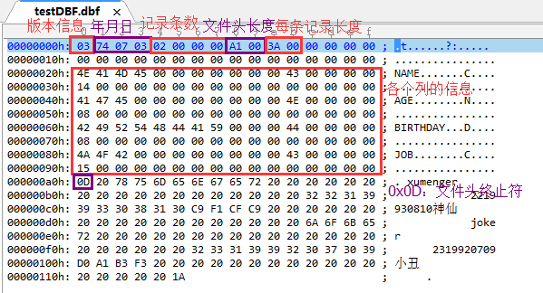
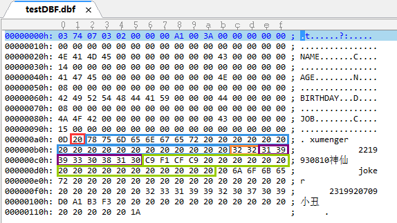
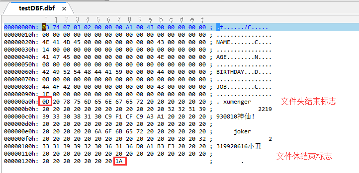

##参考文章

* [《DBF文件格式说明》](http://blog.csdn.net/xwebsite/article/details/6912146)
* [《DBF文件数据结构实例分析》](http://blog.csdn.net/xwebsite/article/details/6912151)
* [《DBF文件读取与写入程序设计》](http://blog.csdn.net/xwebsite/article/details/6912157)
* [《Delphi的Ord函数和ASCII码对照表》](http://www.xumenger.com/delphi-ord-20160222/)

##基础数据准备

使用DBF View工具新建一个DBF文件，可以点击[这里](../download/20160703/testDBF.dbf)进行下载：

首先该文件有4个字段，如下图：

详细说明

* NAME：姓名、Char类型、20字节长度限制
* AGE：年龄、Int类型，长度限制为8
* BIRTHDAY：生日、Date类型，长度为8
* JOB：工作、Char类型，长度限制是21

文件有2条记录，记录内容如下图

##DBF总体介绍

DBF文件是一种以二进制进行存储的表格数据文件，其文件内部有着严格的格式要求，具体的由文件头和记录项组成。其中文件头中包括的相关信息。DBF文件的数据结构如下：

##DBF文件头分析

以上面的DBF文件为例，讲解一下DBF的头文件结构！先使用Ultra Edit工具打开该DBF文件：

我们可以看到上面的截图中，使用Ultra Edit打开DBF文件后会显示3部分：

* 第一部分(红框)是标记这一行的开始地址，是十六进制表示法
* 第二部分(蓝框)是表示每个字节的值，是十六进制表示
* 第三部分(黄色)是表示和第二部分的十六进制一一对应的ASCII码的值

简单了解了Ultra Edit编辑器打开DBF文件后显示的结构，就继续接下来的分析：

* 第0个字节表示当前的DBF版本信息
	* 该文件的值是十六进制'03'，表示是FoxBASE+/Dbase III plus, no memo
* 1~3字节，表示最新的更新日期，按照YYMMDD格式
	* 第一个字节的值 = 保存时的年 - 1990
	* 第二个字节的值 = 保存时的月
	* 第三个字节的值 = 保存时的日
	* 该文件的第一个字节是十六进制74，对应十进制116,116+1990正好等于当前的年2016
	* 第二个字节是十六进制07，对应十进制07，第三个字节是03，正好今天是7月3日
* 4~7字节，Int32类型，表示DBF文件中有多少条记录
	* 可以看到值是02，正好当前文件确实只有两条记录
* 8~9，Int16类型，表示当前DBF的文件头占用的字节长度
	* 该文件对应的值是十六进制的A1，对应十进制161
* 10~11，Int16类型，表示一条记录中的字节长度，即每行数据所占的长度
	* 该文件的值是十六进制数3A，对应十进制的58
	* 创建该文件时，一共4个字段，分别长度是20、8、8、21
	* 计算4个列的长度和是57，比58少1
	* 多出来的一个字节在每条记录最开始存储十六进制数20，也就是空格作为每行的开始
* 12~13，2个字节，保留字节，用于以后添加新的说明性信息时使用，这里用0来填写
* 14，1个字节，表示未完成的操作
* 15，1个字节，dBASE IV编密码标记
* 16~27，12个字节，保留字节用于多用户处理时使用
* 28，1个字节，DBF文件的MDX标识
	* 在创建一个DBF表时，如果使用MDX格式的索引文件，那么DBF的表头中的这个字节就自动被设置一个标志
	* 当你下次试图重新打开这个DBF表的时候，数据引擎会自动识别这个标识
	* 如果此标示为真，则数据引擎将试图打开相应MDX文件
* 29，1个字节，页码标记
* 30~31，2个字节，保留字节，用于以后添加新的说明性信息时使用，这里用0来填写。
* 32~N(x*32)，这段长度由表格中的列数（即字段数）决定
	* 每个字段的长度为32，如果有x列，则占用的长度为x * 32
	* 这每32个字节里面又按其规则填写每个字段的名称、类型等信息
* N+1，1个字节，作为字段定义的终止标志，值为0x0D

详细见下图中的标注：

##每个字段信息的定义格式

|  位置  |  内容  |  说明  |
|--------|--------|--------|
|  0~10  |11个字节|字段的名称，是ASCII码值|
|   11   |1个字节 |字段的数据类型，C字符、N数字、D日期、B二进制、等|
| 12~15  |4个字节 |保留字节，用于以后添加新的说明性信息时使用，默认为0|
|  16    |1个字节 |字段的长度，表示该字段对应的值在后面的记录中所占的长度|
|  17    |1个字节 |字段的精度|
| 18~19  |2个字节 |保留字节，用于以后添加新的说明性信息时使用，默认为0|
|  20    |1个字节 |工作区ID|
| 21~31  |11个字节|保留字节，用于以后添加新的说明性信息时使用，默认为0|

##分析DBF中的记录

以下面的这条记录分析为例，其使用DBF查看工具打开是这样的：

对应用Ultra Edit打开后，用不同的颜色标记该记录的不同字段：

* 红色：每条记录的最开始都是十六进制20，对应ASCII符号是空格
	* 可以看到下一条记录joker的第一个字节也是十六进制数20
	* 再次回到前面，明明四个字段长度分别是20、8、8、21，总和是57
	* 但是在文件头中长度却是58，就是因为这个字节
* 蓝色：对应NAME这个字段
	* xumenger分别对应前面的8个十六进制数
	* 最后空出来的12位，用十六进制数20，也就是空格填充
* 橙色：对应AGE这个字段
	* 十六进制数32对应符号2，所以正好是22
	* 可以看出数字类型其实存储在DBF中也是通过字符存储的
	* 不过是其在文件头的字段定义中类型是N而不是C
* 紫色：对应的是BIRTHDAY字段
	* 同样可以看出，DATE类型也是通过字符在DBF中存储的
* 绿色：对应的是JOB字段
	* 因为是gb2312编码方式，所以每个汉字对应2个字节
	* 可以看到神仙对应的ASCII编码是C9F1CFC9
	* 剩余的部分使用十六进制数20，也就是空格填充

上面提到文件头的结束标志是十六进制数0x0D，对应可以看到文件体的结束标志是十六进制数0x1A

