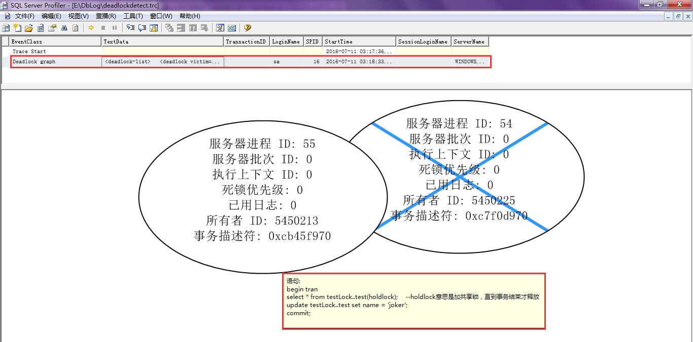

##参考文章

* [《数据库锁机制》](http://www.xumenger.com/z-database-lock-20160710/)
* [《模拟系统登录时卡死以简单了解数据库原理》](http://www.xumenger.com/oracle-lock-plsql-login-20160503/)
* [《Oracle数据表死锁的解决方法》](http://www.xumenger.com/oracle-deadlock-20160218/)
* [《深入浅出SQL Server中的死锁》](http://www.cnblogs.com/CareySon/archive/2012/09/19/2693555.html)
* [《怎么捕获和记录SQL Server中发生的死锁》](http://bbs.csdn.net/topics/350234619)
* [《SqlServer 并发事务：死锁跟踪（一）简单测试》](http://blog.csdn.net/kk185800961/article/details/41488215)
* [《SqlServer 并发事务：死锁跟踪（二）确定死锁锁定的资源》](http://blog.csdn.net/kk185800961/article/details/41687209)
* [《SqlServer 并发事务：死锁跟踪（三）6种跟踪死锁的方法总结》](http://blog.csdn.net/kk185800961/article/details/42504857)

##说明

在多线程/多进程的程序中并发操作数据库，如果对数据库的运行原理理解的不深入，编写的代码没有考虑数据库运行原理的话，就很有可能导致死锁的发生，那么就需要赶紧解决问题，而我最近也遇到了一个SQL Server死锁的问题，所以趁此机会研究一下死锁的排查方法

SQL Server死锁时候报错的信息一般是：事务(进程 ID 54)与另一个进程被死锁在 锁 资源上，并且已被选作死锁牺牲品。请重新运行该事务。

那么应该怎么排查？最好的方法当然是先定位到导致死锁的两条SQL，然后再去相关的程序源码中找到相应的SQL、检查对应的代码逻辑，分析并发情况下死锁的原因，然后破坏死锁产生的条件来解决死锁问题

上面的相关博客中有多种方法，这里先整理出一个简单、有效的方法：利用服务器端跟踪。**其消耗小，在最繁忙的系统中也可使用**。其他的方法会在日后慢慢研究和整理补充

##模拟SQL Server死锁

参考[《数据库锁机制》](http://www.xumenger.com/z-database-lock-20160710/)，创建数据库、创建表、模拟200万条记录

然后分别在SQL Server Management Studio打开两个会话，分别执行下面的两条语句以模拟死锁

```
--会话一
begin tran
select * from testLock..test(holdlock);    --holdlock意思是加共享锁，直到事务结束才释放
update testLock..test set name = 'joker';
commit;


--会话二
begin tran
select * from testLock..test(holdlock); 
update testLock..test set name = 'xumeng';
commit;
```

##先整理一个简单有效的方法

**1.编写如下脚本，并执行**

```  
-- 定义参数  
declare @rc int  
declare @TraceID int  
declare @maxfilesize bigint  
set @maxfilesize = 5   
 
-- 初始化跟踪  
exec @rc = sp_trace_create @TraceID output, 0, N'E:\DbLog\deadlockdetect', @maxfilesize, NULL   
--此处的E:\dblog\deadlockdetect是文件名（可自行修改），SQL会自动在后面加上.trc的扩展名  
if (@rc != 0) goto error  
 
-- 设置跟踪事件  
declare @on bit  
set @on = 1  
--下述语句中的148指的是locks:deadlock graph事件(参见sys.trace_events),12指的是spid列(参见sys.trace_columns)  
exec sp_trace_setevent @TraceID, 148, 12, @on    
exec sp_trace_setevent @TraceID, 148, 11, @on  
exec sp_trace_setevent @TraceID, 148, 4, @on  
exec sp_trace_setevent @TraceID, 148, 14, @on  
exec sp_trace_setevent @TraceID, 148, 26, @on  
exec sp_trace_setevent @TraceID, 148, 64, @on  
exec sp_trace_setevent @TraceID, 148, 1, @on  
 
-- 启动跟踪  
exec sp_trace_setstatus @TraceID, 1  
 
-- 记录下跟踪ID，以备后面使用  
select TraceID = @TraceID  
goto finish  
 
error:   
select ErrorCode=@rc  
 
finish:   
go  
```

运行上述语句后，每当SQL Server中发生死锁事件，都会**自动**往文件E:\DbLog\deadlockdetect.trc中插入一条记录。

**2.暂停和停止服务器端跟踪**

```  
--先执行这个SQL，否则如果直接执行下面暂停的SQL会报错： 无法停止或修改默认跟踪。请使用SP_CONFIGURE 将其关闭
 EXEC sp_configure 'show advanced options', 1;
 GO
 RECONFIGURE;
 GO
 EXEC sp_configure 'default trace enabled', 0;
 GO
 RECONFIGURE;
 GO
 
 
--如果要暂停上面的服务器端跟踪，可运行下面的语句：
--注意：要想停止服务器跟踪，必须先执行这条暂停的SQL命令，不能直接执行下面的停止的SQL命令
exec sp_trace_setstatus 1, 0;
--第一个参数表示TraceID,即步骤1中的输出参数。第二个参数表示将状态改为0，即暂停


--先执行暂停的SQL，才能接着执行停止跟踪的SQL，如果直接执行停止的SQL会报错的！
--如果要停止上面的服务器端跟踪，可运行下面的语句：
exec sp_trace_setstatus 1, 2;
--第一个参数表示TraceID,即步骤1中的输出参数。第二个参数表示将状态改为2，即停止
```

**3.查看跟踪文件内容**

对于上面生成的跟踪文件(E:\DbLog\deadlockdetect.trc),可通过两种方法查看：

1).执行t-sql命令

```  
select * from fn_trace_gettable('E:\DbLog\deadlockdetect.trc',1)  
```


 
结果中的TextData列即以XML的形式返回死锁的详细信息。将TextData的信息复制输出到文本文件中，然后通过搜索SQL的关键词，比如select、update、where、from、set等来找到信息中的SQL，就可以找到导致死锁的SQL语句。同时在该信息中还有死锁相关的进程ID等信息！

2).在SQL Server Profiler中打开。

依次 进入Profiler（以管理员身份打开）-> 文件 -> 打开跟踪文件 ->选择E:\DbLog\deadlockdetect.trc，就可以看到以图形形式展现的死锁信息了。 

截图如下，可以看到死锁的的关键字：DeadLock graph，先选中死锁的那条记录，然后到下面的图形界面将鼠标放在图形上，就会展示对应的SQL语句


