##说明

通过WireShark抓网络包，然后对网络包进行分析是很好的了解网络协议格式、网络协议工作原理的学习方法

WireShark可以用抓包和分析TCP、UDP、HTTP……多种网络协议，本文只是展示WireSahrk的一个简单用处，WireShark功能强大，绝不止于此！

为了安全考虑，WireShark只能查看封包，而不能修改封包的内容，或者发送封包

**参考文章和书籍**

* [《Wireshark抓包介绍和TCP三次握手分析 》](http://blog.csdn.net/xifeijian/article/details/9280435)
* [《结合Wireshark捕获分组深入理解TCP/IP协议栈之TCP协议(TCP报文格式+三次握手实例)》](http://blog.chinaunix.net/uid-9112803-id-3212041.html)
* [《Wireshark网络分析就这么简单 》](https://book.douban.com/subject/26268767/)

##选择网卡开始抓包

WireShark是捕获机器上的某一块网卡的网络包，当机器上有多块网卡时，需要先选择你希望去抓包的那个

【菜单】-->【Capture】-->【Interfaces】

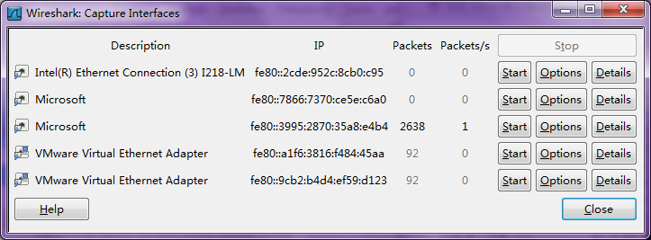

选择你需要抓包的那个网卡，然后点击【Start】按钮，开始抓包

比如我现在正在使用的是无线网的方式上网，打开dos，执行ipconfig，可以看到对应的无限局域网适配器信息：

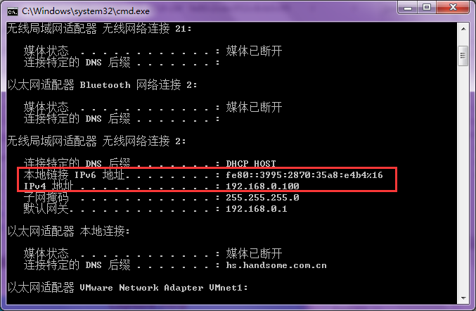

那么我就在WireShark选择对应的网卡进行抓包，选择好网卡后，WireShark主界面就会如下面展示的那样

* 显示过滤器：用于条件过滤网络包
* 封包列表：用于显示捕获到的封包，有源地址和目标地址、端口号等
* 封包详细信息：显示封包中的字段
* 16进制数据：可以类比[《深入理解DBF文件格式》](http://www.xumenger.com/dbf-20160703/)
* 地址栏：杂项

##WireShark过滤

对一块网卡全部抓包，会有大量的包冗余在一起

想从这成千上万条记录中找出自己想要的信息就需要结合过滤器的使用，将大量的不需要的信息通过过滤条件过滤掉

过滤器有两种

* 显示过滤器：就是主界面上那个，用来在捕获的记录中找所需要的记录
* 捕捉过滤器：用来过滤捕获的封包，以免捕获太多的记录
  * 在【Capture】-->【Capture Filter】中进行设置

**过滤器的规则**

* 协议过滤
  * 比如TCP，只显示TCP协议
* IP 过滤
  * 比如 ip.src ==192.168.1.102 显示源地址为192.168.1.102
  * ip.dst==192.168.1.102, 目标地址为192.168.1.102
* 端口过滤
  * tcp.port ==80,  端口为80的
  * tcp.srcport == 80,  只显示TCP协议的源端口为80的
* Http模式过滤
  * http.request.method=="GET",   只显示HTTP GET方法的
* 逻辑运算符为 AND/OR
* 就像编程一样，对于过滤条件，配合**括号()**的使用将会更加清晰

##封包列表

封包列表的面板中展示编号、时间戳、源地址、目标地址、协议、长度、以及封包信息。不同的协议一般用不同颜色

##封包详细信息

在这个面板中，可查看协议中的每个字段。各行信息分别为

* Frame：物理层的数据帧信息
* Ethernet II：数据链路层以太网帧头部信息
* Internet Protocol Version 4：互联网层IP包头部信息
* Transmission Control Protocol：传输层的数据段头部信息，此处是HTTP
* Hypertext Transfer Protocol：应用层的消息，此处是HTTP协议

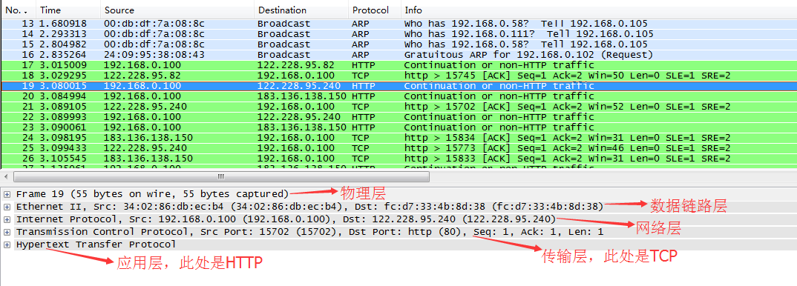

##分析TCP三次握手过程

在过滤器中输入：http，因为http在传输层是使用的TCP协议，所以使用过滤条件"http"过滤出来的http协议包中包含TCP协议信息

三次握手的过程文字描述为：

* 客户端发送SYN报文，并置发送序号为X
* 服务端发送SYN + ACK报文，并置发送序号为Y，确认序号为X+1
* 客户端发送ACK报文，并置发送序号为Z，确认序号为Y+1

以一个实际的例子分析TCP的三次握手过程，在浏览器的地址栏输入：http://www.xumenger.com/dbf-20160703/

在WireSahrk中找到**GET /dbf-20160703..**的记录，【右键】-->【Follow TCP Stream】

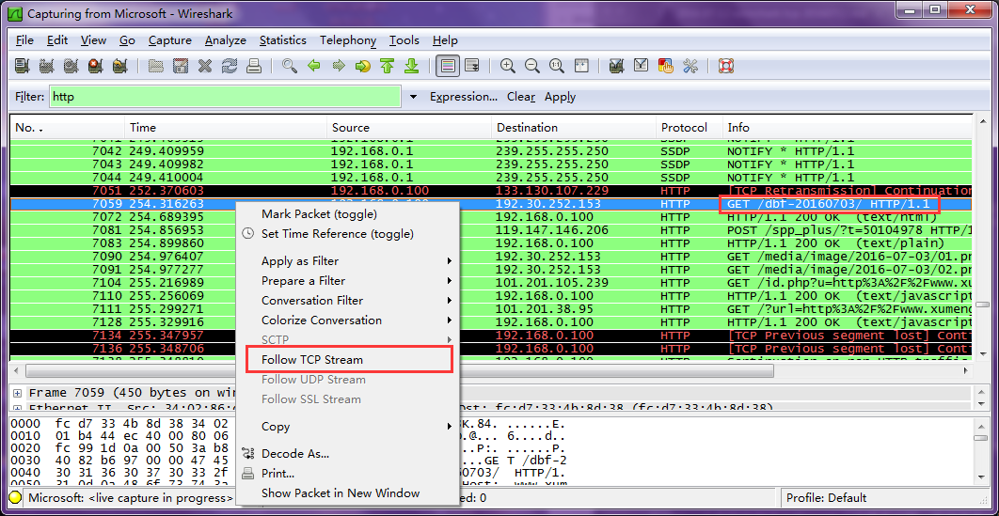

然后就会过滤出该条记录对应的所有记录，可以看到下图中**GET /dbf-20160703..**记录的前三行就对应TCP的三次握手过程

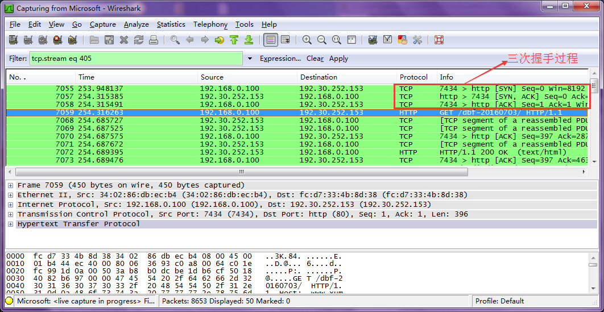

**第一次握手**

客户端发送一个TCP，标志位为SYB，序列号是0，代表客户端请求建立连接

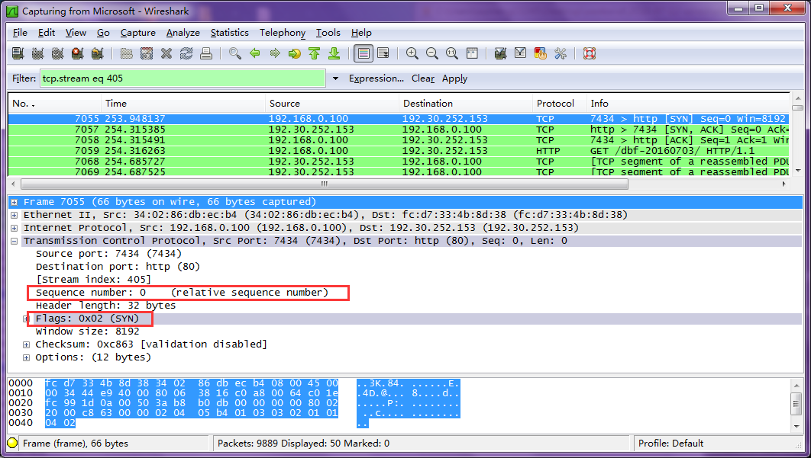

**第二次握手**

服务端发挥确认包，标志位为SYN，ACK。将确认序号（Acknowledgement Number）设置为客户端的Sequence Number加 1，也就是0 + 1 = 1

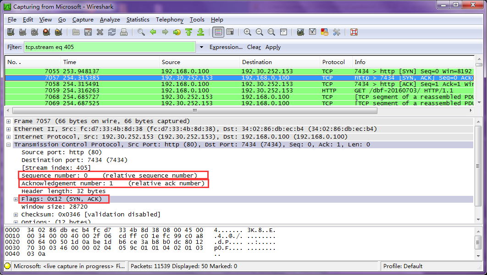

**第三次握手**

客户端再次发送确认包（ACK）：SYN标志位为0，ACK标志位为1，并且将服务端发送来的ACK的序号字段 + 1，放在确定字段中发送给对方，并且在数据段放写Sequence Number的 + 1

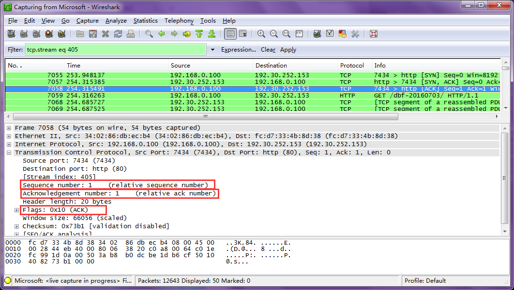

**通过三次握手的过程就建立了TCP连接，之后就可以进行通信了**

##补充：图解常用的网络协议

**IP报文**

**TCP报文**

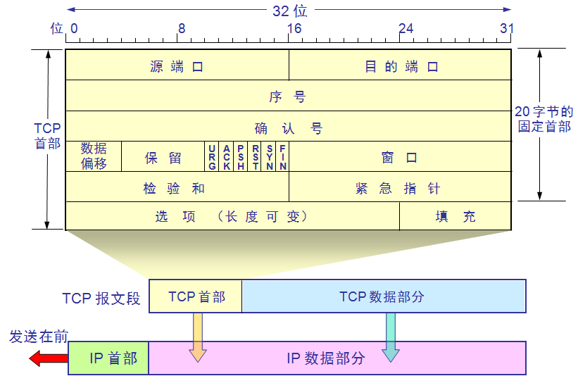

**UDP报文**

**HTTP请求报文**

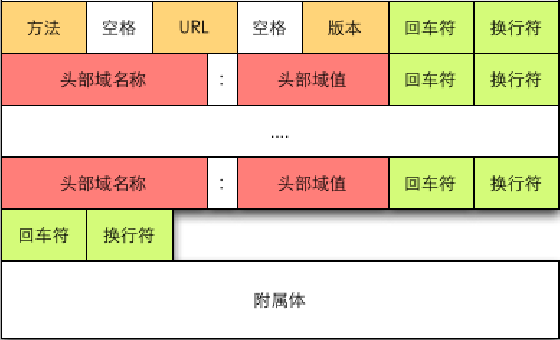

**HTTP响应报文**

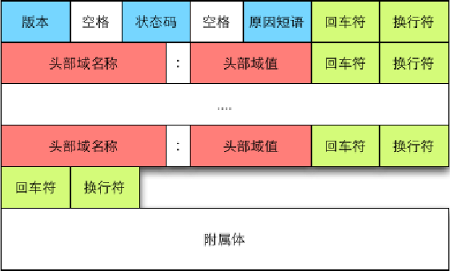
