##说明

AQTime不光可以用于分析 Delphi程序，还可以用于其他多种开发语言，具体的方法可以自己查阅资料、参考本文。不过本文只是展示如何使用 AQTime分析 Delphi程序的性能。

一直听说过“不要过早优化”这样的说法，因为要想对程序的性能进行优化，前提是定位到程序(线程)的性能瓶颈，然后再针对这个性能瓶颈进行分析、优化。不要过早优化是因为往往早期并不能确定性能瓶颈在哪里，所以这时候的优化多少有点瞎优化的感觉！

本文通过对一个简单的测试程序进行分析、优化，展示如何正确的优化：先定位瓶颈点，再去针对瓶颈点优化！

##AQTime的安装和Delphi的配置

**AQTime的安装**

点击[【AQTime下载地址】](https://smartbear.com/product/aqtime-pro/overview/)下载 AQTime，或者点击[【下载地址2】](http://www.softpedia.com/dyn-postdownload.php/6eb5d6aa1a1016435280aef484835995/578c5dae/9ff3/4/2?tsf=0)

安装的时候注意选择开发语言

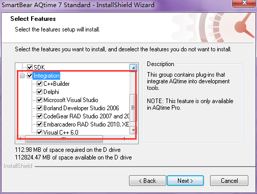

安装的过程中可能会有报错

需要【打开控制面板】-->【文件夹选项】-->【查看】-->【高级设置】，不勾选“隐藏受保护的操作系统文件”，以及勾选“显示隐藏的文件、文件夹和驱动器”

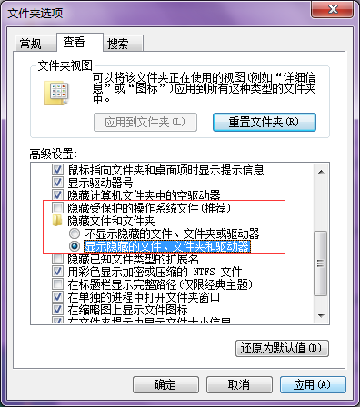

然后进入 C:\ProgramData 目录下，看到 Documents 是一个快捷方式，将其删除

然后点击重试即可安装成功

**Delphi工程配置**

Delphi的工程需要确保某些编译选项、连接选项是打开的，才能对其进行性能分析

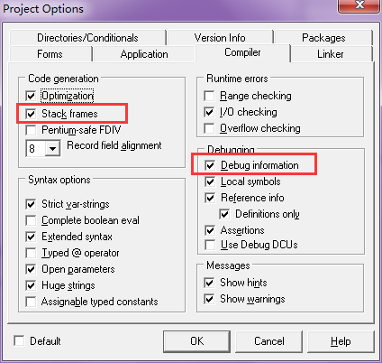

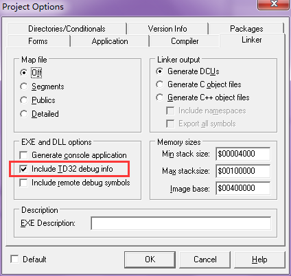

编译后生成的 exe或 dll变大很多，因为包含了很多调试信息

##使用AQTime分析一个测试程序

点击[【本文测试程序】](../download/20160718/testAQTime.zip)下载测试程序

测试程序的逻辑很简单：

* 创建一个[0..10000]的字符数组
* 从 0到 9999按照序号对 127取余，分别赋 ASCII为从 1到 127的值
* 关于ASCII码可以参考[《Delphi的Ord函数和ASCII码对照表》](http://www.xumenger.com/delphi-ord-20160222/)
* 数组的最后一个元素赋值为ASCII的0，表示字符串结束
* 然后统计字符串中字符'o'的个数

先运行程序，感受一下，发现程序会有很长的一段时间假死，然后才给出统计结果！

然后开始使用 AQTime进行分析！打开 AQTime的主界面是这样的：

**新建工程**

菜单：【File】-->【New Project】，或者使用快捷键【Ctrl + Shift + N】

新建一个分析程序性能的工程，分析完成后，可以将分析的结果进行保存的

**添加模块**

如下图点击【Add Module】按钮，或者【在Setup对应栏右键】-->【Add Module】

可以是 EXE，也可以是 DLL，也可以是 BPL

可以添加多个，Standard版本是免费的，可以添加5个

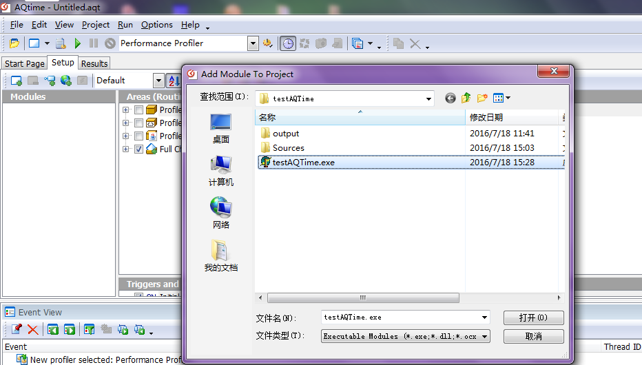

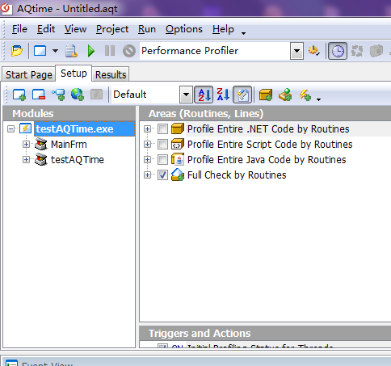

**开始性能测试**

首先需要选择“性能测试”：

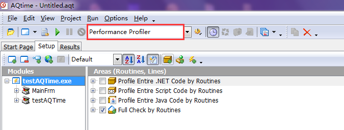

选择宿主程序：【Run】-->【Parameters】，选择宿主程序，如果 Add Module中选择 EXE，那么这里可以不需要选择

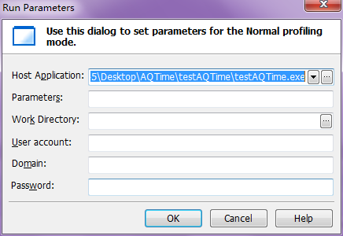

然后点击运行：

**开始对程序进行测试**

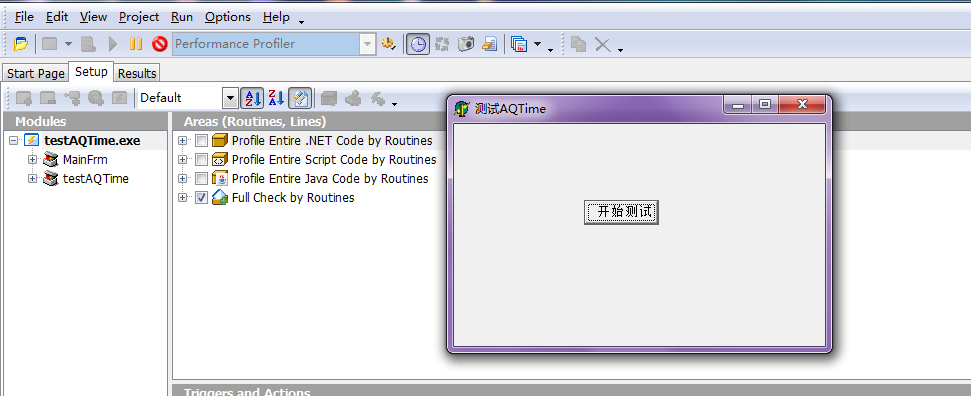

运行结束后如下图

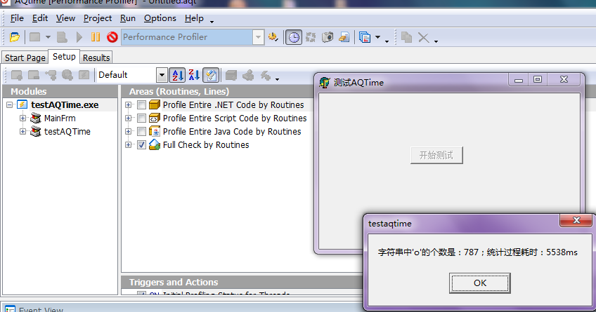

然后【Run】-->【Get Results】可以立即获得从程序运行以来的所有和 testAQTime.exe（也可以是一些 DLL、BPL模块） 相关方法的时间统计信息

【Run】-->【Clear Results】 是结果清除，重新开始统计

性能统计重点是看时间统计区域的信息

* Time 列表示的该方法自身代码的耗时
* Time With Children 列表示方法总耗时
* Time = Time With Children – 子函数总耗时
* 注意子函数总耗时，该子函数必须是 AQTime可统计的子函数

**根据统计结果进行分析**

* 可以看到 GetStrLength方法被调用 100001次，总共耗时 5451.04ms
* btn1Click方法，自身代码耗时 5.17ms，但是调用子方法耗时 5456.21 - 5.17 = 5451.04ms

配合该工程的代码进行分析：

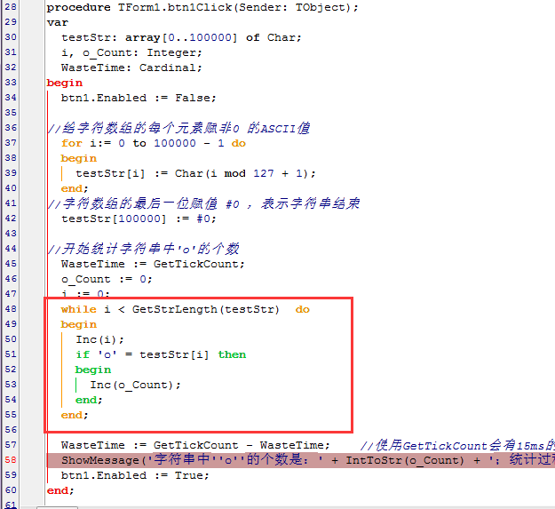

可以看到这个循环，会循环 100001次，每次都会调用 GetStrLength，而 GetStrLength内部也是使用循环去统计数量，每次执行 GetStrLength循环 100000次

所以点击按钮之后会循环 100001 * 100000 次，当然会很耗时

定位到了性能瓶颈点，就可以对这个性能瓶颈点去进行针对性的优化了，这样的优化才是有意义的优化

结合代码分析，因为 GetStrLength 的值是不变的，所以我们可以【一次获取，多次使用】，而不是每次都去调用该方法

修改成下面的代码逻辑：

* 先调用 GetStrLength 一次，将其结果放到局部变量 length中
* 然后循环的时候直接使用 length 的值，不需要调用 GetStrLength
* 这样就可以节省很多的时间，将很多不必要的操作精简掉
* 因为这样修改后，时间复杂度就降到了 100001，而不是超大的 100001 * 100000

可以看到执行的耗时为0ms，不过因为使用 GetTickCount统计，所以可能有 15ms的误差，但是明显也可以看到性能大幅度的提升了，另外还可以再使用 AQTime对修改后的程序进行性能统计和分析，不过就不在这里展示了

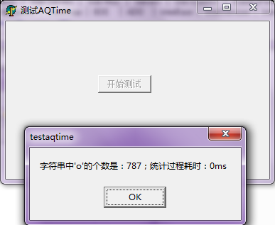

**图形化的统计信息**

上面展示的是表格形式的统计信息，AQTime还会有图形化的统计信息

【View】-->【Other Panels】-->【Call Graph】可以显示方法的调用关系和时间分布，更加直观地看到哪个是性能的瓶颈，这里因为测试程序简单、调用的逻辑简单，所以调用情况的图像化统计也是比较简单的

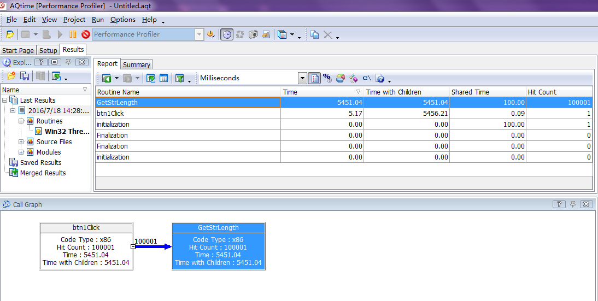

详细局部图

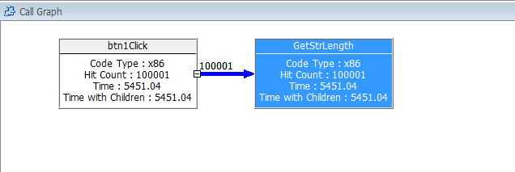

【View】-->【Other Panels】-->【Call Tree】可以查看方法的调用树，这里因为函数调用的层次很少，所以展示的调用树的层次、分支很少

##总结

**层次与分支**

* 本文展示的例子是一个极其简单的例子，代码量很少，所以分析起来会很简单、很清晰
* 但我们在工作中接触的项目，单就代码量而言，少的也要有千行的级别，所以分析起来就不可能是这么简单
* 当代码量很大时，必需综合 AQTime的统计信息，以及项目代码本身去分析性能瓶颈点，去进行优化！
* 总之本文只是一个简单例子的展示，具体还是自己在开发和使用的时候灵活应用！

**单线程与多线程**

* 本文只是展示的一个单线程的简单的例子
* 实际的项目开发中，可能是有大量的线程同时运行
* 本文使用的是 AQTime的免费版，不会分线程统计函数调用情况的
* AQTime的付费版是支持在多线程环境下对各个线程的调用情况进行分别统计的，如果有必要的话，花钱买来用到自己的项目开发中，的确对于性能调优、提升程序质量有很大的帮助！
