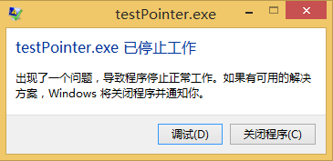

之前在SegmentFault上回答过这么一个问题，而且是在去年9月份回答的

##对方的问题

我在Win8中 使用codeblock编写了一段程序。使用的是GCC 4.7 & 4.8 编译器：

```
#include <iostream>

using namespace std;

int main()
{
    int *i=0;


    cout<< "Hello world!" << endl;
    return 0;
}
```

程序可以运行，输出：Hello world。很奇怪的是一旦加入指针赋值语句，编译组建通过，但无法运行。

```
int main()
{
    int *i=0;
    *i = 9;

    cout<< "Hello world!" << endl;
    return 0;
}
```



控制台上显示为：Process returned -1073741819 (0xC0000005) execution time : 1.453 s

使用VC++ 6.0 出现了同样的现象

##我的回答

```
int *i = 0;
```

这个语句是相当于把int\* 的指针变量 i 赋值为0，而不是将int\* 的指针 i 指向 0这个常量所在的内存地址，也就是相当于是这样的代码：

```
int *i;
i=0;
```

而不是

```
int *i;
*i= 0; 
```

不过如果本来是希望达到后面这个语句的效果，那也是有问题的！这句代码的作用是为指针 i所指向的内存赋值，但是因为i 指向未知内存，因为前面只是进行了初始化，所以这时候是一个野指针。为野指针指向的内存赋值，显然还是会导致内存错误！

##奇怪

上面是自己在2015-09-10的回答，今天无意中又看到这个问题，竟然没有第一时间想到原因，反而是去看了自己在去年的答案才理解


