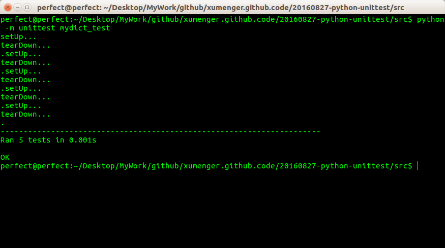
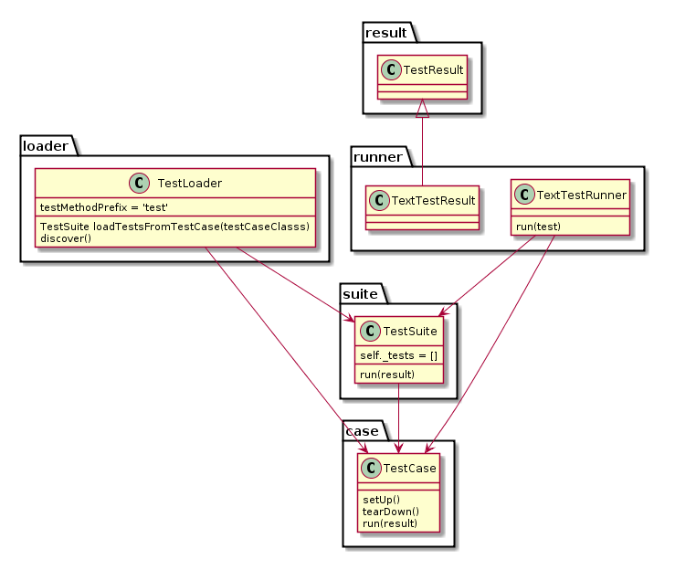
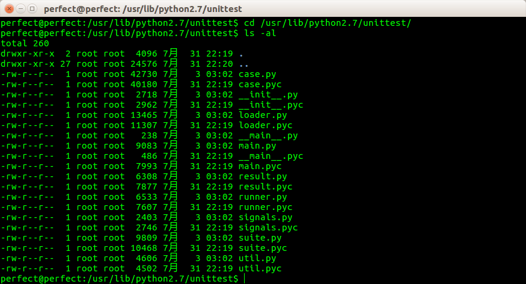

##简介

在Python 中编写和运行单元测试是非常简单的，它不但不会干扰或破坏现有程序，还会极大地帮助你和其他开发人员维护软件

单元测试作为任何语言的开发者都应该是必要的，因为时隔数月后再回来调试自己的复杂程序时，其实是很崩溃的事情。虽然会很快熟悉内容，但是修改和调试将是一件痛苦的事情，如果你在修改了代码后出现问题的话，而单元测试可以帮助我们很快的定位到问题的位置，出现问题的模块和单元。所以这是一件很愉快的事情，因为我们知道其他修改或没有修改的地方仍然是正常工作的，而我们目前唯一的问题就是搞定眼前这个有点问题的“家伙”。所以工作会在轻松中开始，并且很快将会结束，因为你已经知道很多信息了

什么是测试？其实就是以某种方式将自己的代码运行起来，拿实际的输出结果、运行效果来和预期得到的结果进行对比，如果二者一致，那么可以认为程序没有问题、测试通过，如果出现报错、二者不一致，那么就说明程序存在bug，需要赶紧去定位

在开发中正常是这样应用单元测试的：比如实现了一个基础的类，或者基础的函数，那么针对这个类、函数的各个功能点编写对应的单元测试，按照预期结果和实际结果来确定测试是不是通过。单元测试通过之后有什么意义呢？如果我们后续对这个类、函数的代码进行了修改，只需要再跑一遍单元测试，如果通过，说明我们的修改不会对类、函数原有的行为造成影响，如果测试不通过，说明我们的修改与原有行为不一致，要么修改代码，要么修改测试

其实，就算目前所有的测试做完了，得到的实际结果和预期的结果都一致，那也不能说明是程序完全没有问题，因为从逻辑角度来说，总会有遗漏掉的代码路径。或者因为个人的经验不足、思维疏漏，总会有你没有考虑到的某些场景！

总之，开发中坚持进行测试是必不可少的，但是不要妄想有了充分的测试之后就能避免所有的bug，只能说是自己在开发中积累经验，总结自己可能会疏忽掉的点、经常引入缺陷的点等等，逐步都添加到自己的测试中，让自己的测试思维也“逐步成长”

单元测试的基本策略：单元测试的测试用例要覆盖常用的输入组合、边界条件和异常

Python 本身是自带了一个测试的框架的: unittest，unittest 是Python 标准库的一部分。本文只是通过unittest 初步对于Python 的单元测试进行介绍，其实Python 单元测试的技术点远不止于此！

##二话不说，先用起来

下面的部分主要是参考[《单元测试》](http://www.liaoxuefeng.com/wiki/0014316089557264a6b348958f449949df42a6d3a2e542c000/00143191629979802b566644aa84656b50cd484ec4a7838000)

比如先封装了一个基础的类Dict，以供功能代码进行调用，这个类和dict 的行为一致，但可以通过属性来访问，就像下面这样：

```
>>> d = Dict(a=1, b=2)
>>> d['a']
1
>>> d.a
1
```

**封装一个类**

实现的代码如下，mydict.py：

```
class Dict(dict):
    def __init__(self, **kw):
        super(Dict, self).__init__(**kw)
    def __getattr__(self, key):
        try:
            return self[key]
        except KeyError:
            raise AttributeError(r"'Dict' object has no attribute '%s'" % key)
    def __setattr__(self, key, value):
        self[key] = value
```

**编写测试用例**

使用unittest 编写测试用例，mydict_test.py：

```
import unittest
from mydict import Dict

class TestDict(unittest.TestCase):
    def test_init(self):
        d = Dict(a=1, b='test')
        self.assertEqual(d.a, 1)
        self.assertEqual(d.b, 'test')
        self.assertTrue(isinstance(d, dict))
    def test_key(self):
        d = Dict()
        d['key'] = 'value'
        self.assertEqual(d.key, 'value')
    def test_attr(self):
        d = Dict()
        d.key = 'value'
        self.assertTrue('key' in d)
        self.assertEqual(d['key'], 'value)
    def test_keyerror(self):
        d = Dict()
        with self.assertRaises(KeyError):
            value = d['empty']
    def test_attrerror(self):
        d = Dict()
        with self.assertRaises(AttributeError):
            value = d.empty
```

编写单元测试时，需要编写一个测试类，从unittest.TestCase 继承。以test 开头的方法就是测试方法，所有以test 开始的测试方法都会被执行；不以test 开头的方法不被认为是测试方法，测试时不会被执行

对每一类测试都需要编写至少一个test_xxx()。由于unittest.TestCase 提供了很多内置的条件判断，我们只需要调用这些方法就可以断言输出是否是我们所期望的。最常用的断言就是assertEqual()：

```
self.assertEqual(abs(-1), 1) # 断言函数返回的结果与1相等
```

另一种重要的断言就是期待抛出指定类型的Error，比如通过d['empty']访问不存在的key时，断言会抛出KeyError：

```
with self.assertRaises(KeyError):
    value = d['empty']
```

而通过d.empty访问不存在的key时，我们期待抛出AttributeError：

```
with self.assertRaises(AttributeError):
    value = d.empty
```

**运行单元测试**

一旦编写好单元测试，我们就可以运行单元测试。最简单的运行方式是在mydict_test.py的最后加上两行代码：

```
if __name__ == '__main__':
    unittest.main()
```

这样就可以把mydict_test.py当做正常的python脚本运行：

```
$ python3 mydict_test.py
```

另一种方法是在命令行通过参数-m unittest直接运行单元测试，在python2、python3下都可以测试：

```
$ python2 -m unittest mydict_test
$ python3 -m unittest mydict_test
```


这是推荐的做法，因为这样可以一次批量运行很多单元测试，并且，有很多工具可以自动来运行这些单元测试

**setUp与tearDown**

对一个测试用例环境的搭建和销毁，是一个fixture，通过覆盖TestCase的setUp()和tearDown()方法来实现，这两个方法会分别在每调用一个测试方法的前后分别被执行

setUp()和tearDown()方法有什么用呢？设想你的测试需要启动一个数据库，这时，就可以在setUp()方法中连接数据库，在tearDown()方法中关闭数据库，这样，不必在每个测试方法中重复相同的代码：

```
class TestDict(unittest.TestCase):
    def setUp(self):
        print('setUp...')
    def tearDown(self):
        print('tearDown...')
        def test_init(self):
        d = Dict(a=1, b='test')
        self.assertEqual(d.a, 1)
        self.assertEqual(d.b, 'test')
        self.assertTrue(isinstance(d, dict))
    def test_key(self):
        d = Dict()
        d['key'] = 'value'
        self.assertEqual(d.key, 'value')
    def test_attr(self):
        d = Dict()
        d.key = 'value'
        self.assertTrue('key' in d)
        self.assertEqual(d['key'], 'value)
    def test_keyerror(self):
        d = Dict()
        with self.assertRaises(KeyError):
            value = d['empty']
    def test_attrerror(self):
        d = Dict()
        with self.assertRaises(AttributeError):
            value = d.empty
```

可以再次运行测试看看每个测试方法调用前后是否会打印出setUp...和tearDown...

还可以看出来是在TestCase子类的每个test_xxx方法执行的前后都会调用setUp、tearDown方法，而不是针对整个TestCase子类调用一次。其实在unittest 的具体实现中是对每一个以test 开头的方法，都为其构建了一个TestCase 对象



##unittest的原理

以下先引用[《Python单元测试——深入理解unittest 》](http://www.cnblogs.com/hackerain/p/3682019.html)文章中的相关内容对unittest 的原理进行初步了解



* 一个TestCase 的实例就是一个测试用例。什么是测试用例呢？就是一个完整的测试流程，包括测试前准备环境的搭建(setUp)，执行测试代码(run)，以及测试后对环境的还原(tearDown)。元测试(unit test)的本质也就在这里，一个测试用例是一个完整的测试单元，通过运行这个测试单元，可以对某一个问题进行验证
* 而多个测试用例集合在一起，就是TestSuite，而且TestSuite 也可以嵌套TestSuite
* TestLoader 是用来加载TestCase 到TestSuite 中的，其中有几个loadTestsFrom__()方法，就是从各个地方寻找TestCase，创建它们的实例，然后add 到TestSuite中，再返回一个 TestSuite实例
* TextTestRunner 是用来执行测试用例的，其中的run(test)会执行TestSuite/TestCase 中的run(result)方法
* 测试的结果会保存在TextTestResult 实例中，包括运行了多少测试用例，成功了多少，失败了多少等信息

>所以整个流程是：先写好TestCase，然后TestLoader 加载TestCase 到TestSuite，然后由TextTestRunner来运行TestSuite，运行的结果保存在TextTestResult 中，整个过程集成在unittest.main 模块中

**继续深究**

可以在Linux 下执行命令`pydoc unittest`查看unittest 模块的说明文档

对于Python2，它的标准库unittest 的源码在 /usr/lib/python2.7/unittest 这个目录下


