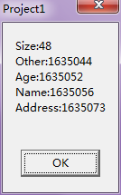
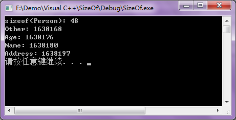

##说明

>关于结构体的对齐机制的深层次原因应该和编译器、操作系统、CPU等都有关

>目前我的平台配置是：Delphi 6、VC++ 6、Windows 7、32位CPU

>其他平台上可能会有不同的效果和现象

以下的总结参考了网上找到的一些博文，另外就是自己在VC++、Delphi上编写简单的代码去看运行的效果

参考的文章有：

* [《C语言结构体的对齐原则》](http://www.cnblogs.com/luxiaoxun/archive/2012/11/09/2762438.html)
* [《结构体对齐详解》](http://www.cnblogs.com/motadou/archive/2009/01/17/1558438.html)

##测试程序

**Delphi测试程序**

```
unit Unit1;

interface

uses
  Windows, Messages, SysUtils, Variants, Classes, Graphics, Controls, Forms,
  Dialogs, StdCtrls;

type
  TForm1 = class(TForm)
    btn1: TButton;
    procedure btn1Click(Sender: TObject);
  private
    { Private declarations }
  public
    { Public declarations }
  end;

Person = record
	Name: array[0..16] of Char;		//17
	Age: Integer;					//4
	Address: array[0..16] of Char;	//17
	Other: Int64;					//8
end;

var
  Form1: TForm1;

implementation

{$R *.dfm}

procedure TForm1.btn1Click(Sender: TObject);
begin
  ShowMessage('SizeOf(Person): ' + IntToStr(SizeOf(Person)));
end;

end.
```

上面程序中定义的结构体类型，正常在内存中存储这么类型的一个成员需要的字节数为17+4+17+8=46。但我们运行上面的程序发现弹出框中该结构体的大小是56字节

**VC++测试程序**

```
#include <stdio.h>
#include <stdlib.h>

struct Person
{
	char Name[17];		//姓名，17字节
	int Age;			//年龄，32位，4字节
	char Address[17];	//地址，17字节
	_int64 Other;		//其他，64位，8字节
};

int main(int argc, char* argv[])
{
	printf("SizeOf(Person): %d\n", sizeof(Person));
	system("pause");
	return 0;
}
```

上面程序中定义的结构体类型，正常在内存中存储这么类型的一个成员需要的字节数为17+4+17+8=46。但我们运行上面的程序发现输出结果也是56

##分析上面结构体的内存分布

上面的现象和结构体的对齐机制有关，以上程序中不管是Delphi 还是VC++ 的程序中定义的Person 结构体，实际上最终在内存中的分布都是一样的，所以下面的总结对于Delphi 和VC++ 都是一样的

许多实际的计算机系统对基本是数据类型在内存的存放有位置限制，它们会要求这些数据的起始地址的值是某个数k 的倍数，这就是所谓的内存对齐，而这个k 则被称为该数据类型的对齐模数。这种强制的要求一来简化了处理器与内存之间传输系统的设计，二来可以提升读取数据的速度

展示一下上面Delphi 程序中定义的Person 结构体在内存中的分布情况：用A表示在Name 成员对应在内存中占有的字节，B表示Age 成员对应在内存中占用的字节，C对应Address 成员在内存中占用的字节，D表示Other 成员在内存中占用的字节，X表示内存空隙。我的机器是32位的，所以上面的结构体对应在内存中是下面这样分布的，可以看到在Name 成员和Age 成员之间有空下来3个字节的内存空间，Address 成员和Other 成员之间空了7个字节

00|01|02|03|04|05|06|07|08|09|10|11|12|13|14|15|16|17|18|19|20|21|22|23|24|25|26|27|28|29|30|31
--|--|--|--|--|--|--|--|--|--|--|--|--|--|--|--|--|--|--|--|--|--|--|--|--|--|--|--|--|--|--|--
A |A |A |A |A |A |A |A |A |A |A |A |A |A |A |A |A |X |X |X |B |B |B |B |C |C |C |C |C |C |C |C 
C |C |C |C |C |C |C |C |C |X |X |X |X |X |X |X |D |D |D |D |D |D |D |D 

下面简单总结一下对齐原则：

* 结构体中的成员，第一个成员在偏移0的位置，之后的每个成员的起始位置必须是当前成员大小的整数倍
* 如果结构体A含有结构体成员B，那么B的起始位置必须是B中最大元素大小整数倍地址
* 结构体的总大小，必须是内部最大成员的整数倍

以上面的原则分析一下这个Person 结构体

* 第一个成员，Name 的偏移位置是0，因为这个数组长度是17，所以最后一位的地址偏移是16
* 接下来是成员Age，这个成员的类型是Integer，对应4字节，所以起始位置必须是其整数倍，接下来举例17最近的且是4的整数倍的就是20，所以Age 的偏移是20
* Address 因为是char 数组，所以对于它的最大元素应该以char 算而不能按数组算，char 是1字节，所以其内存直接从Age 的后一位24开始
* 再去看最后一个Other，它是Int64 类型，对应8字节，Address 数组的最后一位的偏移是40，距离40最近的且是8的整数的偏移就是48，所以Other 的偏移是48，结束地址是48+8
* 综上所述，所以整个Person 结构体占了56个字节的内存空间

如果还有怀疑，我们可以写一个简单的Delphi 程序输出该结构体的各个成员的首地址来确认一下

```
var
  MemAddres: string;
  p: Person;
begin
  MemAddres := 'Size:' + IntToStr(SizeOf(Person)) + #13#10;
  MemAddres := MemAddres + 'Name:' + IntToStr(Integer(@(p.Name))) + #13#10;
  MemAddres := MemAddres + 'Age:' + IntToStr(Integer(@(p.Age))) + #13#10;
  MemAddres := MemAddres + 'Address:' + IntToStr(Integer(@(p.Address))) + #13#10;
  MemAddres := MemAddres + 'Other:' + IntToStr(Integer(@(p.Other))) + #13#10;

  ShowMessage(MemAddres);
end;
```

最后对应弹出框中的内容是下面这样的，可以看到Name 的首地址和Age 的首地址相差20，而不是17，所以说明在Name 的最后一位结束后，距离Age 的首地址还有3个空闲地址空间，正好和上面展示的内存分布情况是完全一致的；当然Age 和Address 的内存分布也是完全一样的


##强制不做内存对齐

对于Delphi 和C/C++ 都支持在语法上强制指定结构体不对齐，那么结构体中所有的成员在内存中都是紧挨着的，那么就不会有浪费的内存空间

**Delphi可以使用关键字packed**

```
Person = packed record
	Name: array[0..16] of Char;		//17
	Age: Integer;					//4
	Address: array[0..16] of Char;	//17
	Other: Int64;					//8
end;
```

这样定义之后，SizeOf(Person)的结果就是46

**C/C++可以用#pragma pack(1)**

```
#pragma pack(1)

struct Person
{
	char Name[17];		//姓名，17字节
	int Age;			//年龄，32位，4字节
	char Address[17];	//地址，17字节
	_int64: Other;		//其他，4字节
};
```

上面的定义，使用sizeof(Person)得到的结果也是46

不过C/C++的`#pragma pack(1)`更灵活，它可以使用`#pragma pack(1)`指定按照一个字节对齐，效果就相当于没有对齐，全部紧挨着，也可以用`#pragma pack(4)`指定按照4个字节对齐

##对比对齐和不对齐

就像前面说的，对齐和不对齐都有优点和缺点

* 对齐：处理器可以处理的更快，但相对就可能浪费内存
* 不对齐，可以不浪费内存，但相对而言就会慢点

其实可以规范我们定义结构体中成员变量的顺序既做到节省内存空间，又可以保证程序更快：按照成员的类型占用字节数从大到小来排列在结构体中的成员定义顺序

比如上面的Person结构体，按照成员数据类型的大小来顺序定义

```
Person = record
	Other: Int64;					//Int64类型最大，放在第一位
	Age: Integer;					//Integer次大，放在第二位
	//确定数组元素的位置时不看数组的总体大小，而看数组的每个元素的大小
	Name: array[0..16] of Char;		//Char是1字节，笔Integer小，所以在后面
	Address: array[0..16] of Char;	//Name和Address都是Char数组，所以可以不分前后
end;
```

对应C/C++的结构体可以定义为

```
struct Person
{
	_int64: Other;		//其他，4字节
	int Age;			//年龄，32位，4字节
	char Name[17];		//姓名，17字节
	char Address[17];	//地址，17字节
};
```

不过输出上面的结构体大小，无论是Delphi程序还是VC++程序，最后的结果都是48，而不是46

按照上面的分析，其在内存中的分布应该是这样的：A表示Other、B表示Age、C表示Name、D表示Address

00|01|02|03|04|05|06|07|08|09|10|11|12|13|14|15|16|17|18|19|20|21|22|23|24|25|26|27|28|29|30|31
--|--|--|--|--|--|--|--|--|--|--|--|--|--|--|--|--|--|--|--|--|--|--|--|--|--|--|--|--|--|--|--
A |A |A |A |A |A |A |A |B |B |B |B |C |C |C |C |C |C |C |C |C |C |C |C |C |C |C |C |C |D |D |D 
D |D |D |D |D |D |D |D |D |D |D |D |D |D | 

对于Delphi程序，写如下的测试程序

```
var
  MemAddres: string;
  p: Person;
begin
  MemAddres := 'Size:' + IntToStr(SizeOf(Person)) + #13#10;
  MemAddres := MemAddres + 'Other:' + IntToStr(Integer(@(p.Other))) + #13#10;
  MemAddres := MemAddres + 'Age:' + IntToStr(Integer(@(p.Age))) + #13#10;
  MemAddres := MemAddres + 'Name:' + IntToStr(Integer(@(p.Name))) + #13#10;
  MemAddres := MemAddres + 'Address:' + IntToStr(Integer(@(p.Address))) + #13#10;

  ShowMessage(MemAddres);
end;
```

发现弹出框是这样的



* Other首地址是1635044，Age的首地址是1635052，相差8 Byte，正好Other是8 Byte的类型，所以Other和Age之间没有内存间隙
* Age首地址是1635052，Name的首地址是1635056，相差4 Byte，正好Age是4 Byte的类型，所以Age和Name之间没有内存间隙
* Name首地址是1635056，Assress的首地址是1635073，相差17 Byte，正好Name数组是17 Byte，所以Name和Address之间没有内存间隙
* 那么基本可以推理出来，多出来的两个字节是在Address占用内存结束后的接下来2 Byte

对于VC++程序，写如下的测试程序

```
int main(int argc, char* argv[])
{
	Person p;
	printf("sizeof(Person): %d\n", sizeof(p));

	printf("Other: %d\n", &(p.Other));
	printf("Age: %d\n", &(p.Age));
	printf("Name: %d\n", &(p.Name));	
	printf("Address: %d\n", &(p.Address));
	
	system("pause");
	return 0;
}
```

输出信息是这样的



* Other 首地址是1638168，Age 的首地址是1638176，相差8 Byte，正好Other 是8 Byte的类型，所以Other 和Age 之间没有内存间隙
* Age 首地址是1638176，Name 的首地址是1638180，相差4 Byte，正好Age 是4 Byte的类型，所以Age和Name 之间没有内存间隙
* Name 首地址是1638180，Assress 的首地址是1638197，相差17 Byte，正好Name 数组是17 Byte，所以Name 和Address 之间没有内存间隙
* 那么基本可以推理出来，多出来的两个字节是在Address占用内存结束后的接下来2 Byte

基于对上面输出情况的分析，完全可以猜测不管是Delphi还是VC++，最终其在内存中的分布是这样的，最后两位虽然没有用到，但也被这个结构体占用了

00|01|02|03|04|05|06|07|08|09|10|11|12|13|14|15|16|17|18|19|20|21|22|23|24|25|26|27|28|29|30|31
--|--|--|--|--|--|--|--|--|--|--|--|--|--|--|--|--|--|--|--|--|--|--|--|--|--|--|--|--|--|--|--
A |A |A |A |A |A |A |A |B |B |B |B |C |C |C |C |C |C |C |C |C |C |C |C |C |C |C |C |C |D |D |D 
D |D |D |D |D |D |D |D |D |D |D |D |D |D |X |X

上面的结构体虽然还是浪费了2个字节，但是从56降低到48，内存的节省比例已经很明显了：**1/7**！！！
