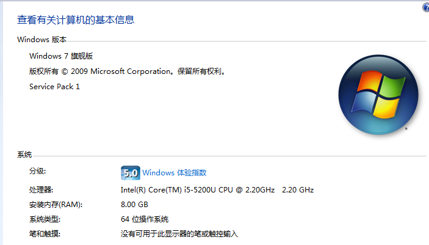
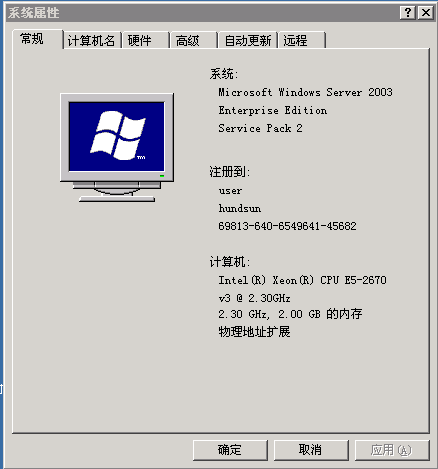
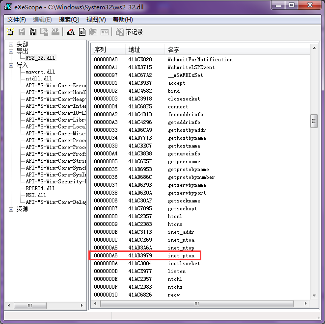
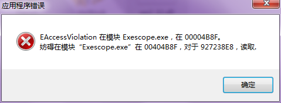
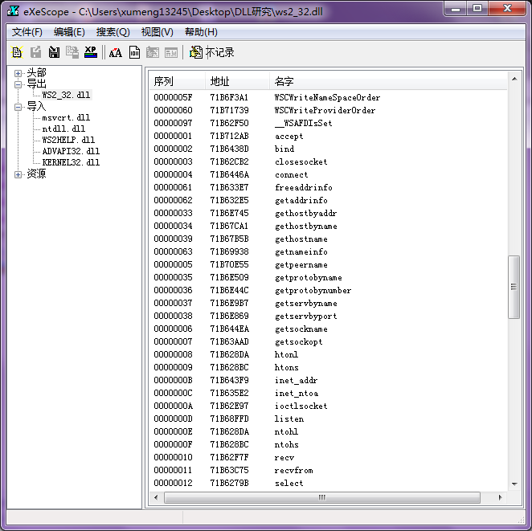
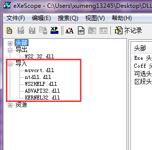
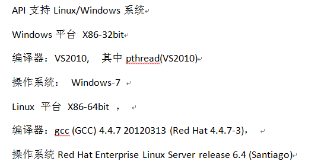

开发了一个小程序，使用到了第三方的封装了网络传输功能的DLL，我使用Visual C++ 程序将第三方的DLL 再做了一层封装，然后在Delphi 端调用使用Visual C++ 封装的DLL 进行开发

在我的机器上程序正确运行，对应的操作系统是Windwos 7(64位)

在另外的一台机器上就会有问题，运行时报错，这台机器的操作系统是Windows Server 2003(32位)

运行时的报错信息如下

继而导致报错非法地址访问错误

最开始还以为是编译的问题：怀疑是在Windows 7(64位)上使用Visual C++ 编译的DLL 在Windows Server 2003(32位) 的环境上无法运行，比如编译时需要依赖的一些东西会在32位和64位上有差异

所以想到在Windows Server 2003(32位)的环境上安装一个Visual C++ 开发工具再去编译这份代码

但使用Windows Server 2003(32位)上的Visual C++ 编译之后，再次运行程序还是会有同样的报错

为什么不根据第一个报错去检查WS2\_32.DLL 的导出方法inet\_pton 呢？

先检查Windows 7(64位)，使用eXeScope 工具打开C:\Windows\System32 下面的WS2\_32.DLL，可以看到有inet\_pton 导出方法

注意，我的环境中查看WS2\_32.DLL，需要在C:\Windows\System32 使用eXeScope打开，比如拷贝到桌面后在使用eXeScope 打开的话会报错

导入部分列出的DLL，是这个DLL 所需要依赖的DLL

再去使用eXeScope查看报错的机器上的WS2_32.DLL 的导出方法（[下载地址](../download/20160928/ws2_32.zip)），检查并没有inet_pton 导出方法

再去看其导入部分需要依赖的DLL

明显可以看出来不同的操作系统的同一个系统DLL 无论是导出方法，还是导入所以来的DLL 都有很大的差别，想要直接用将WIndwos 7 上的WS2\_32.DLL 拷贝到Windwos Server 2003 上的对应目录是无法解决的，因为不知道两个DLL 的依赖环境有什么不同，只能通过升级操作系统的方式来解决

##结合上面的排查，总结一下

在我的这个程序中，使用了第三方封装好的网络传输的DLL

而这个第三方的DLL 中有使用到WS2\_32.DLL 的inet\_pton 导出方法

在Windows 7的操作系统上，经过上面的排查，WS2\_32.DLL 是有这个导出方法的

但在Windows Server 2003 的操作系统上没有这个导出方法，所以在Windows Server 2003 的机器上就不可用

也就是说这个第三方的DLL本身不支持Windows Server 2003的平台，要想使用这个第三方的DLL，就不能在Windwos Server 2003的平台上进行部署

再去仔细检查第三方DLL 的接口说明文档，上面是明确有对支持的平台进行说明的

还是不细心啊！

##操作系统

Windows 提供的系统调用，其实就是在C:\Windows\System32 下面的各个DLL 通过导出函数的方式提供的

上面的这个问题和操作系统的位数、编译原理、链接、运行时库还会不会有什么深入的关联？后续值得再去深入研究一下！
