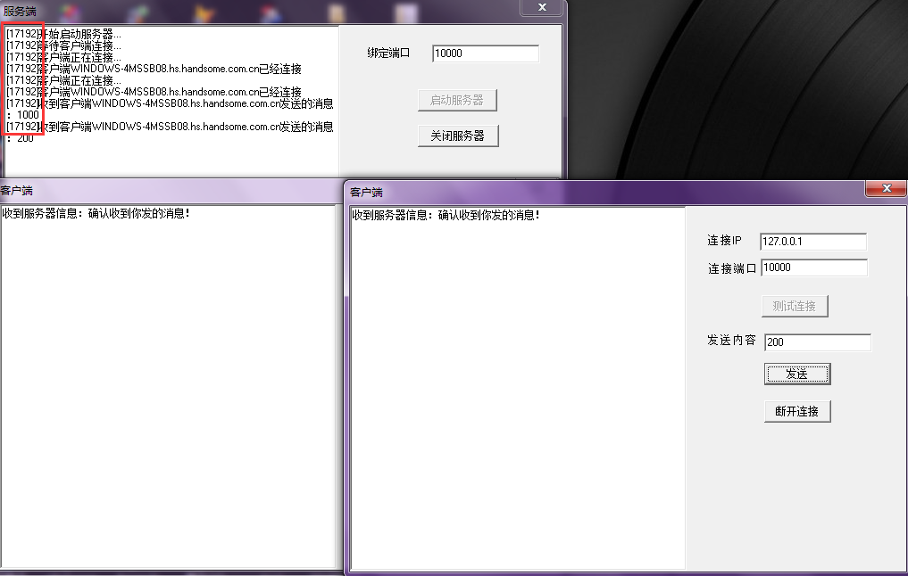
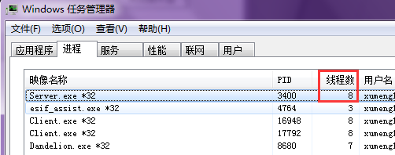

[《Delphi网络编程：使用IdTcpServer/IdTcpClient》](http://www.xumenger.com/windows-delphi-socket-20160929/)讲到了使用Indy 组件进行网络编程，具体客户端使用IdTcpClient、服务端使用IdTcpSerever

上面的文章也简单展示了如何使用IdTcpClient、IdTcpServer 分别进行客户端和服务端开发，并且简单列举了两个可能因为服务端的多线程机制而出现的线程冲突错误

Indy 的IdTcpServer/IdTcpClient 都是阻塞模式的

而ServerSocket/ClientSocket 既可以是非阻塞模式，也可以是阻塞模式的。ServerSocket 通过将ServerType 设置成stNonBlocking 或stThreadBlocking 来设置为非阻塞或阻塞；ClientSocket 通过将ClientType 设置成ctNonBlocking 或ctBlocking 来设置为非阻塞或阻塞。如果不设置，ServerSocket/ClientSocket 都默认是非阻塞的

本文通过一个例子简单讲一下使用ClientSocket、ServerSocket 进行网络开发，本文展示的实例是客户端、服务端都选择非阻塞模式开发的

##代码实例

对应的代码可以点击[【这里】](../download/20161010/SocketExample.zip)下载

**客户端代码**

```
unit MainForm;

interface

uses
  Windows, Messages, SysUtils, Variants, Classes, Graphics, Controls, Forms,
  Dialogs, StdCtrls, ScktComp;

type
  TForm1 = class(TForm)
    mmo1: TMemo;
    lbl1: TLabel;
    edt1: TEdit;
    lbl2: TLabel;
    edt2: TEdit;
    lbl3: TLabel;
    edt3: TEdit;
    btn2: TButton;
    btn1: TButton;
    btn3: TButton;
    procedure FormCreate(Sender: TObject);
    procedure FormDestroy(Sender: TObject);
    procedure btn1Click(Sender: TObject);
    procedure btn2Click(Sender: TObject);
    procedure btn3Click(Sender: TObject);
  private
    ClientSocket: TClientSocket;
    procedure SocketRead(Sender: TObject; Socket: TCustomWinSocket);
    procedure SocketConnect(Sender: TObject; Socket: TCustomWinSocket);
    procedure SocketConnecting(Sender: TObject; Socket: TCustomWinSocket);
    procedure SocketDisconnect(Sender: TObject; Socket: TCustomWinSocket);
    procedure SocketError(Sender: TObject; Socket: TCustomWinSocket; ErrorEvent: TErrorEvent; var ErrorCode: Integer);
  public
    { Public declarations }
  end;

var
  Form1: TForm1;

implementation

{$R *.dfm}

procedure TForm1.FormCreate(Sender: TObject);
begin
  mmo1.Clear;
  ClientSocket := TClientSocket.Create(nil);
  btn2.Enabled := False;
  btn3.Enabled := False;
end;

procedure TForm1.FormDestroy(Sender: TObject);
begin
  ClientSocket.Free;
end;

procedure TForm1.btn1Click(Sender: TObject);
begin
//设置IP、端口
  ClientSocket.Address := edt1.Text;
  ClientSocket.Port := StrToInt(edt2.Text);

//设置回调函数
  ClientSocket.OnRead := SocketRead;              //收到服务端应答回调函数
  ClientSocket.OnConnect := SocketConnect;        //成功连接到服务端回调函数
  ClientSocket.OnConnecting := SocketConnecting;  //开始连接的回调函数
  ClientSocket.OnDisconnect := SocketDisconnect;  //断开连接回调函数
  ClientSocket.OnError := SocketError;            //连接错误回调函数

//开始连接服务器
  ClientSocket.Open;
end;

procedure TForm1.btn2Click(Sender: TObject);
begin
  ClientSocket.Socket.SendText(edt3.Text);
end;

procedure TForm1.btn3Click(Sender: TObject);
begin
  ClientSocket.Close;
end;

procedure TForm1.SocketRead(Sender: TObject; Socket: TCustomWinSocket);
var
  showMsg: string;
begin
  showMsg := Socket.ReceiveText;
  mmo1.Lines.Add('收到服务器信息：' + showMsg);
end;

procedure TForm1.SocketConnect(Sender: TObject; Socket: TCustomWinSocket);
begin
  ShowMessage('连接成功！');
  btn1.Enabled := False;
  btn2.Enabled := True;
  btn3.Enabled := True;
end;

procedure TForm1.SocketConnecting(Sender: TObject; Socket: TCustomWinSocket);
begin
  ShowMessage('开始连接...');
end;

procedure TForm1.SocketDisconnect(Sender: TObject; Socket: TCustomWinSocket);
begin
  ShowMessage('断开连接！');
  btn1.Enabled := True;
  btn2.Enabled := False;
  btn3.Enabled := False;
end;

procedure TForm1.SocketError(Sender: TObject; Socket: TCustomWinSocket; ErrorEvent: TErrorEvent; var ErrorCode: Integer);
begin
  ShowMessage('连接发送错误！');
end;

end.
```

**服务端代码**


注意，下面的代码中使用GetCurrentThreadId 获取线程号，GetCurrentThreadId 的返回值是Cardinal 类型的，但是使用StrToInt 将其转成string 类型，其实是有问题的，因为Integer 和Cardinal 虽都是32位整数，但Integer 是有符号的，Cardinal 是无符号的，会先将Cardinal 隐式转换成Integer 类型，再转成string 类型，假如Cardinal 的值大于2147483647 转成Integer 就可能转成负数，可以参见[《Delphi配合VC++开发：基础数据类型对应关系》](http://www.xumenger.com/delphi-vc-dll-1-20160903/)

不过因为这里只是简单的测试程序，为了展示IdTcpServer 的运行效果就不强求了，但在实际的生产编程中一定不能这样，否则可能引起大问题

```
unit MainForm;

interface

uses
  Windows, Messages, SysUtils, Variants, Classes, Graphics, Controls, Forms,
  Dialogs, StdCtrls, ScktComp;

type
  TForm1 = class(TForm)
    mmo1: TMemo;
    lbl1: TLabel;
    edt1: TEdit;
    btn1: TButton;
    btn2: TButton;
    procedure FormCreate(Sender: TObject);
    procedure FormDestroy(Sender: TObject);
    procedure btn1Click(Sender: TObject);
    procedure btn2Click(Sender: TObject);
  private
    ServerSocket: TServerSocket;
    procedure ServerSocketClientConnect(Sender: TObject; Socket: TCustomWinSocket);
    procedure ServerSocketClientDisconnect(Sender: TObject; Socket: TCustomWinSocket);
    procedure ServerSocketClientError(Sender: TObject; Socket: TCustomWinSocket; ErrorEvent: TErrorEvent; var ErrorCode: Integer);
    procedure ServerSocketListen(Sender: TObject; Socket: TCustomWinSocket);
    procedure ServerSocketClientRead(Sender: TObject; Socket: TCustomWinSocket);
    procedure ServerSocketGetSocket(Sender: TObject; Socket: Integer; var ClientSocket: TServerClientWinSocket);
  public
    { Public declarations }
  end;

var
  Form1: TForm1;

implementation

{$R *.dfm}

procedure TForm1.FormCreate(Sender: TObject);
begin
  mmo1.Clear;
  ServerSocket := TServerSocket.Create(nil);
  btn2.Enabled := False;
end;

procedure TForm1.FormDestroy(Sender: TObject);
begin
  ServerSocket.Free;
end;

procedure TForm1.btn1Click(Sender: TObject);
begin
  mmo1.Lines.Add('[' + IntToStr(GetCurrentThreadId) + ']' + '开始启动服务器...');

  ServerSocket.Port := StrToInt(edt1.Text);

//设置回调函数
  ServerSocket.OnClientConnect := ServerSocketClientConnect;       //当有某个客户端连接上后，回调该方法
  ServerSocket.OnClientDisConnect := ServerSocketClientDisconnect; //当有某个客户端端口连接之后，回调该方法
  ServerSocket.OnClientError := ServerSocketClientError;           //某个客户端发送错误时回调该方法
  ServerSocket.OnListen := ServerSocketListen;                     //服务器监听端口的回调函数
  ServerSocket.OnClientRead := ServerSocketClientRead;
  ServerSocket.OnGetSocket := ServerSocketGetSocket;

//开启服务器
  ServerSocket.Open;
  btn1.Enabled := False;
  btn2.Enabled := True;
end;

procedure TForm1.btn2Click(Sender: TObject);
begin
  ServerSocket.Close;
  btn1.Enabled := True;
  btn2.Enabled := False;
  mmo1.Lines.Add('服务器停止运行！')
end;

procedure TForm1.ServerSocketClientConnect(Sender: TObject; Socket: TCustomWinSocket);
begin
  mmo1.lines.add('[' + IntToStr(GetCurrentThreadId) + ']' + '客户端' + Socket.RemoteHost + '已经连接');
end;

procedure TForm1.ServerSocketClientDisconnect(Sender: TObject; Socket: TCustomWinSocket);
begin
  mmo1.lines.add('[' + IntToStr(GetCurrentThreadId) + ']' + '客户端' + Socket.RemoteHost + '断开连接');
end;

procedure TForm1.ServerSocketClientError(Sender: TObject; Socket: TCustomWinSocket; ErrorEvent: TErrorEvent; var ErrorCode: Integer);
begin
  mmo1.Lines.Add('[' + IntToStr(GetCurrentThreadId) + ']' + '客户端' + Socket.RemoteHost + '发送错误！');
end;

procedure TForm1.ServerSocketListen(Sender: TObject; Socket: TCustomWinSocket);
begin
  mmo1.lines.add('[' + IntToStr(GetCurrentThreadId) + ']' + '等待客户端连接...');
end;

procedure TForm1.ServerSocketClientRead(Sender: TObject; Socket: TCustomWinSocket);
var
  showMsg: string;
begin
  showMsg := Socket.ReceiveText;
  mmo1.Lines.Add('[' + IntToStr(GetCurrentThreadId) + ']' + '收到客户端' + Socket.RemoteHost + '发送的消息：' + showMsg);

  Socket.SendText('确认收到你发的消息！');
end;

procedure TForm1.ServerSocketGetSocket(Sender: TObject; Socket: Integer; var ClientSocket: TServerClientWinSocket);
begin
  mmo1.lines.add('[' + IntToStr(GetCurrentThreadId) + ']' + '客户端正在连接...');
end;

end.
```

**运行效果如下**

开启两个客户端，同时向一个服务器发起连接、发送数据



看到主线程的线程号是17192，同样也是由主线程对各个客户端连接进行处理的，所以在实际生产中如果考虑到服务器一个线程应对多个客户端连接会很忙，那么也可以自己进一步实现针对每个客户端的连接分别创建一个线程进行处理，明显可以看出这种实现方式不会有使用Indy 给我们封装好的直接用来的方便

再去看资源管理器



可以看到服务器程序的线程数并不只是1个，有8个，不过具体ServerSocket 内部是如何创建线程的，目前我还没有研究到