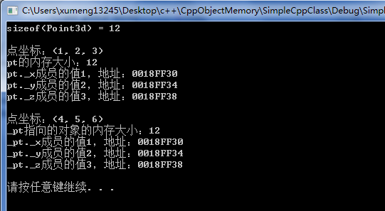
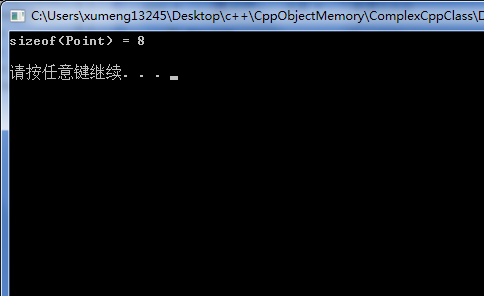
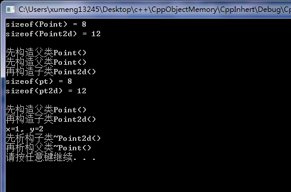

[《深度探索C++对象模型》](https://book.douban.com/subject/10427315/)这本书是进阶深入学习C++的一本好书。Delphi在这方面的书实在没有找到

结合这本书中的讲解，对应通过编写程序展示各种典型的C++对象的内存模型，但对书中C++编译器设计思路的进化历程、C++编译器设计过程中各种内存模型方案的对比等都不过分涉及。当然一篇简短的文章绝不可能将C++这种高深莫测的语言讲得多么深入！也可以用于复习C++的简单语法部分！

除了[《深度探索C++对象模型》](https://book.douban.com/subject/10427315/)，还参考了[《高质量程序设计指南：C/C++语言》](https://book.douban.com/subject/2116929/)

本文中涉及到的C++程序测试环境是：64位Windows 7、Visual C++ 6.0。Linux平台暂时还没有测试

以下摘自书中侯捷老师的忠告

>如果一个程序员了解底层实现模型，他就能够写出效率较高的代码，自信心也比较高。一个人不应该用猜的方式，或者等待某大师的宣判，才确定“何时提供一个copy constructor 而何时不需要”。这类问题的解答应该来自于我们自身对对象模型的了解

>了解C++对象模型绝对有助于你在语言本身以及面向对象观念两方面的层次提升

>对象模型是深层结构的知识，关系到“与语言无关、与平台无关、跨网络可执行”软件组件的基础原理。也因此，了解C++对象模型是学习目前软件组件三大规格（COM、CORBA、SOM）的技术基础。如果你对软件组件没有兴趣，C++对象模型也能够使你对虚拟函数、虚拟继承、虚拟接口有脱胎换骨的新认知，或是对于各种C++写法所带来的效率有通盘的认识

##一个最简单的C++类

测试程序代码如下，点击[这里](../download/20161104/SimpleCppClass.zip)下载程序源码

```
#include<stdio.h>
#include<stdlib.h>
#include<iostream>

using namespace std;

class Point3d
{
	public:
		Point3d( float x=0.0, float y=0.0, float z=0.0)
			: _x(x), _y(y), _z(z) {  }

		float *x_addr() { return &_x; }
		float *y_addr() { return &_y; }
		float *z_addr() { return &_z; }

		float x() { return _x; }
		float y() { return _y; }
		float z() { return _z; }

		void x( float xval ) { _x = xval; }
		void y( float yval ) { _y = yval; }
		void z( float zval ) { _z = zval; }

		void Point3d_print() {
			printf ("点坐标：(%g, %g, %g)\n", _x, _y, _z);
		}

	private:
		float _x;
		float _y;
		float _z;
};

int main()
{
	cout << "sizeof(Point3d) = " << sizeof(Point3d) << endl << endl;

	//C++中可以直接声明一个类对象
	Point3d pt(1, 2, 3);
	pt.Point3d_print();
	cout << "pt的内存大小：" << sizeof(pt) << endl;
	cout << "pt._x成员的值" << pt.x() << "，地址：" << pt.x_addr() << endl;
	cout << "pt._y成员的值" << pt.y() << "，地址：" << pt.y_addr() << endl;
	cout << "pt._z成员的值" << pt.z() << "，地址：" << pt.z_addr() << endl << endl;

	//也可以动态根据类指针在运行时申请内存创建一个对象
	Point3d *_pt = new Point3d(4, 5, 6);
	_pt->Point3d_print();
	cout << "_pt指向的对象的内存大小：" << sizeof(*_pt) << endl;
	cout << "_pt._x成员的值" << pt.x() << "，地址：" << pt.x_addr() << endl;
	cout << "_pt._y成员的值" << pt.y() << "，地址：" << pt.y_addr() << endl;
	cout << "_pt._z成员的值" << pt.z() << "，地址：" << pt.z_addr() << endl << endl;
	delete _pt;

	system("pause");
	return 0;
}
```

运行结果如下图



在C中要想表示一个三维空间的点，就需要定义一个struct结构体，包含x、y、z三个变量，然后打印这个点还需要再定义一个以该struct类型为参数的函数。关于结构体，相关文章推荐[《Delphi配合VC++开发：结构体对齐机制》](http://www.xumenger.com/delphi-vc-dll-2-20160903/)

可以看出Point3d类对象所占用的内存空间是12byte，而每个float类型变量是32bit，也就是4byte。Point3d中有3个float成员变量，而Point3d的每个对象大小是4byte，所以对象的内存中只包含了3个成员变量并不包含成员方法

相比于C使用结构体，C++使用类将变量和方法封装在一起。如上分析，这个简单的Point3d类使用C++的封装方法后，布局成本并没有增加，三个data members直接内含在一个class object中，就像C struct的情况一样。而member functions虽然含在class的声明之内，却不出现在object中。每一个non-inline member function只会诞生一个函数实例。至于每一个“拥有零个或一个定义”的inline function则会在其每一个使用者(模块)身上产生一个函数实例

Point3d支持封装性质，但并未带给它任何空间或执行期的不良后果。其实C++在布局以及存取时间上主要的额外负担是由virtual引起的，包括：virtual fuction机制，用以支持一个有效率的“执行期绑定”；virtual base class，用以实现“多次出现在继承体系中的base class，有一个单一而被共享的实例

此外还有一些多重继承下的额外负担，发生在“一个derived class和其第二或后继之base class的转换”之间。然而，一般而言，并没有什么天生的理由说C++程序一定比其C兄弟庞大而迟缓

##一个稍微复杂点的类

在C++中，有两种class data members：static和nonstatic，以及三种class member functions：static、nonstatic和virtual，那么同时包含这些成员的类对象在机器中的内存布局将会是什么样的呢？

以下的实验程序可以点击[这里](../download/20161104/ComplexCppClass.zip)下载

```
#include<stdio.h>
#include<stdlib.h>
#include<iostream>

using namespace std;

class Point{
	public:
		Point( float xval );
		virtual ~Point();

		float x() const;
		static int PointCount();

	protected:
		virtual ostream& print( ostream &os ) const;
		
		float _x;
		static int _point_count;
};
//此代码中未实现方法Point()、x()等也是可以编译通过的
//但不可以创建Point对象

int main()
{
	cout << "sizeof(Point) = " << sizeof(Point) << endl << endl;
	system("pause");
	return 0;
}
```

该实验程序的运行结果如下图，可以看到sizeof(Point)的值是8



C++对象模型中，nonstatic data members被置于每一个class obejct之内；static data members则被存放在个别的class object之外；static和nonstatic function members也被放在个别的class object之外。virtual functions则以两个步骤进行支持：

* 每一个class产生一个指向virtual functuons的指针，放在表格之中，这个表格被称为virtual table(vtbl)
* 每一个class object被安插一个指针，指向相关的virtual table。通常这个指针被称为vptr。vptr的设定和重置都由每一个class的constructor、destructor和copy assignment运算符自动完成。每一个class所关联的type\_info object(用以支持runtime type identification，RTTI)也经由virtual table被指出来，通常放在表格的第一个slot

上面的这个类的对象模型如下图，很好的解释了为什么sizeof(Point)的值是8了


* Point对象的内存中只包含\_x成员变量和vptr指针
* vptr指针指向Point的RTTI、虚析构方法、虚print方法
* static成员变量\_point\_cout、static成员方法Point_Count()、构造方法、nonstatic成员方法x()都在对象内存之外

##类的继承

众所周知，面向对象的三大基本特征是：封装、继承、多态，大学里教授Java、C++的老师整天念叨这一套，但有个鸟用，你还是不会。这里使用一个简单的例子展示C++继承下的对象的内存模型

下面的测试程序基于上面的那个稍微复杂的类实现，点击[这里](../download/20161104/CppInhert.zip)下载

```
#include<stdio.h>
#include<stdlib.h>
#include<iostream>

using namespace std;

class Point{
	public:
		Point( float xval );
		virtual ~Point();

		float x() const;
		static int PointCount();

	protected:
		virtual ostream& print( ostream &os ) const;
		
		float _x;
		static int _point_count;
};

class Point2d: public Point{
	public:
		Point2d ( float xval, float yval );
		~Point2d();
		
		float y() const;
		ostream& print( ostream &os ) const;
	protected:
		float _y;
};

//Point方法实现
Point::Point( float xval ){
	_x = xval;
	_point_count ++;
	cout << "先构造父类Point()" << endl;
}

Point::~Point(){
	_x = 0;
	_point_count --;
	cout << "再析构父类~Point()" << endl;
}

float Point::x() const{
	return _x;
}

int Point::PointCount(){
	return _point_count;
}

ostream& Point::print( ostream &os ) const{
	os << "x=" << _x << endl;
	return os;
}

int Point::_point_count = 0;	//必须初始化C++类的静态变量

//Point2d方法实现
//注意子类实现构造方法时的格式
Point2d::Point2d( float xval, float yval ): Point( xval ){
	_y = yval;
	cout << "再构造子类Point2d()" << endl;
}

float Point2d::y() const{
	return _y;
}

Point2d::~Point2d(){
	cout << "先析构子类~Point2d()" << endl;
}

ostream& Point2d::print( ostream &os ) const{
	os << "x=" << _x << ", y=" << _y << endl;
	return os;
}

int main()
{
	cout << "sizeof(Point) = " << sizeof(Point) << endl;
	cout << "sizeof(Point2d) = " << sizeof(Point2d) << endl << endl;
	
	Point pt(1);
	Point2d pt2d(1, 2);
	cout << "sizeof(pt) = " << sizeof(pt) << endl;
	cout << "sizeof(pt2d) = " << sizeof(pt2d) << endl << endl;

	Point2d *_pt2d = new Point2d(1, 2);
	_pt2d->print(cout);

	delete _pt2d;

	system("pause");
	return 0;
}
```

运行结果如下图



在父类的内存模型基础上多了一个float \_y;成员变量，所以Point2d子类对象相对于Point父类对象的内存多了4byte，所以看到Point2d对象的内存大小是12byte
