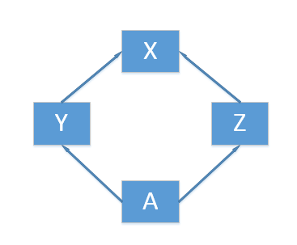
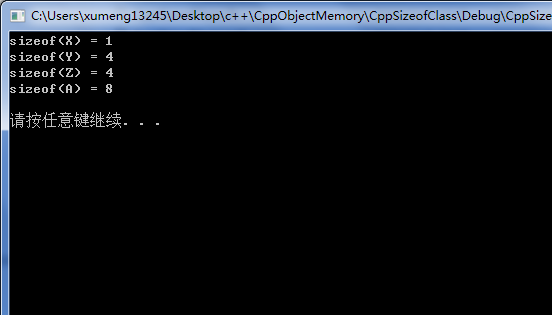

《深度探索C++对象模型》中第三章“Data语意学”中有讲到一个法国人针对C++“空类继承体系”的内存空间的疑惑，这里就直接将作者对其解释摘抄下来，当然先要自己实现并验证一下了

本文对应的测试环境依然是64位Windwos 7、Visual C++ 6.0，测试程序可以点击[这里](../download/20161105/CppSizeofClass.zip)下载

```
#include<stdio.h>
#include<stdlib.h>
#include<iostream>

using namespace std;

class X	{};
class Y : public virtual X {};
class Z : public virtual X {};
class A : public Y, public Z {};

int main()
{
	cout << "sizeof(X) = " << sizeof(X) << endl;
	cout << "sizeof(Y) = " << sizeof(Y) << endl;
	cout << "sizeof(Z) = " << sizeof(Z) << endl;
	cout << "sizeof(A) = " << sizeof(A) << endl << endl;

	system("pause");
	return 0;
}
```

程序中几个类的继承关系如下图：



程序本身实在是很简单，运行效果如下：



不过书中讲到的法国人所遇到的情况并不是这样，下表展示一下各种情况

	运行效果 | 法国人的机器 	| 作者 Visual C++ 5.0  	|  我 Visual C++ 6.0
------------ | ------------- 	| ------------  		|------------------
sizeof(X)	|			1		|			1			|		1			
sizeof(Y)	|			8		|			4			|		4			
sizeof(Z)	|			8		|			4			|		4			
sizeof(A)	|			12		|			8			|		8			

##先看class X

```
class X {};
```

是一个空的class。但实际上并不是空的，程序运行的结果也显示sizeof(X)的值是1，因为它有一个隐藏的1byte大小，那是被编译器安插进去的一个char。这使得这一class的两个object得以在内存中配置独一无二的地址

```
X a, b;
if (&a == &b){
	cerr << "地址冲突！" << endl;
}
```

##再看class Y和class Z

可以看到上面不同人的不同机器、不同编译器中sizeof(Y)和sizeof(Z)运行结果是不同的，有的是4，有的是8。其实这个值的大小和机器有关，也和编译器有关，事实上Y和Z的大小受三个因素影响

**1.语言本身所造成的额外负担**。当语言支持virtual base classes时，就会导致一些额外负担。在derived class中，这个额外负担反映在某种形式的指针身上，它或者指向virtual base class subobject，或者指向一个相关表格；表格中存放的若不是virtual base class subobject的地址，就是其偏移位置。法国人的机器上，指针式4byte，所以首先class Y、class Z就要有4byte的内存空间存储该指针

**2.编译器对于特殊情况所提供的优化处理**。virtual base class X subobject的1byte大小也出现在class Y和class Z身上。传统上它被放在derived class的固定（不变动）部分的尾端。某些编译器也对empty virtual base class提供特殊支持。法国人所使用的编译器显然并未提供这项特殊处理

**3.alignment的限制（内存对其机制）**。法国人机器上class Y和class Z的大小到目前为止为5byte。在大部分机器上，聚合的结构体大小会受到alignment的限制，使它们能够更有效率地在内存中被存取，在法国人的机器上，alignment是4byte，所以class Y和class Z必须填补3byte，最终得到结果8byte

empty virtual base class已经成为C++ OO设计的一个特有术语了。它提供一个virtual interface，没有定义任何数据。某些新近的编译器对此提供了特殊处理。在这个策略之下，一个empty virtual base class被视为derived class object最开头的一部分，也就是说它并没有花费任何的额外空间。这就节省了上述第2点的1byte，也就不需要第3点的2byte来进行补齐，所以我的机器上sizeof(Y)和sizeof(Z)的值都是4

##最后看class A

>记住！一个virtual base class subobject只会在derived class中存在一份实例，不管它在class继承体系中出现了多少次！

明显，上面的例子中class X就是被Y和Z虚拟继承的

法国人的机器上的编译器未实现“特别对empty virtual base class做了处理”，class A的大小由一下几点决定：

* 被大家共享的唯一一个class X实例，大小是1byte
* base class Y的大小，减去“因virtual base class X而配置”的大小，结果是4byte。base class Z的算法亦同。一共是8byte
* class A自己的大小：0byte
* class A的alignment数量。前三项总和目前是9byte，class A必须调整至4byte边界，所以需要填补3byte，结果是12byte

上面是针对法国人机器的解释。现在如果考虑“特别对empty virtual base class做了处理”的编译器，一如前述，class X实例的那1byte将被拿掉，于是额外的2byte填补额也不必了，因此class A的大小是8byte，这也就可以解释我的机器上这个程序的运行效果了

>注意：如果我们在virtual base class X中放置一个或一个以上的data member，两种编译器（“有特殊处理”者和“无特殊处理”者）就会产生出完全相同的对象布局