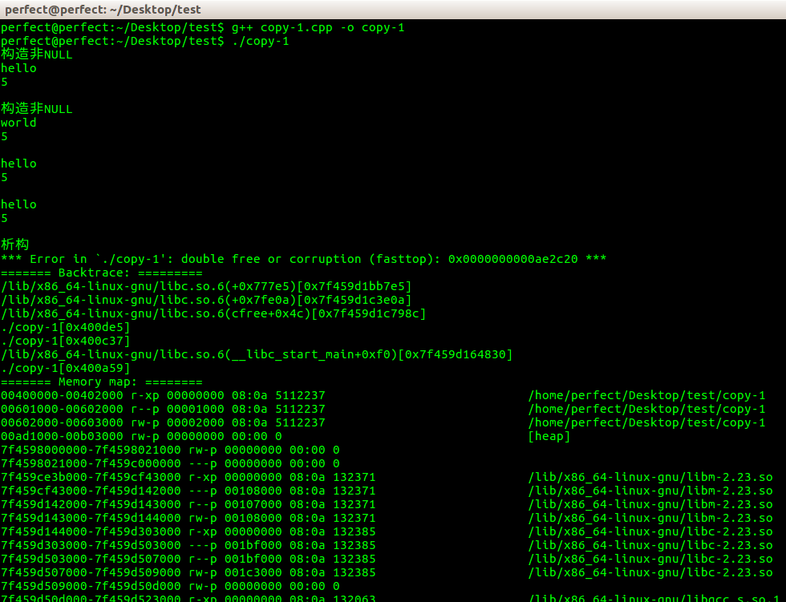

##一个简单的应用模板的例程

先通过一个[例程](../download/20161113/template.cpp.zip)简单复习一下模板的语法

```
#include<iostream>
using namespace std;

template<class Type>
class Point{
	public:
		Point(Type x = 0, Type y = 0, Type z = 0){
			_x = x;
			_y = y;
			_z = z;
			cout << "Point构造方法" << endl;
		}
		~Point(){
			cout << "Point析构方法" << endl;
		}
		Type x(){
			cout << "_x的值是：" << _x << endl;
		}
		Type y(){
			cout << "_y的值是：" << _y << endl;
		}
		Type z(){
			cout << "_z的值是：" << _z << endl;
		}
	private:
		Type _x, _y, _z;
};

int main()
{
	Point<int> *pi;
	pi = new Point<int>(1, 2, 3);
	pi->x();
	pi->y();
	pi->z();
	delete pi;
	cout << endl;

	Point<float> *pf;
	pf = new Point<float>(1.1, 2.2, 3.3);
	pf->x();
	pf->y();
	pf->z();
	delete pf;
	cout << endl;

	return 0;
}
```

程序的运行效果如下：


