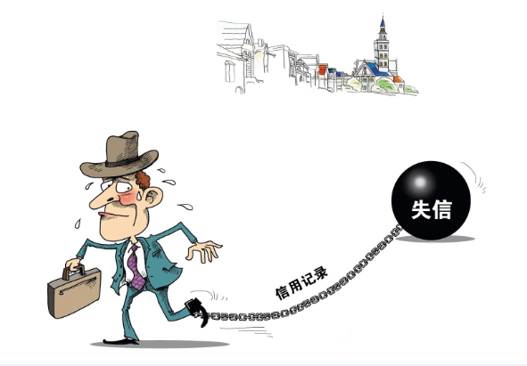
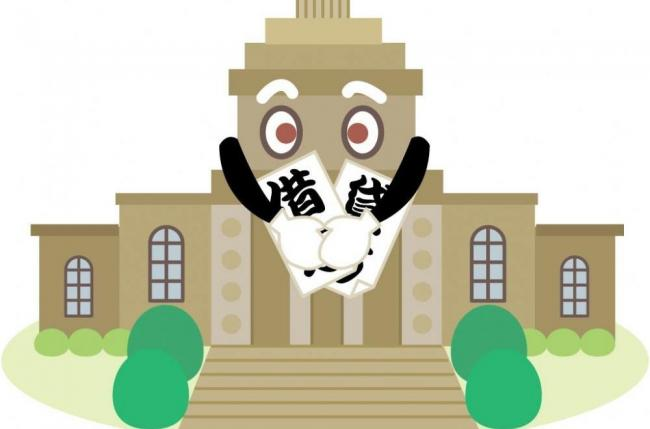

##商业银行

比如平时无论是对于企业还是个人，如果有钱需要存放，显然现金放在自己手上很不安全，可能丢失、可能被偷窃，于是你会选择存放到银行，而银行则支付你少的可怜的利息，甚至都追不上通货膨胀的速度；相应的，如果你需要用钱，则可能是向银行进行贷款，但这时候你要付给银行的利息却远远高于你存款时银行付给你的利息，可能还需要担保

就像上面的描述，为什么我们把钱借给银行（存钱），相比于我们向银行借钱（贷款）会相差这么大，其实这中间就是信誉在作怪，作为一个机构，银行的信誉比一个普通个人大得多，所以你“借钱”给它，几乎可以保证到期后拿到本和利，但是个人的信誉就差得远了，谁能保证你不会跑路，所以相对而言要收更多的利息，也需要有担保

>如果你履行你的诺言，会得到报偿。这就是为什么要讲诚信的道理。讲诚信，是人的理性行为，表面上看对别人好，但更根本的，还是对自己有好处，是利己的，因此是值得的。而利人利己是最大意义的善，又是可以扩展的善，是一种自我加强的机制。光利己而损害他人是不可持续的，因为每个人说到底都是追求自己利益极大化，即自利的。这是整个经济学的最基本假设

>存款和贷款就是商业银行的核心

银行是靠运用资金赚钱生存的，但必须先有资金来源，才有资金的运用。负债业务就是商业银行组织资金来源的业务，包括存款业务和借入款业务

存款就是商业银行为客户开立账户，接受客户资金存入，并为客户支付利息的业务

非存款业务就是借入款，向谁借入呢？一个是同行。商业银行可以在专门的市场——同业拆借市场，向其他金融机构借入资金。此时借钱的银行就是缺头寸的一方，而对方则是富余头寸或者多头寸的一方；还可以向中央银行借款，商业银行向中央银行借款，可以用再贴现或再贷款方式；此外，商业银行还可以用发债的方式借入资金

商业银行运用借入的资金产生收入的业务就是资产业务。最主要的资产业务就是贷款，这是银行利润的主要来源，贷款就是银行向借款人提供资金，后者按照事先双方约定的利率和期限偿还资金的业务

除此之外，商业银行的证券投资业务也是一项资产业务，比如购买债券包括政府债券和企业债、股票等

一般工商企业开业，要有资金准备，作为经营货币的特殊企业，银行开业更需要有支持资金，这就是资本金。银行的资本金就是银行的股东和债权人为获取收益，而投入银行的货币资金，以及他们保留在银行中的利润

##中央银行

最开始的时候，各家银行都有发行货币（银行券）的权力，尽管便利了交易，但各家银行的信誉和实力千差万别，因为常有银行面临银行券不能兑付的尴尬局面。各家银行每天都在进行债权债务的清算和票据的交换，各家银行各自轧差，势必遇到困难，因此需要一个共同的票据交易中心，集中进行轧差清算，以保证各家银行间债权债务关系的及时出清，保证银行系统的持续运转。另外和经营企业一样，如果银行经营不善也会破产倒闭，但银行的倒闭产生的危害远远大于普通的企业

中央银行就是为了适应这样切实的需要而产生的。中央银行垄断了货币的发行，不再有不能兑付的尴尬；作为票据交易中心，及时清算债权债务；作为最后的贷款人，为其他银行提供贷款，保证商业银行在面临挤兑、频临破产时能安然渡过难关

中央银行是特殊的银行，它不经营一般的银行业务，比如存款、贷款、汇兑等，它的职能可以用三句话概括：发行的银行、银行的银行、政府的银行

中央银行终结了商业银行都发行银行券的春秋战国局面，把货币发行权牢牢掌握在自己手中。这是中央银行最核心的职能，也是它行使其他职能的基础

如果个人和企业需要资金，可以找银行，但银行作为一个企业也有需要资金的时候，它也需要贷款。中央银行作为银行的银行，表现为商业银行要向中央银行缴纳法定存款准备金，中央银行把各家商业银行的准备金集中起来，当商业银行遇到挤兑、支付困难等紧急情况时，中央银行就可以作为最后的贷款人，对商业银行予以资金支持。同时作为银行的银行，中央银行还代为履行各家商业银行的清算业务

中央银行是政府金融政策的制定和执行部门，比如基础利率、汇率、存款准备金率、贴现率、公开市场业务，都是由中央银行具体制定和操作的。中央银行还有管理和监督商业银行和其他金融机构、维护金融秩序的功能。中央银行也是一个国家参与国际金融活动和国际金融合作，参加国际金融组织的代表

##货币市场

货币市场是交易期限在一年以内（含一年）的金融工具的金融市场。其参与者主要是金融机构、企业、政府机构，而不是个人和家庭，因为交易的金额特别巨大，所以被认为是一种“批发市场”

主要的货币市场有：同业拆借市场、票据贴现市场、回购市场等

同业拆借市场是金融机构（同行）之间相互借贷短期资金的市场，具体业务就是买卖它们保留在中央银行的超额准备金。因为商业银行从事资产业务，也有捉襟见肘、缺乏头寸的时候，有时还特别急用，如果让储户或者客户知道银行居然“缺钱”，可能会引发不信任和挤兑，这时候，它们只能也只敢向有钱的同行借。除了调节头寸，同业拆借也是银行赚钱的寻常手段。因为有的银行有多余的准备金，但没有合适的客户，资金就处于闲置的状态，而有的银行准备金不足，优质客户前来贷款，不敢发放贷款，通过同业拆借，可以保证贷款顺利进行，对拆借的银行双方而言是双赢

同业拆借的期限是很短的，一般是隔夜（第二天还钱），长的一般也不过几周。同业拆借的借方要支付利息，同业拆借市场的利率是整个经济中资金利率的基础，因为拆借利息是银行借钱的成本，而一般工商企业却是向银行借钱

票据贴现表面看起来是持票人把未到期的票据转让给银行，银行把从贴现日至到期日的利息扣除，再将票据剩余款项给持票人，但实质上是持票人获得急需的短期资金的行为，是重要的融资手段

回购市场，是以回购协议形式融资的市场。回购协议是证券持有人在出售证券的同时，与购买商约定，在一定期限后，再按约定价格购回所售证券的协议。先出售后购回是“正回购”，反之叫“逆回购”。回购期限通常是隔夜或7天，所以回购市场也属于短期融资的货币市场

##银行间债券市场

全国银行间债券市场是指依托于中国外汇交易中心暨全国银行间同业拆借中心和中央国债登记结算有限责任公司的，面向商业银行、农村信用联社、保险公司、证券公司等金融机构进行债券买卖和回购的市场

话说，80年代以前的计划经济时代，政府直接投资进行国家建设，后来成立了4大国有商业银行通过这些银行的贷款来进行国家的建设，有时候银行对外放的资金太大，造成国家的经济过热（88年是典型），那么人民银行就通过要求各银行多往自己这存钱（所谓调高上存保证金比例）来控制银行往市面上投钱（所谓紧缩银根）。这种行政命令式的金融调控手段，不是长久之计，于是90年代初成立了“银行间债券市场”，通过人民银行往这个市场投送短期债券和回收短期债券来达到货币供给量调控（所谓公开市场操作）的目的。同时，通过这个市场，银行之间可以以国债为抵押物，互相之间调配资金（所谓调配头寸）
