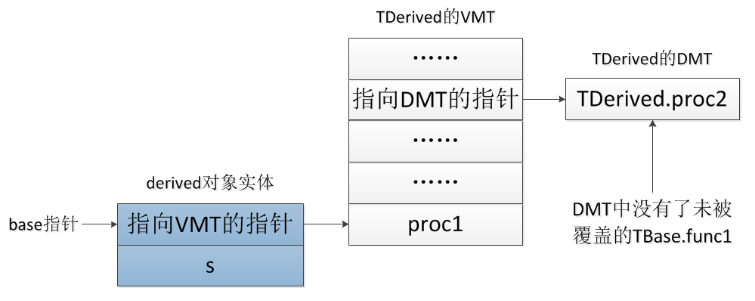

Delphi的面向对象语法中，当创建一个类的实例后，编译器会在该对象的内存空间的首4个地址安插一个指针，该指针所指向的地址称为VMT（Virtual Method Table，虚方法表），这个表中存放了该类的所有虚方法的入口地址。在Delphi中，所有类实例都会有这么一个指向VMT的指针。如果没有在类中声明虚方法，则该指针值为nil

##Delphi 6类的VMT

假如有一个父类TBase以及它的一个派生类TDerived

```
TBase = class
protected
	s: string;
public
	procedure proc1(); virtual; abstract;
	procedure proc2(): virtual; abstract;
	function func1(): string; virtual;
end;

TDerived = class(TBase)
public
	constructor Create();
	destructor Destroy(); override;
	procedure proc1(); override;
	procedure proc2(); override;
	//没有覆盖TBase.func1()
end;
```

用TBase类型指针创建一个TDerived对象实例

```
var
	base: TBase;
begin
	base := TDerived.Create();
end;
```

这时base指针指向的对象内存模型如下


没有被派生类覆盖的方法，编译器会基类的该方法的实现入口地址填入派生类的VMT中。比如上面的例子，TDerived类覆盖了基类TBase的proc1()和proc2()，因此在TDerived的VMT中，proc1()和proc2()被确定为TDerived自己所实现的方法入口地址。而由于TDerived没有覆盖父类的func1()方法，所以在TDerived的VMT中还是填入TBase.func()的入口地址

继续上面的代码，所以当调用base.proc1()时对应调用子类TDerived实现的proc1()方法，而当调用base.func1()时则对应调用的父类TBase实现的func1()方法

这部分的解释总体和C++对象内存模型一致，可以对比[《C++对象内存模型》](http://www.xumenger.com/tags/#C++对象内存模型)系列以更深入的了解

这里存在一个问题，TBase的析构方法也是virtual的，为什么没有出现在VMT中呢？其实并非VMT中没有析构函数，只能说它没有出现在我们能看到的VMT中。之前所说的“指向VMT的指针”所指向的VMT，其实只是真正的VMT的一部分，也就是用户定义的第一个虚方法的位置。如果以这个位置作为原点，向正方向即刚才所说的VMT。而向负方向则是语言定义的另一些类信息所在的地址，析构函数地址就被放在了负方向上了。Delphi之所以这么做，是为了使得Delphi的VMT与C++以及COM的vtabl（虚函数表）兼容！

##Delphi 6的VMT布局

偏移地址  |  类型    |    描述
----------|----------|---------------------
 -76      | Pointer  | pointer to virtual method table (or nil)
 -72      | Pointer  | pointer to interface table (or nil)
 -68      | Pointer  | pointer to Automation information table (or nil)
 -64      | Pointer  | pointer to instance initialization table (or nil)
 -60      | Pointer  | pointer to type information table (or nil)
 -56      | Pointer  | pointer to field defination table (or nil)
 -52      | Pointer  | pointer to method defination table (or nil)
 -48      | Pointer  | pointer to dynamic method table (or nil) 指向DMT的指针
 -44      | Pointer  | pointer to short string containing class name
 -40      | Cardinal | instance size in bytes
 -36      | Pointer  | pointer to a pointer to ancestor class (or nil)
 -32      | Pointer  | pointer to entry point of SafecallException method (or nil)
 -28      | Pointer  | entry point of AfterConstruction method
 -24      | Pointer  | entry point of BeforeDestruction method
 -20      | Pointer  | entry point of Dispatch method
 -16      | Pointer  | entry point of DefaultHandler method
 -12      | Pointer  | entry point of NewInstance method
 -8       | Pointer  | entry point of FreeInstance method
 -4       | Pointer  | entry point of Destroy destructor
 0        | Pointer  | entry point of first user-defined virtual method
 4        | Pointer  | entry point of second user-defined virtual method
 4n(n>1)  | Pointer  | entry point of n+1 user-defined virtul method (n是整数)


可以看到，偏移地址-28~-4所存放的都是TObject的虚方法地址，当然析构函数也在其中

>Delphi中所有类（除了TObject类本身）都是从TObject类派生的！C++中则不存在这样一个所有类都必须继承的基类！

##Delphi 6类的DMT

上面表格中，在偏移量-48处是一个指向DMT的指针。在VMT中可以看到，派生类的虚方法表完全继承了基类的虚方法表，只是将被覆盖了的虚方法的地址改变了。基类和每个派生类都有一份自己的虚方法表。可以想象，随着类层次的扩展，虚方法表将耗费非常大的内存空间。为了防止这种情况，Delphi引入了“dynamic”的概念。对程序员来说，dynamic方法和virtual方法实现相同的功能，只是声明的关键字不同

被声明为dynamic的方法，其入口地址将被放在DMT中。DMT和VMT的区别在于：对于派生类没有覆盖的方法，这些方法的入口地址不会出现在DMT中，编译器要通过基类的信息来寻找它们的入口地址

还是上面的例子，将proc2、func2改成dynamic，proc1还是保持virtual

```
TBase = class
protected
	s: string;
public
	procedure proc1(); virtual; abstract;		//仍保持为virtual
	procedure proc2(); dynamic; abstract;		//将virtual改为dynamic
	function func1(): string; dynamic;			//将virtual改为dynamic
end;

TDerived = class(TBase)
public
	constructor Create();
	destructor Destroy(); override;
	procedure proc1(); override;
	procedure proc2(); override;
	function func1(): string; override;			//不覆盖TBase.func1()方法
end;
```

TDerived类对象的内存模型如下，可以看到DMT中没有func2，因为func2被声明为dynamic，但TDerived又没有实现该方法去覆盖TBase的func2方法：



由于DMT中不会出现没有被派生类覆盖的基类dynamic方法，因此DMT会比VMT节省空间（大多数情况下）。当基类有许多虚方法，而派生类只覆盖很少几个时，区别尤其明显。当派生层次越来越深，派生类数量越来越多，DMT就能节省更多的空间。但DMT中对基类的动态方法的寻址不是直接进行的，因此dynamic方法的寻址相比于virtual要慢得多

virtual和dynamic的区别仅在于编译器采用不同的晚绑定策略而已，对于程序员而言，其功能是相同的，具体选择使用dynamic还是virtual需考虑程序是更注重性能还是更注重内存空间！

>另外需要注意的是，只有VMT才与C++、COM的vtable兼容，因此当需要这样的兼容性时，只能使用virtual
