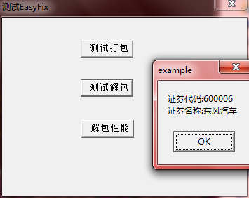
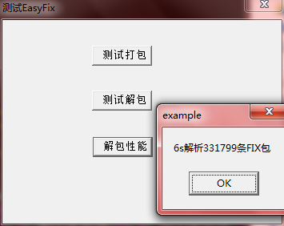
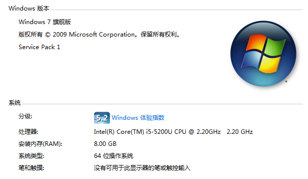

FIX协议 (金融信息交换协议Financial Information exchange)是适用于实时证券、金融电子交易开发的数据通信标准。它是由国际FIX协会组织提供的一个开放式协议，目的是推动国际贸易电子化的进程，在各类参与者之间，包括投资经理、经纪人，买方、卖方建立起实时的电子化通讯协议。FIX 协议的目标是把各类证券金融业务需求流程格式化，使之成为一个个可用计算机语言描述的功能流程，并在每个业务功能接口上统一交换格式，方便各个功能模块的连接。目前，欧、美主要发达国家都是FIX协会的成员

FIX现已被许多企业和销售商使用，它已经成为行业内推荐的消息协议。以我国的几个主要交易市场为例：

* 深交所新一代报盘接口一种是二进制协议，还有一种就是FIX协议
* 上交所目前在报盘接口中也有用到FIX协议，一种模式是开发商这边将信息打包成FIX格式写入数据库，比如上交所的大宗交易；另一种则是直接将FIX包通过TCP发送出去，比如上交所的协议回购接口
* 银行间市场使用的IMIX协议其实也是在FIX协议基础上做的一些个性化处理

##FIX包结构

FIX协议包含2个层次：会话层和应用层。会话层与数据的通信相关；而应用层定义了商务数据内容

>会话是指应用双方通过彼此的协商，所创建的一条逻辑的连接。该连接通过双方各自维护的序列号来实施缺口的发现以及填补过程以实现可靠的通信传输，通过连接建立时协商的安全机制，会话双方可以实现安全的数据传输过程。会话的建立说明双方对之后的数据传输达成了某种共识

本文重点分析应用层面的FIX包的结构，而会话层，以及应用层的其他方面的比如大小写、数据类型（字符串类型/整型/浮点型）、校验和、消息头、消息尾、MsgType标识消息类型、什么数字表示什么含义、系统消息、应用消息等这里就不做说明了

FIX包主要是键值对的格式，键主要用一个个专用的数字表示具体的含义，比如席位用12表示，股东用98表示，证券代码用100表示，这个就具体看通信双方的约定了，然后每个键值对通过ASCII码为1的字符表示，这里我用<SOH>来代指这个分隔符

比如一个单层的FIX包，比如12表示席位，98表示股东，100表示报单数量

```
12=13245<SOH>98=1000000000<SOH>100=60000<SOH>
```

FIX不光有单层的结构，还可以表示双层，比如10表示证券数量，101表示证券代码，102表示证券名称，103表示证券的最新价

下面的格式表示有2只证券信息，然后依次打包证券代码、证券名称、证券最新价

```
10=2<SOH>101=600000<SOH>102=浦发银行<SOH>103=16.28<SOH>101=600005<SOH>102=武钢股份<SOH>103=3.37<SOH>
```

再进一步扩展，FIX格式的字符串可以有n层，下面展示一个3层结构的例子，以简单的委托为例，1表示委托的笔数，20表示买卖方向（B/S），然后每笔委托内部可能包括买卖多只股票（这只是一种假设）

```
1=2<SOH>20=S<SOH>10=2<SOH>101=600000<SOH>102=浦发银行<SOH>103=16.28<SOH>101=600005<SOH>102=武钢股份<SOH>103=3.37<SOH>20=B<SOH>10=1<SOH>101=600006<SOH>102=东风汽车<SOH>103=6.98<SOH>
```

>FIX要想打包多层，必须在第n层打包第n+1层之前有一个字段专门表示第n+1层包含多少条记录！

##实现一个FIX打包解包的类

根据FIX包的多层结构，使用Delphi实现一个简单的FIX包解析类

以下的简单实现是没有参考已有的成熟的FIX解析方法的情况下，自己分析FIX包的特点实现的一个简单版本

>一个完善的FIX引擎实现比这个复杂的多：要实现网络通信、考虑网络连接的管理、根据配置文件的数据字典对小消息包的合法性进行校验（标识为必需字段是否缺少、字段的数据类型是否正确、字段的取值是否在指定范围内等）、极致的打包解包性能

```
unit EasyFix;

interface
uses
  StrUtils, SysUtils, Classes;

const
  SOH = #1;
  SEQUAL = '='; 

type
  TBaseFix = class
  public
    constructor Create; overload;
    constructor Create(fixPkg: string); overload;
    destructor Destroy; override;
  protected
    //获取子串subStr出现在Str中第i次对应的位置，未找到时返回0
    function NPos(subStr: string; Str: string; n: Integer): Integer;
    //sText是Key=Value<SOH>格式的字符串，根据该字符串获取键、值
    procedure GetNameValue(sText: string; var iKey, sValue: string);
  protected
    sBuffer: string;
  end;

  TFixValue = class(TBaseFix)
  public
    function GetFixValue(key: Integer; index: Integer = 1): TFixValue;
    
    procedure SetKey(key: Integer);
    procedure SetValue(value: string);
    function GetKey: Integer;
    function GetString: string; overload;
    function GetInt: Integer; overload;
    function GetFloat: Double; overload;
  private
    iKey: Integer;
    sValue: string;
  end;

  TEasyFix = class(TBaseFix)
  public
    function GetFixValue(key: Integer; index: Integer = 1): TFixValue;

    procedure AddValue(key: Integer; value: string; iLen: Integer); overload;
    procedure AddValue(key: Integer; value: Integer; iLen: Integer); overload;
    procedure AddValue(key: Integer; value: Double; iLen: Integer); overload;
    function GetBuffer: string;
  private
    function GetSpaceText(value: string; iLen: Integer): string; overload;
    function GetSpaceText(value: Integer; iLen: Integer): string; overload;
    function GetSpaceText(value: Double; iLen: Integer): string; overload;
  end;

implementation

constructor TBaseFix.Create;
begin
  sBuffer := '';
end;

constructor TBaseFix.Create(fixPkg: string);
begin
  sBuffer := fixPkg;
  sBuffer := StringReplace(sBuffer, ' ', '', [rfReplaceAll]);
end;

destructor TBaseFix.Destroy;
begin
  sBuffer := '';
end;

//返回值0表示没有搜索到
function TBaseFix.NPos(subStr: string; Str: string; n: Integer): Integer;
var
  i, position: Integer;
  x, y: Integer;
begin
  Result := 0;
  for i:=1 to n do
  begin
    position := Pos(subStr, Str);

    x := position+Length(subStr);
    y :=Length(Str)-position-Length(subStr)+1;
    Str := Copy(Str, x, y);
    if (0 = position) then
    begin
      Result := 0;
      Break;
    end;
    Result := Result + position;
  end;
  if (0 <> Result) then
  begin
    Result := Result + (n-1) * (Length(subStr)-1);
  end;
end;

procedure TBaseFix.GetNameValue(sText: string; var iKey, sValue: string);
var
  index: Integer;
begin
  iKey := '';
  sValue := '';
  index := Pos(SEQUAL, sText);
  if (0 = index) then
  begin
    Exit;
  end;
  iKey := LeftStr(sText, index-1);
  sValue := Trim(RightStr(sText, Length(sText)-index));
end;

function TFixValue.GetFixValue(key: Integer; index: Integer = 1): TFixValue;
var
  searchKey, searchBuffer: string;
  position1, position2: Integer;
  sTemp, iKey, sValue: string;
begin
  searchKey := IntToStr(key) + SEQUAL;
  position1 := NPos(searchKey, sBuffer, index);
  searchBuffer := Copy(sBuffer, position1, Length(sBuffer)-position1+1);
  position2 := Pos(SOH, searchBuffer);
  sTemp := Copy(searchBuffer, 1, position2);
  GetNameValue(sTemp, iKey, sValue);
  searchBuffer := Copy(searchBuffer, position2+1, Length(searchBuffer)-position2);

  Result := TFixValue.Create(searchBuffer);
  Result.SetKey(key);
  Result.SetValue(sValue);
end;

procedure TFixValue.SetKey(key: Integer);
begin
  iKey := key;  
end;

procedure TFixValue.SetValue(value: string);
begin
  sValue := value;
end;

function TFixValue.GetKey: Integer;
begin
  Result := iKey;
end;

function TFixValue.GetString: string;
begin
  Result := sValue;
end;

function TFixValue.GetInt: Integer;
begin
  try
    Result := StrToInt(sValue);
  except
    Result := 0;
  end;
end;

function TFixValue.GetFloat: Double;
begin
  try
    Result := StrToFloat(sValue);
  except
    Result := 0.0;
  end;
end;

function TEasyFix.GetFixValue(key: Integer; index: Integer = 1): TFixValue;
var
  searchKey, searchBuffer: string;
  sTemp, iKey, sValue: string;
  position1, position2: Integer;
begin
  searchKey := IntToStr(key) + SEQUAL;
  position1 := NPos(searchKey, sBuffer, index);
  searchBuffer := Copy(sBuffer, position1, Length(sBuffer)-position1+1);
  
  position2 := Pos(SOH, searchBuffer);
  sTemp := Copy(searchBuffer, 1, position2);
  GetNameValue(sTemp, iKey, sValue);
  searchBuffer := Copy(searchBuffer, position2+1, Length(searchBuffer)-position2);

  Result := TFixValue.Create(searchBuffer);
  Result.SetKey(key);
  Result.SetValue(sValue);
end;

procedure TEasyFix.AddValue(key: Integer; value: string; iLen: Integer);
begin
  sBuffer := sBuffer + IntToStr(key) + SEQUAL + GetSpaceText(value, iLen) + SOH;
end;

procedure TEasyFix.AddValue(key: Integer; value: Integer; iLen: Integer);
begin
  sBuffer := IntToStr(key) + SEQUAL + GetSpaceText(value, iLen) + SOH;
end;

procedure TEasyFix.AddValue(key: Integer; value: Double; iLen: Integer);
begin
  sBuffer := IntToStr(key) + SEQUAL + GetSpaceText(value, iLen) + SOH;
end;

function TEasyFix.GetBuffer: string;
begin
  //打包包头，第一个键值对是FIX包的长度
  sBuffer := '9' + SEQUAL + GetSpaceText((Length(sBuffer)), 5) + SOH + sBuffer;

  //打包包尾
  //这个看通信双方的约定，有些约定要在包尾用专门的字段打包校验值等信息，有些则没有

  //获取最终FIX包
  Result := sBuffer;
end;

function TEasyFix.GetSpaceText(value: string; iLen: Integer): string;
begin
  //string类型的要在后补空格
  Result := value + StringOfChar(' ', iLen - Length(value));
end;

function TEasyFix.GetSpaceText(value: Integer; iLen: Integer): string;
begin
  //number类型要在前补空格
  Result := StringOfChar(' ', iLen - Length(IntToStr(value))) + IntToStr(value);
end;

function TEasyFix.GetSpaceText(value: Double; iLen: Integer): string; 
begin
  //number类型要在前补空格
  Result := StringOfChar(' ', iLen - Length(FloatToStr(value))) + FloatToStr(value);
end;

end.
```

然后写一个简单的测试程序，分别测试打包功能、解包功能、解包性能

```
unit MainForm;

interface

uses
  Windows, Messages, SysUtils, Variants, Classes, Graphics, Controls, Forms,
  Dialogs, StdCtrls, EasyFix;

type
  TForm1 = class(TForm)
    btn1: TButton;
    btn2: TButton;
    btn3: TButton;
    procedure btn1Click(Sender: TObject);
    procedure btn2Click(Sender: TObject);
    procedure btn3Click(Sender: TObject);
  private
    { Private declarations }
  public
    { Public declarations }
  end;

var
  Form1: TForm1;

implementation

{$R *.dfm}

procedure TForm1.btn1Click(Sender: TObject);
var
  fix: TEasyFix;
begin
  fix := TEasyFix.Create;
  fix.AddValue(10, 100, 4);
  fix.AddValue(100, '600570', 8);

  ShowMessage(fix.GetBuffer);
  fix.Free;
end;

procedure TForm1.btn2Click(Sender: TObject);
var
  fix: TEasyFix;
  fixPkg: string;
  stockCode: string;
  stockName: string;
begin
  fixPkg := '1=2' + SOH
          + '20=S' + SOH + '10=2' + SOH
          + '101=600000' + SOH + '102=浦发银行' + SOH + '103=16.28' + SOH
          + '101=600005' + SOH + '102=武钢股份' + SOH + '103=3.37' + SOH
          + '20=B' + SOH + '10=1' + SOH 
          + '101=600006' + SOH + '102=东风汽车' + SOH + '103=6.98' + SOH;

  fix := TEasyFix.Create(fixPkg);
  stockCode := fix.GetFixValue(1, 1).GetFixValue(10, 2).GetFixValue(101).GetString;
  stockName := fix.GetFixValue(1, 1).GetFixValue(10, 2).GetFixValue(102).GetString;
  ShowMessage('证券代码:' + stockCode + #13#10 + '证券名称:' + stockName);
  fix.Free;
end;

procedure TForm1.btn3Click(Sender: TObject);
var
  BeginTime: Cardinal;
  Round: Integer;
  fixPkg: string;
  fix: TEasyFix;
  stockCode, stockName: string;
begin
  BeginTime := GetTickCount;
  Round := 0;
  fixPkg := '1=2' + SOH
          + '20=S' + SOH + '10=2' + SOH
          + '101=600000' + SOH + '102=浦发银行' + SOH + '103=16.28' + SOH
          + '101=600005' + SOH + '102=武钢股份' + SOH + '103=3.37' + SOH
          + '20=B' + SOH + '10=1' + SOH 
          + '101=600006' + SOH + '102=东风汽车' + SOH + '103=6.98' + SOH;
  while True do
  begin
    fix := TEasyFix.Create(fixPkg);
    stockCode := fix.GetFixValue(1, 1).GetFixValue(10, 2).GetFixValue(101).GetString;
    stockName := fix.GetFixValue(1, 1).GetFixValue(10, 2).GetFixValue(102).GetString;
    fix.Free;

    Inc(Round);
    if (GetTickCount - BeginTime > 6000) then
    begin
      Break;
    end;
  end;
  ShowMessage('6s解析' + IntToStr(Round) + '条FIX包');
end;

end.
```

点击打包按钮的输出为


点击解包按钮的输出为



点击测试解包性能，可以看到6秒钟解析一个简单的FIX包可以解析331799次（注意GetTickCount有15ms的误差），同时关注了一下资源管理器，在解包期间，CPU的占用到了25%（4核的机器，单线程的程序，说明当时将整个核都占满了），说明解包的过程是很耗CPU的



当然解析的性能和机器的硬件配置也是息息相关的（重点是CPU配置），以下是我的开发机器的配置



简单分析一个这个FIX解析类的性能问题，可以使用专业的性能分析工具比如AQTime来统计程序执行过程中那个函数调用的次数过多来分析性能，不过对于这个简单的类通过经验判断主要是以下几点影响了解析性能：

1. 每次获取某个字段值时都要通过调用GetFixValue方法来做到，所以获取n个值就必须调用n次，如果是m层的，那么就需要调用n*m次
2. 目前的实现方式中，一个GetFixValue内部有3个字符串拷贝的操作，所以调用GetFixValue次数越多，内部的Copy就越多
3. 每个GetFixValue内部为了实现获取每个字段的值，都要调用字符串搜索函数Pos，假如要获取n个字段，每个字段在该层的顺序都是m，那么要执行n*(m+1)次

以上可以看出调用次数最多的就是Copy和Pos

1. 对于Copy完全可以避免，可以使用字符数组的方式来存储sBuffer而不是string，共用sBuffer：sBuffer的尾部是#0，可以通过使用不同的指针指向sBuffer的不同位置来实现“得到对应后续搜索的子串”的效果
2. 对于Pos，就这个类的实现思路而言，字符串搜索还真是无法剔除的逻辑

这个简单的FIX解包类，以及后续的优化，以及后续用其他的算法逻辑实现其他新的解析类都会放在github上托管，地址是：[https://github.com/xumenger/Parsers/tree/master/FIX](https://github.com/xumenger/Parsers/tree/master/FIX)

>后续还是要参考更多的FIX协议的资料，以及参考目前开源的FIX协议的实现[quickFix](https://github.com/quickfix/quickfix)来封装一个性能更加优越的接口

##参考资料和文章

* [《金融信息交换协议（FIX）v5.0读书笔记（1）》](http://blog.csdn.net/songzhang/article/details/1778118)
* [《》]()
* [《》]()
* [《》]()
* [《》]()
* [《》]()
* [《》]()
* [《》]()
